### Módulo 1: Revisión de la sintaxis de Visual C #
#### Laboratorio: Desarrollo de la solicitud de inscripción a clases

Preparacion del ejercicio.
Verificar que la base de datos School.md se encuentra alojada en (localdb)\MSSQLLocalDB

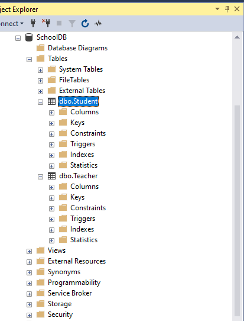
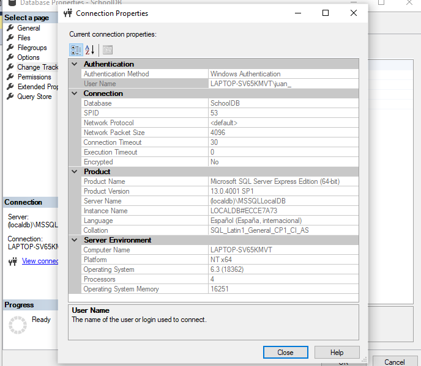


Ejercicio 1: implementación de la funcionalidad de edición para la lista de estudiantes
Partimos de dos formularios 
MainWindow.xmal que contiene la lista de los estudiantes y Studentform.xmal que contiene el detalle de cada estudiante

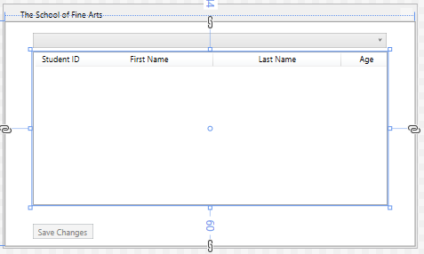

La lista de estudiantes se carga cuando se carga la aplicación desde la base de datos.
el ejercicio es cargar los detalles del estudiante al presionar enter sobre la lista de estudiantes y presentar la información en el segundo formulario
Las modificaciones en el formulario detalle se actualizará la lista cuando se cierre dicho formulario.
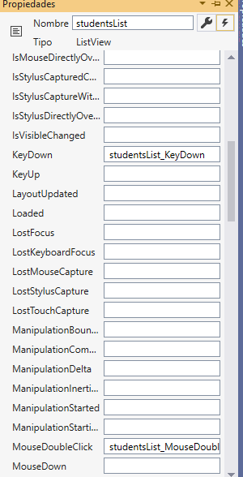


```c# 
        private void studentsList_KeyDown(object sender, KeyEventArgs e)
        {
            // TODO: Exercise 1: Task 1a: If the user pressed Enter, edit the details for the currently selected student
            // TODO: Exercise 1: Task 2a: Use the StudentsForm to display and edit the details of the student
            // TODO: Exercise 1: Task 2b: Set the title of the form and populate the fields on the form with the details of the student
            // TODO: Exercise 1: Task 3a: Display the form
            // TODO: Exercise 1: Task 3b: When the user closes the form, copy the details back to the student
            // TODO: Exercise 1: Task 3c: Enable saving (changes are not made permanent until they are written back to the database)

            switch (e.Key)
            {
                case Key.Enter:
                    Student student = this.studentsList.SelectedItem as Student;
                    StudentForm sf = new StudentForm();
                    sf.Title = "Edit Student Details";
                    sf.firstName.Text = student.FirstName;
                    sf.lastName.Text = student.LastName;
                    sf.dateOfBirth.Text = student.DateOfBirth.ToString("d");

                    if (sf.ShowDialog().Value)
                    {
                        student.FirstName = sf.firstName.Text;
                        student.LastName = sf.lastName.Text;
                        student.DateOfBirth = DateTime.ParseExact(sf.dateOfBirth.Text, "MM/dd/yyyy", CultureInfo.InvariantCulture);
                        saveChanges.IsEnabled = true;
                    }
                        break;
            }
          }
````
Ejecución
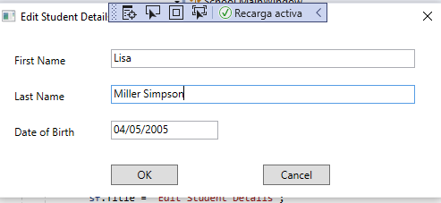
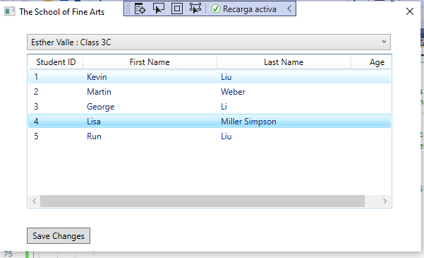

Depuración
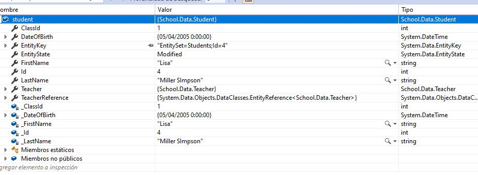


Ejercicio 2: implementación de la funcionalidad de inserción para la lista de estudiantes


Se trata de añadir un nuevo estudiante cuando el usuario pulsa INSERT sobre la lista de estudiantes
Habrá que asociarlo al teahcer


´´´´ c#
 // TODO: Exercise 2: Task 1a: If the user pressed Insert, add a new student
                // TODO: Exercise 2: Task 2a: Use the StudentsForm to get the details of the student from the user
                // TODO: Exercise 2: Task 2b: Set the title of the form to indicate which class the student will be added to (the class for the currently selected teacher)
                // TODO: Exercise 2: Task 3a: Display the form and get the details of the new student
                // TODO: Exercise 2: Task 3b: When the user closes the form, retrieve the details of the student from the form and use them to create a new Student object
                // TODO: Exercise 2: Task 4a: Assign the new student to the current teacher
                // TODO: Exercise 2: Task 4b: Add the student to the list displayed on the form
                // TODO: Exercise 2: Task 4c: Enable saving (changes are not made permanent until they are written back to the database)

                case Key.Insert:
                    sf = new StudentForm
                    {
                        Title = "New Student for Class " + teacher.Class
                    };
                    if (sf.ShowDialog().Value)
                    {
                        Student newStudent = new Student();
                        newStudent.FirstName = sf.firstName.Text;
                        newStudent.LastName = sf.lastName.Text;
                        newStudent.DateOfBirth = DateTime.ParseExact(sf.dateOfBirth.Text, "MM/dd/yyyy", CultureInfo.InvariantCulture);

                        this.teacher.Students.Add(newStudent);
                        this.studentsInfo.Add(newStudent);
                        saveChanges.IsEnabled = true;

                    }

                        break;
´´´´

Ejecución

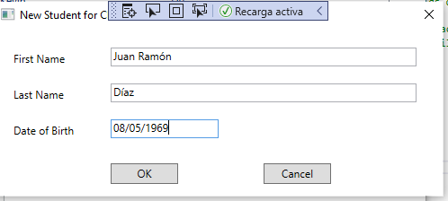
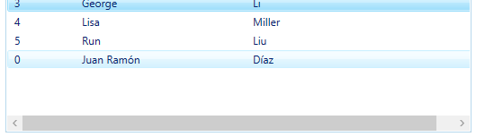


Ejercicio 3: implementación de la funcionalidad de eliminación para la lista de estudiantes

Ahora vamos a eliminar el estudiante cuando hagamos keydown Supr 
debera confirmar la eliminación

````c#
// TODO: Exercise 3: Task 1a: If the user pressed Delete, remove the currently selected student
// TODO: Exercise 3: Task 2a: Prompt the user to confirm that the student should be removed
// TODO: Exercise 3: Task 3a: If the user clicked Yes, remove the student from the database
// TODO: Exercise 3: Task 3b: Enable saving (changes are not made permanent until they are written back to the database)

case Key.Delete:

    student = this.studentsList.SelectedItem as Student;
    MessageBoxResult response = MessageBox.Show(
                string.Format("Remove {0}", student.FirstName + " " + student.LastName),
                "Confirm",
                MessageBoxButton.YesNo,
                MessageBoxImage.Question,
                MessageBoxResult.No);
    if (response == MessageBoxResult.Yes)
    {
        //this.schoolContext.Students.DeleteObject(student);
        this.teacher.Students.Remove(student);
        this.studentsInfo.Remove(student);
    }
    break;
````

Ejecución

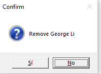
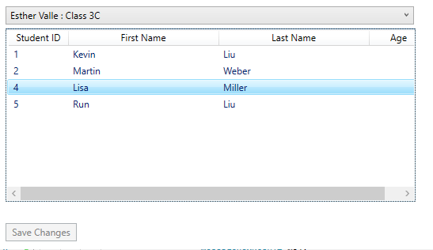


Ejercicio 4: Visualización de la edad de un estudiante


 ```` c#

    [ValueConversion(typeof(string), typeof(Decimal))]
    class AgeConverter : IValueConverter
    {
        public object Convert(object value, Type targetType, object parameter,
                              System.Globalization.CultureInfo culture)
        {
            // Convert the date of birth provided in the value parameter and convert to the age of the student in years
            // TODO: Exercise 4: Task 2a: Check that the value provided is not null. If it is, return an empty string
            // TODO: Exercise 4: Task 2b: Convert the value provided into a DateTime value
            // TODO: Exercise 4: Task 2c: Work out the difference between the current date and the value provided
            // TODO: Exercise 4: Task 2d: Convert this result into a number of years
            // TODO: Exercise 4: Task 2e: Convert the number of years into a string and return it

            if (value != null)
            {
                DateTime studentDateOfBirth = (DateTime)value;
                TimeSpan difference = DateTime.Now.Subtract(studentDateOfBirth);
                int ageInYears = (int)(difference.Days / 365.25);
                return ageInYears.ToString();
            }
            else
            {
                return "";
            }
        }

````

Ejecucion

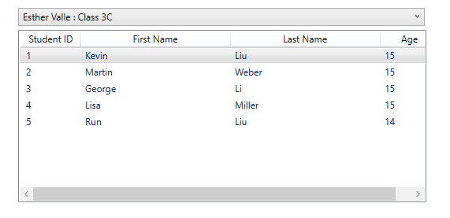


notas:


en App.xaml tenemos la propiedad StartupUri="MainWindow.xaml" para saber cual es el fichero inicial