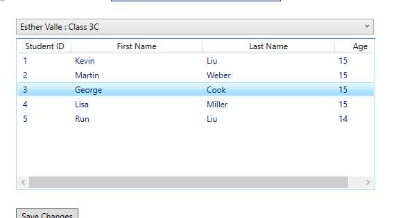
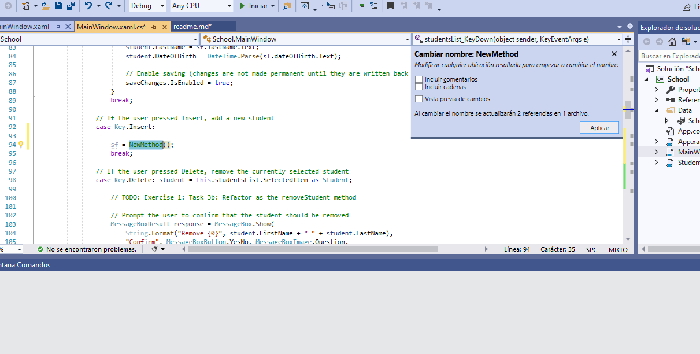
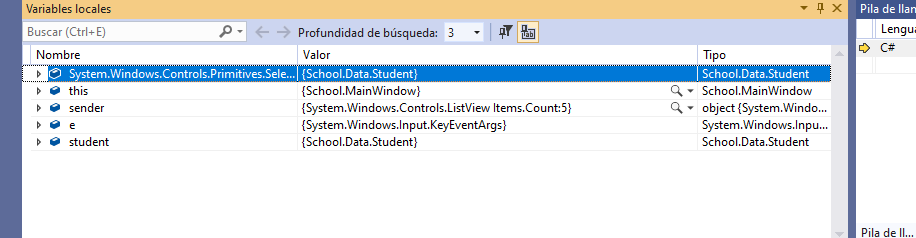
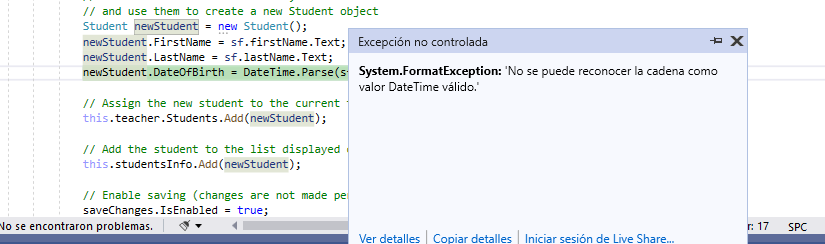
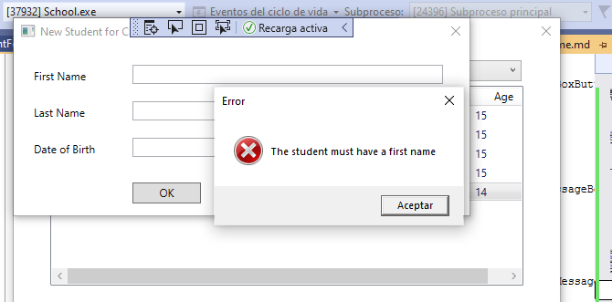
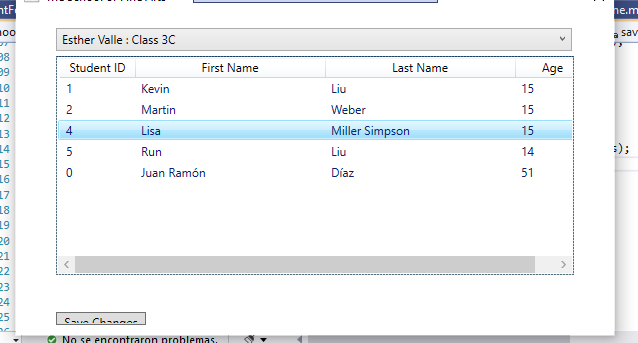
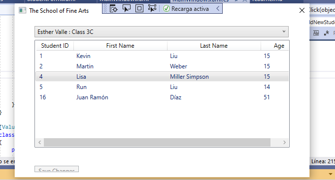
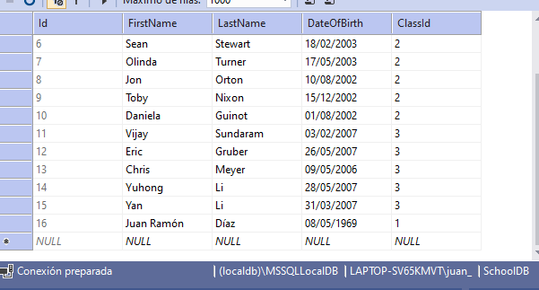

## Módulo 2: Creación de métodos, manejo de excepciones y aplicaciones de monitoreo
#### Laboratorio: Ampliación de la funcionalidad de la aplicación de inscripción a clases

##### Ejercicio 1: Refactorización del código de inscripción

hacer que StudentsList_MouseDoubleClick ejecute el código edit


```c#

  // TODO: Exercise 1: Task 1b: If the user double-clicks a student, edit the details for that student
        private void studentsList_MouseDoubleClick(object sender, MouseButtonEventArgs e)
        {


            // TODO: Exercise 1: Task 1a: Copy code for editing the details for that student
            Student student = this.studentsList.SelectedItem as Student;

            // TODO: Exercise 1: Task 3d: Refactor as the EditStudent method

            // Use the StudentsForm to display and edit the details of the student
            StudentForm sf = new StudentForm();

            // Set the title of the form and populate the fields on the form with the details of the student           
            sf.Title = "Edit Student Details";
            sf.firstName.Text = student.FirstName;
            sf.lastName.Text = student.LastName;
            sf.dateOfBirth.Text = student.DateOfBirth.ToString("d"); // Format the date to omit the time element

            // Display the form
            if (sf.ShowDialog().Value)
            {
                // When the user closes the form, copy the details back to the student
                student.FirstName = sf.firstName.Text;
                student.LastName = sf.lastName.Text;
                student.DateOfBirth = DateTime.Parse(sf.dateOfBirth.Text);

                // Enable saving (changes are not made permanent until they are written back to the database)
                saveChanges.IsEnabled = true;
            }

        }
````




Refactorizar como tarea del método AddNewStudent , DeleteStuden y Editstudent.




Tras las sicesivas refactorizaciones 
```c#
.........
 private void studentsList_KeyDown(object sender, KeyEventArgs e)
        {
            Student student;
            switch (e.Key)
            {
              
                case Key.Enter:
                    student = this.studentsList.SelectedItem as Student;
                    EditStudent(student);
                    break;
                case Key.Insert:

                    AddNewStudent();
                    break;
                case Key.Delete:
                    student = this.studentsList.SelectedItem as Student;
                    DeleteStudent(student);
                    break;
            }
        }

        private void studentsList_MouseDoubleClick(object sender, MouseButtonEventArgs e)
        {

            Student student = this.studentsList.SelectedItem as Student;
            EditStudent(student);
        }
........


        private void EditStudent(Student student)
        {
            StudentForm sf = new StudentForm();

            // Set the title of the form and populate the fields on the form with the details of the student           
            sf.Title = "Edit Student Details";
            sf.firstName.Text = student.FirstName;
            sf.lastName.Text = student.LastName;
            sf.dateOfBirth.Text = student.DateOfBirth.ToString("d"); // Format the date to omit the time element

            // Display the form
            if (sf.ShowDialog().Value)
            {
                // When the user closes the form, copy the details back to the student
                student.FirstName = sf.firstName.Text;
                student.LastName = sf.lastName.Text;
                student.DateOfBirth = DateTime.Parse(sf.dateOfBirth.Text);

                // Enable saving (changes are not made permanent until they are written back to the database)
                saveChanges.IsEnabled = true;
            }

            
        }

        private void  DeleteStudent(Student student)
        {
         

            // TODO: Exercise 1: Task 3b: Refactor as the removeStudent method

            // Prompt the user to confirm that the student should be removed
            MessageBoxResult response = MessageBox.Show(
                String.Format("Remove {0}", student.FirstName + " " + student.LastName),
                "Confirm", MessageBoxButton.YesNo, MessageBoxImage.Question,
                MessageBoxResult.No);

            // If the user clicked Yes, remove the student from the database
            if (response == MessageBoxResult.Yes)
            {
                this.schoolContext.Students.DeleteObject(student);

                // Enable saving (changes are not made permanent until they are written back to the database)
                saveChanges.IsEnabled = true;
            }


        }

        private void  AddNewStudent()
        {
            // TODO: Exercise 1: Task 3a: Refactor as the addNewStudent method

            // Use the StudentsForm to get the details of the student from the user
            StudentForm sf = new StudentForm();

            // Set the title of the form to indicate which class the student will be added to (the class for the currently selected teacher)
            sf.Title = "New Student for Class " + teacher.Class;

            // Display the form and get the details of the new student
            if (sf.ShowDialog().Value)
            {
                // When the user closes the form, retrieve the details of the student from the form
                // and use them to create a new Student object
                Student newStudent = new Student();
                newStudent.FirstName = sf.firstName.Text;
                newStudent.LastName = sf.lastName.Text;
                newStudent.DateOfBirth = DateTime.Parse(sf.dateOfBirth.Text);

                // Assign the new student to the current teacher
                this.teacher.Students.Add(newStudent);

                // Add the student to the list displayed on the form
                this.studentsInfo.Add(newStudent);

                // Enable saving (changes are not made permanent until they are written back to the database)
                saveChanges.IsEnabled = true;
            }
        }

````


Probar que la aplicación funciona y depuracion

examen de ventana locales y pila de llamadas





#### Ejercicio 2: Validación de la información del estudiante

Probamos a insertar un estudainte vacio




añadimos las validaciones correspondiente

````c#
 private void ok_Click(object sender, RoutedEventArgs e)
        {
            // Indicate that the data is valid

            if (String.IsNullOrEmpty(this.firstName.Text))
            {
                MessageBox.Show("The student must have a first name", "Error", MessageBoxButton.OK, MessageBoxImage.Error);
                return;
            }
            if (String.IsNullOrEmpty(this.lastName.Text))
            {
                MessageBox.Show("The student must have a last name", "Error", MessageBoxButton.OK, MessageBoxImage.Error);
                return;
            }

            DateTime result;

            if (!DateTime.TryParse(this.dateOfBirth.Text, out result))
            {
                MessageBox.Show("The date of birth must be a valid date", "Error", MessageBoxButton.OK, MessageBoxImage.Error);
                return;
            }
            TimeSpan age = DateTime.Now.Subtract(result);

            if (age.Days / 365.25 < 5)
            {
                MessageBox.Show("The student must be at least 5 years old", "Error", MessageBoxButton.OK, MessageBoxImage.Error);
                return;
            }

            this.DialogResult = true;
        }
````





##### Ejercicio 3: guardar cambios en la lista de clases


En la pagina Mainwindow.xaml.cs añadimos los using
```c#
using System.Data;
using System.Data.Objects;
````

Àctuaizamos el boton savechanges con un savedatos dentro de un try catch
```c#

  try
            {
                // Save the changes
                this.schoolContext.SaveChanges();

                // Disable the Save button (it will be enabled if the user makes more changes)
                saveChanges.IsEnabled = false;
            }
            catch (OptimisticConcurrencyException)
            {
                // If the user has changed the same students earlier, then overwrite their changes with the new data
                this.schoolContext.Refresh(RefreshMode.StoreWins, schoolContext.Students);
                this.schoolContext.SaveChanges();
            }
            catch (UpdateException uEx)
            {
                // If some sort of database exception has occurred, then display the reason for the exception and rollback

                MessageBox.Show(uEx.InnerException.Message, "Error saving changes");
                this.schoolContext.Refresh(RefreshMode.StoreWins, schoolContext.Students);
            }

            catch (Exception ex)
            {
                // If some other exception occurs, report it to the user
                MessageBox.Show(ex.Message, "Error saving changes");
                this.schoolContext.Refresh(RefreshMode.ClientWins, schoolContext.Students);
            }


````









