## LAB03


Verficamos qu tenemos las siguientes Vistas

. LgonPage.xaml

. StudentProfile.xaml

. StudentsPage.xaml

2. LogonSucess event and dummy code for the Logon Click

declaracion del manaejador del evento

            public event EventHandler LogonSuccess;
disparar el evento

             if (LogonSuccess != null)
            {
                LogonSuccess(this, null);
            }

```c#
 #region Event Members
        // TODO: Exercise 1: Task 2a: Define the LogonSuccess event handler
        public event EventHandler LogonSuccess;
        #endregion

        #region Logon Validation

        // TODO: Exercise 1: Task 2b: Implement the Logon_Click event handler for the Logon button
        // Simulate logging on (no validation or authentication performed yet)

        private void Logon_Click(object sender, RoutedEventArgs e)
        {
            // Save the username and role (type of user) specified on the form in the   global context
            SessionContext.UserName = username.Text;
            SessionContext.UserRole = (bool)userrole.IsChecked ? Role.Teacher : Role.Student;

            // If the role is Student, set the CurrentStudent property in the global    context to a dummy student; Eric Gruber
            if (SessionContext.UserRole == Role.Student)
            {
                SessionContext.CurrentStudent = "Eric Gruber";
            }

            // Raise the LogonSuccess event
            if (LogonSuccess != null)
            {
                LogonSuccess(this, null);
            }
        }

        #endregion
````

Asociar el el click del boton al disparador evento

````html
<Button Grid.Row="3" Grid.ColumnSpan="2" VerticalAlignment="Center" HorizontalAlignment="Center" Content="Log on" FontSize="24" Click="Logon_Click" />
````

Por último programar la navegacion:

```c#
public MainWindow()
        {
            InitializeComponent();
            GotoLogon();
        }
````
````c#
 // Handle successful logon
 private void Logon_Success(object sender, EventArgs e)
 {
     // Update the display and show the data for the logged on user
     logonPage.Visibility = Visibility.Collapsed;
     gridLoggedIn.Visibility = Visibility.Visible;
     Refresh();
 }
````
````c#
  private void Refresh()
        {
            switch (SessionContext.UserRole)
            {
                case Role.Student:
                    // Display the student name in the banner at the top of the page
                    txtName.Text = string.Format("Welcome {0}", SessionContext.UserName);

                    // Display the details for the current student
                    GotoStudentProfile();
                    break;

                case Role.Teacher:
                    // Display the teacher name in the banner at the top of the page
                    txtName.Text = string.Format("Welcome {0}", SessionContext.UserName);

                    // Display the list of students for the teacher
                    GotoStudentsPage();
                    break;
            }
        }
````
````c#
 // TODO: Exercise 1: Task 4c: Display the list of students
        private void GotoStudentsPage()
        {
            // Hide the view for a single student (if it is visible)
            studentProfile.Visibility = Visibility.Collapsed;

            // Display the list of students
            studentsPage.Visibility = Visibility.Visible;
            studentsPage.Refresh()
        }

        // TODO: Exercise 1: Task 4b: Display the details for a single student
        public void GotoStudentProfile()
        {
            // Hide the list of students
            studentsPage.Visibility = Visibility.Collapsed;

            // Display the view for a single student
            studentProfile.Visibility = Visibility.Visible;
            studentProfile.Refresh();

        }
````

````html
<!-- TODO: Exercise 1: Task 3c: Catch the LogonSuccess event and call the Logon_Success event handler (to be created)-->
                <y:LogonPage x:Name="logonPage" LogonSuccess="Logon_Success" Visibility="Collapsed" />

````
Con esto la navegacion ya estaría

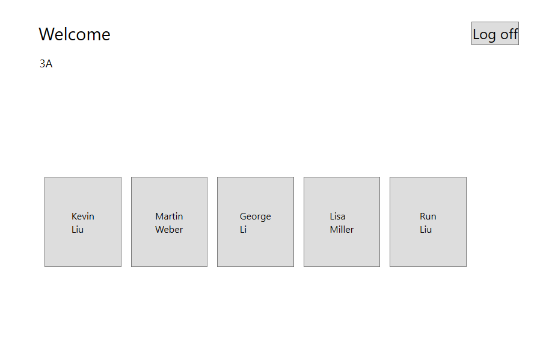
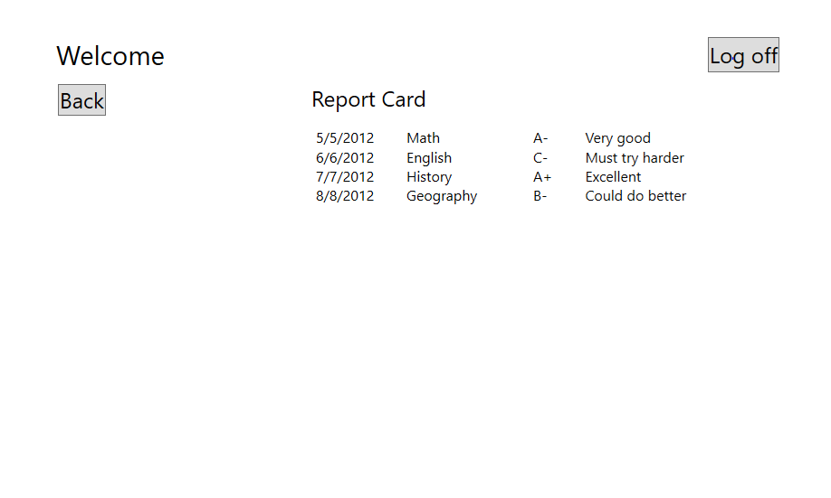
Pero hy que terminar el código para poder acceder a las notas del estudiante desde la vista de student profile
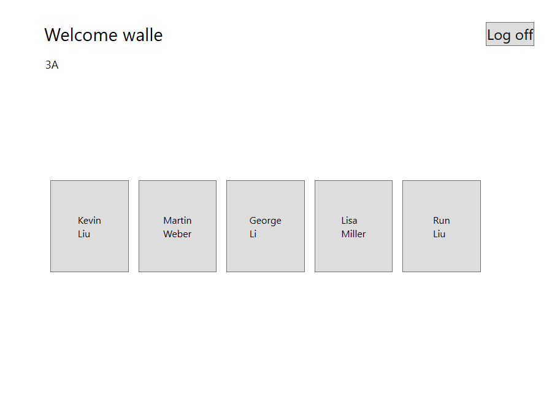
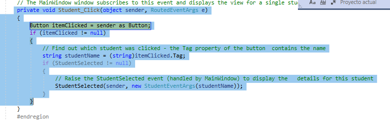
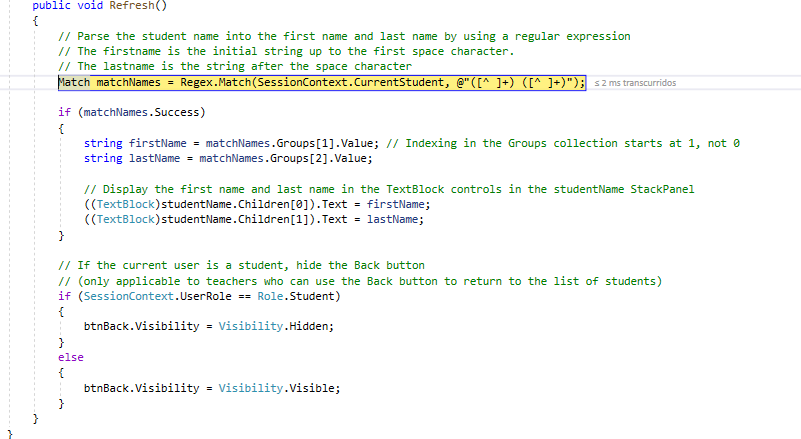
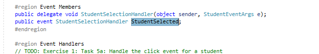
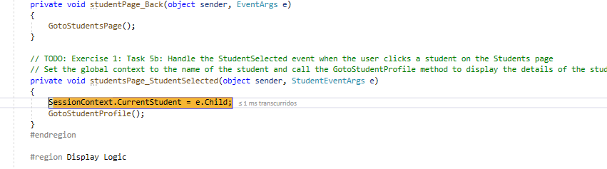


````html
<y:StudentsPage x:Name="studentsPage" StudentSelected="studentsPage_StudentSelected" Visibility="Collapsed" />
````

Comprobacion final
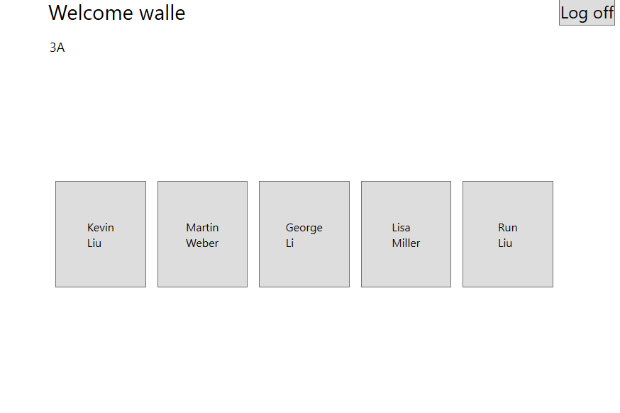
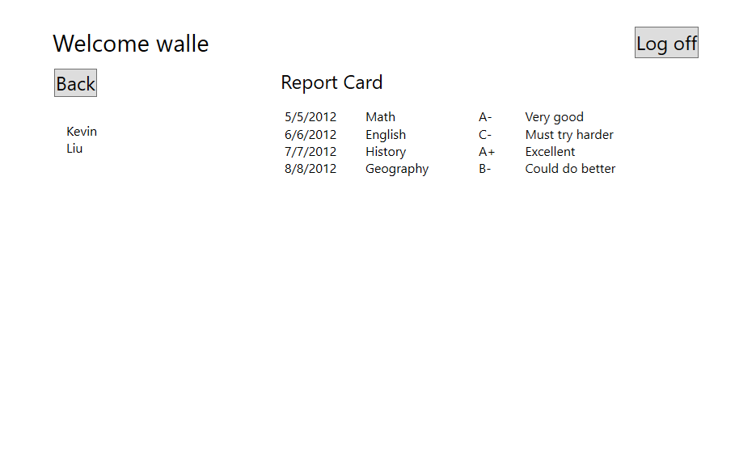


### Exercise 2: Creating Data Types to Store User and Grade Information
1. Creacción de las structs Grade, Teacher, Student
2. Verificar class DataSource y su método CreateData

````c#
 public struct Grade
    {
        public int StudentID { get; set; }
        public string AssessmentDate { get; set; }
        public string SubjectName { get; set; }
        public string Assessment { get; set; }
        public string Comments { get; set; }
    }

    public struct Student
    {
        public int StudentID { get; set; }
        public string UserName { get; set; }
        public string Password { get; set; }
        public int TeacherID { get; set; }
        public string FirstName { get; set; }
        public string LastName { get; set; }
    }

    public struct Teacher
    {
        public int TeacherID { get; set; }
        public string UserName { get; set; }
        public string Password { get; set; }
        public string FirstName { get; set; }
        public string LastName { get; set; }
        public string Class { get; set; }
    }
````


#### Exercise 3: Displaying User and Grade Information

````
   <y:LogonPage x:Name="logonPage" LogonSuccess="Logon_Success" LogonFailed="Logon_Failed" Visibility="Collapsed" />
````
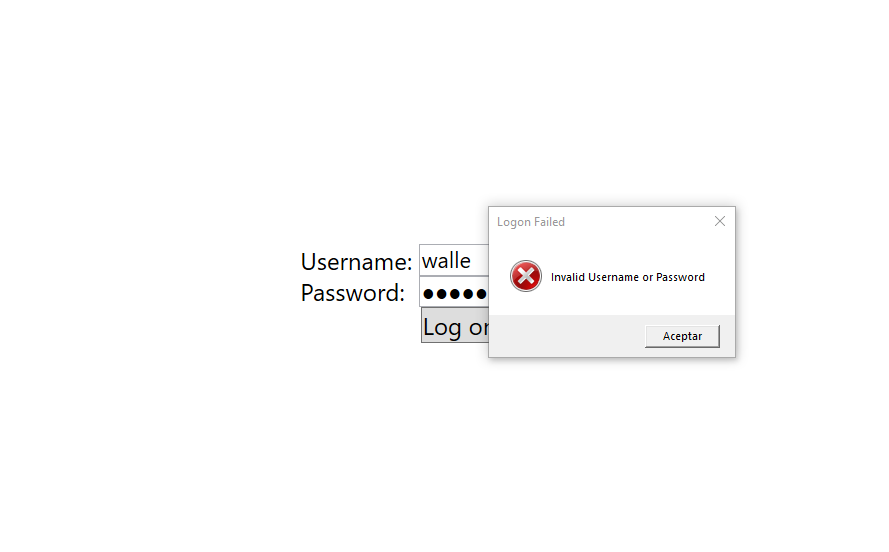
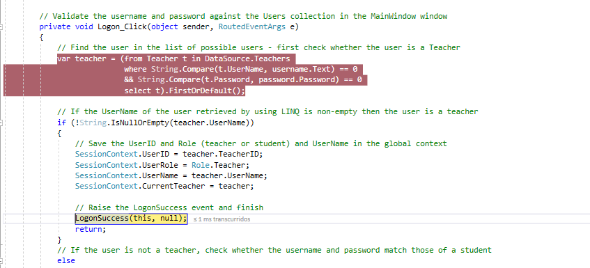
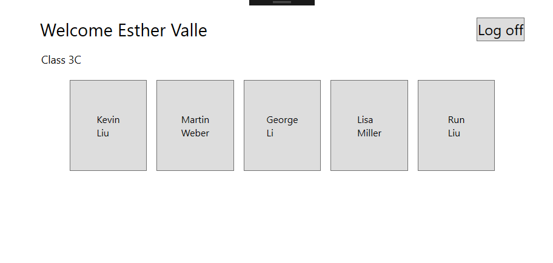
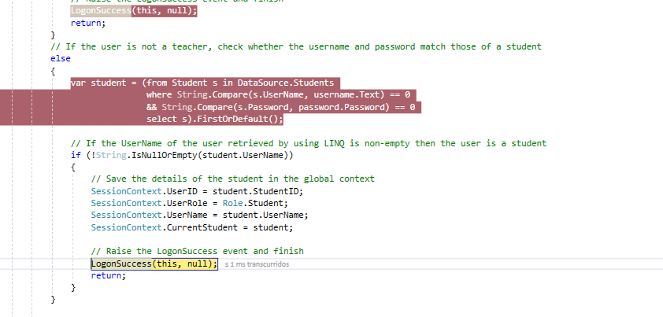
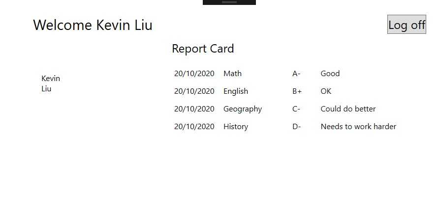
 