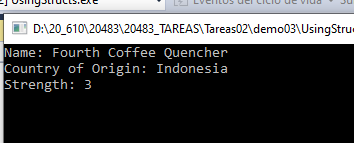
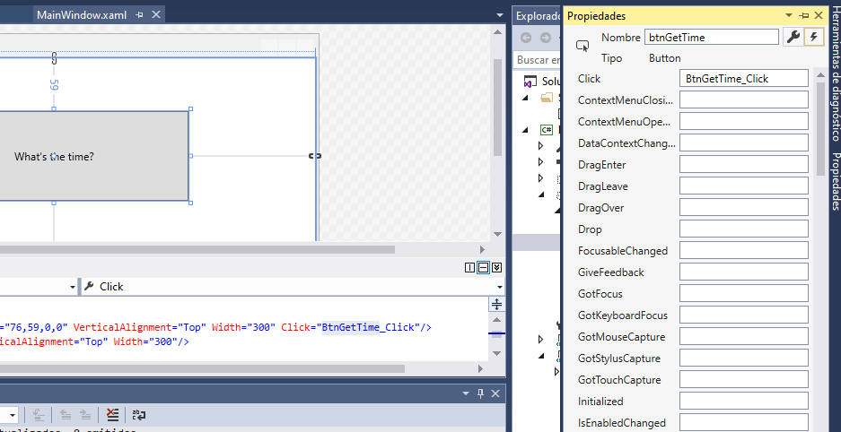
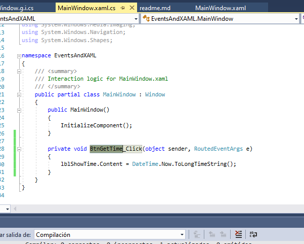
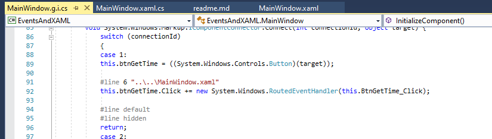

## Module 3: Developing the Code for a Graphical Application

### Lección 1 : STRUCTURES Y ENUM

`Defnición de una estructura y propiedades
````c#
struct Coffee
 {
     public string Name { get; set; }
     public string Bean { get; set; }
     public string CountryOfOrigin { get; set; }
     public int Strength { get; set; }
 }
````
Uso de una structura
````c#
Coffee coffee1 = new Coffee();
 coffee1.Name = "Fourth Coffee Quencher";
 coffee1.CountryOfOrigin = "Indonesia";
 coffee1.Strength = 3;

 Console.WriteLine("Name: {0}", coffee1.Name);
 Console.WriteLine("Country of Origin: {0}",coffee1.CountryOfOrigin);
 Console.WriteLine("Strength: {0}", coffee1.Strength);
 Console.ReadLine();
 ````



### Lección 3: Manejo de eventos

Demonstration: Working with Events in XAML

Se trata de asociar al evento click del botón un metodo
es similar a los WINDOWS FORMS






