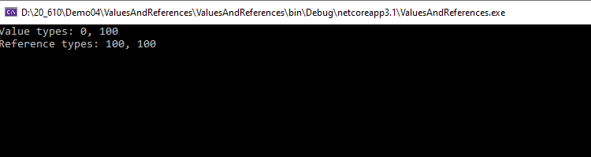

## Modulo 4
#### Demo1 Lesson 1: Creating Classes

1. crear nueva aplicación de consula
2. crear una clase y una estuctura
3. Acceder a su repsectivo campo , asignarle valor e imprimirlo por consola
```c#
struct MyStruct
 {
    public int Contents;
 }

  class MyClass
 {
    public int Contents = 0;
 }

 class Program
    {
        static void Main(string[] args)
        {
            MyStruct struct1 = new MyStruct();
            MyStruct struct2 = struct1;
            struct2.Contents = 100;

            MyClass class1 = new MyClass();
            MyClass class2 = class1;
            class2.Contents = 100;

            Console.WriteLine($"Value types: {struct1.Contents}, {struct2.Contents}");
            Console.WriteLine($"Reference types: {class1.Contents}, {class2.Contents}");
            Console.ReadLine();
        }
    }
````




#### Demo2 Lección 3: Implementación de colecciones de tipo seguro

###### Demostración Laboraorio solución 4
