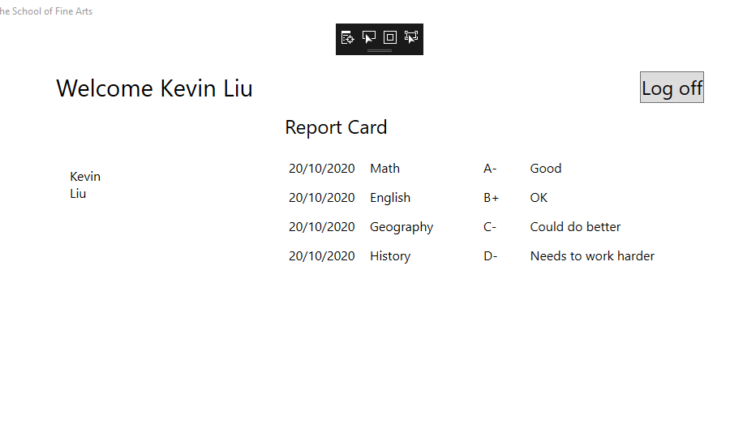
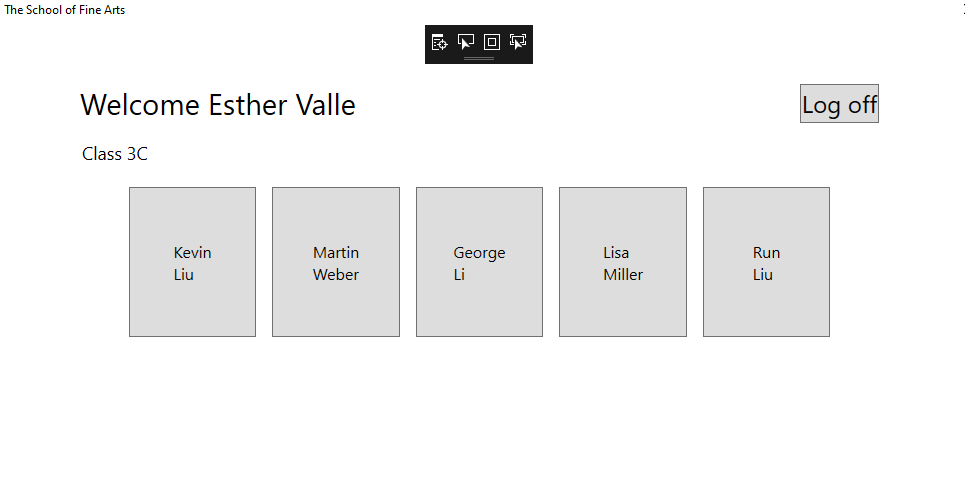
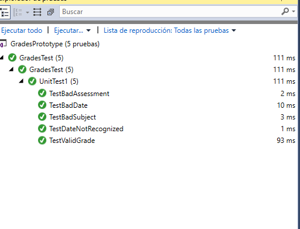
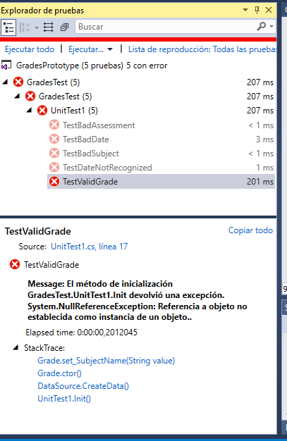

### Laboratorio04


### Ejercicio 1: Implementación de las estructuras de profesor, alumno y grado como clases

1. Tarea 1: convertir la estructura Grades en una clase
 ```c#
 public struct Grade
    {
        public int StudentID { get; set; }
        public string AssessmentDate { get; set; }
        public string SubjectName { get; set; }
        public string Assessment { get; set; }
        public string Comments { get; set; }
    }
````

Refactorizo

Tarea 1: convertir la estructura Grades en una clase

```c#
 public class Grade
    {
        public int StudentID { get; set; }
        public string AssessmentDate { get; set; }
        public string SubjectName { get; set; }
        public string Assessment { get; set; }
        public string Comments { get; set; }

        public Grade(int studentID, string assessmentDate, string subject, string
        assessment, string comments)
        {
            StudentID = studentID;
            AssessmentDate = assessmentDate;
            SubjectName = subject;
            Assessment = assessment;
            Comments = comments;
        }

        // Default constructor
        public Grade()
        {
            StudentID = 0;
            AssessmentDate = DateTime.Now.ToString("d");
            SubjectName = "Math";
            Assessment = "A";
            Comments = String.Empty;
        }

    }
````
Task 2: Convert the Students and Teachers structs into classes


refactorizamos Strudent
```c#
 public class Student
    {
        public int StudentID { get; set; }
        public string UserName { get; set; }
        private string _password; //password solo lectura
        public string Password
        {
            set
            {
                _password = value;
            }
        }
        public int TeacherID { get; set; }
        public string FirstName { get; set; }
        public string LastName { get; set; }

        public Student(int StudentID, string UserName, string Password, int TeacherID, string FirstName, string LastName)
        {
            this.StudentID = StudentID;
            this.UserName = UserName;
            this.Password = Password;
            this.TeacherID = TeacherID;
            this.FirstName = FirstName;
            this.LastName = LastName;
         }

        public Student()
        {
            this.StudentID = 0;
            this.UserName = String.Empty;
            this.Password = String.Empty;
            this.TeacherID = 0;
            this.FirstName =  String.Empty;
            this.Password = String.Empty;
            this.LastName = String.Empty;
        }
        public bool Verificarpassword(string pass)
        {
            return (String.Compare(pass, _password) == 0); // String compare para verificar si las dos cadenas son iguales
        }

    }
```` 
y por ultimo refeactorizo Teachers

nota: private string _password = Guid.NewGuid().ToString(); // Generate a random password by default tambien en student 
```c#
 public class Teacher
    {
         

        public int TeacherID { get; set; }
        public string UserName { get; set; }
        private string _password = Guid.NewGuid().ToString(); // Generate a random password by default
        public string Password {
            set
            {
                _password = value;
            }
        }
        public string FirstName { get; set; }
        public string LastName { get; set; }
        public string Class { get; set; }

        public bool Verificarpassword(string pass)
        {
            return (String.Compare(pass, _password) == 0); // String compare para verificar si las dos cadenas son iguales
        }

        public Teacher(int teacherID, string userName, string password, string firstName, string lastName, string className)
        {
            TeacherID = teacherID;
            UserName = userName;
            Password = password;
            FirstName = firstName;
            LastName = lastName;
            Class = className;
        }

        // Default constructor
        public Teacher()
        {
            TeacherID = 0;
            UserName = String.Empty;
            Password = String.Empty;
            FirstName = String.Empty;
            LastName = String.Empty;
            Class = String.Empty;
        }

    }
```


Task 3: Use the VerifyPassword method to verify the password when a user logs in

En LogonPage.xaml.cs observa que Logon_Click da error porque teacher.password no es accesible de lectura pero tenemos
el metodo Verificarpassword

```c#

 var teacher = (from Teacher t in DataSource.Teachers
                           where string.Compare(t.UserName, username.Text) == 0
                           && String.Compare(t.Password, password.Password) == 0
                           select t).FirstOrDefault();

var teacher = (from Teacher t in DataSource.Teachers
                           where string.Compare(t.UserName, username.Text) == 0
                           && t.Verificarpassword(password.Password)
                           select t).FirstOrDefault();
 ````

 Como nos piden que verifiquemos que el teacher no es null le añadimos a la condición existente
```c#
             // TODO: Exercise 1: Task 3b: Check whether teacher is null before examining the UserName property
            if ( teacher != null && !String.IsNullOrEmpty(teacher.UserName))

            ///if (!String.IsNullOrEmpty(teacher.UserName))
 ````

 y hacemos lo mismo con el Student

 por último compilamos y verificamos que los login sigan funcionado


 
 


### Ejercicio 2: adición de validación de datos a la clase de calificación


Me creo la lista de tareas añadiendolo a la class DataSource y a su metodo CreateData

```` c#
// Collections holding the data used by the prototype application
        public static ArrayList Teachers;
        public static ArrayList Students;
        public static ArrayList Grades;
        public static List<string> Subjects;

Subjects = new List<string>() { "Math", "English", "History", "Geography",  "Science" };
````

Task 2: Add validation logic to the Grade class to check the data entered by the user

```c#
public class Grade
    {
        public int StudentID { get; set; }
        public string AssessmentDate { get; set; }
        public string SubjectName { get; set; }
        public string Assessment { get; set; }
        public string Comments { get; set; }
````

AssessmentDate : 
	Verifique que el usuario haya proporcionado una fecha válida.

	Compruebe que la fecha no sea posterior a la fecha actual. Si es así, lanza una excepción ArgumentOutOfRangeException .

	Si la fecha es válida, guárdela en el formato apropiado.

	Si la fecha no tiene un formato válido, lanza una excepción ArgumentException .

```c#
 private string _assessmentDate;

        public string AssessmentDate
        {
            get
            {
                return _assessmentDate;
            }
            set
            {
                DateTime assessmentDate;
				//utilizo el tryparse
				// compruebo que no sea mayor que la actual
				// si ok grabo
                if (DateTime.TryParse(value, out assessmentDate))
                {
                    // Check that the date is no later than the current date
                    if (assessmentDate > DateTime.Now)
                    {
                        // Throw an ArgumentOutOfRangeException if the date is after the current date
                        throw new ArgumentOutOfRangeException("AssessmentDate", "Assessment date must be on or before the current date");
                    }

                    // If the date is valid, then save it in the appropriate format
                    _assessmentDate = assessmentDate.ToString("d");
                }
                else
                {
                    // If the date is not in a valid format then throw an ArgumentException
                    throw new ArgumentException("AssessmentDate", "Assessment date is not recognized");
                }
            }
```` 

Tambien validamos Subject:
	Compruebe que el tema especificado está en la lista que ha definido.

	Si el asunto es válido, almacene el nombre del asunto.  /// DataSource.Subjects.Contains(value)

	Si el asunto no es válido, lanza una excepción ArgumentException .
```c#
   private string _subjectName;
        public string SubjectName { get

            { return _subjectName; }
            set
            {
                // Check that the specified subject is valid
                if (DataSource.Subjects.Contains(value))
                {
                    // If the subject is valid store the subject name
                    _subjectName = value;
                }
                else
                {
                    // If the subject is not valid then throw an ArgumentException
                    throw new ArgumentException("SubjectName", "Subject is not recognized");
                }
            }
         }
```` 
Por último verificar que la evaluación cumple Match matchGrade = Regex.Match(value, @"[A-E][+-]?$");


```c#
 private string _assessment;
        public string Assessment
        {
            get
            {
                return _assessment;
            }

            set
            {
                // Verify that the grade is in the range A+ to E-
                // Use a regular expression: a single character in the range A-E at the start of the string followed by an optional + or – at the end of the string
                Match matchGrade = Regex.Match(value, @"[A-E][+-]?$");

                if (matchGrade.Success)
                {
                    _assessment = value;
                }
                else
                {
                    // If the grade is not valid then throw an ArgumentOutOfRangeException
                    throw new ArgumentOutOfRangeException("Assessment", "Assessment grade must be in the range of A+ to E-");
                }
            }
		}
```` 

Tarea 3: agregar una prueba unitaria para verificar que las validaciones definidas para la clase de grado funcionan como se esperaba






Exercise 3: Displaying Students in Name Order

1. Implementar la interfaz IComparable <Student> para permitir la comparación de estudiantes

````c#
public class Student : IComparable<Student>
    {
        #region propiedades
        #endregion
        #region constructor
        #endregion

        #region metodos

        public int CompareTo(Student other)
        {
            // Concatenate the LastName and FirstName of this student
            string thisStudentsFullName = LastName + FirstName;

            // Concatenate the LastName and FirstName of the "other" student
            string otherStudentsFullName = other.LastName + other.FirstName;

            // Use String.Compare to compare the concatenated names and return the result
            return (String.Compare(thisStudentsFullName, otherStudentsFullName));
        }

        #endregion

    }
`````
2.  Change the Students ArrayList collection into a List<Student> collection, y sort antes de utilizarla por primera vez

`````c#
 public static List<Student> Students;
  Students = new List<Student>()


     public MainWindow()
        {
            InitializeComponent();
            DataSource.CreateData();
            DataSource.Students.Sort();
            GotoLogon();
        }
````


### Exercise 4: Enabling Teachers to Modify Class and Grade Data


