## Module 5: Creating a Class Hierarchy by Using Inheritance

### Lesson 1: Creating Class Hierarchies


##### Demonstration: Calling Base Class Constructors


Revisión de la clase Beverage .

```` c#

public class Beverage
{
    public string Name { get; set; }
    public bool IsFairTrade { get; set; }

    protected int servingTemperature;

    public Beverage()  // Construcción predeterminado
    {
        IsFairTrade = false;
        servingTemperature = 175;
        Name = "Not known";
    }
    public Beverage(string name, bool isFairTrade, int servingTemp) // constructor alternativo
    {
        this.Name = name;
        this.IsFairTrade = isFairTrade;
        this.servingTemperature = servingTemp;
    }
    public virtual int GetServingTemperature()
    {
        return servingTemperature;
    }
}
````

Revisión de la clase Coffee 

```` c#
 class Coffee : Beverage // hereda de Beverage
    {
        public string Bean { get; set; }
        public string Roast { get; set; }
        public string CountryOfOrigin { get; set; }

        public Coffee()
        {
            Bean = "Not known";
            Roast = "Medium";
            CountryOfOrigin = "Not known";
        }

        public Coffee(string name, bool isFairTrade, int servingTemp, string bean, string roast, string countryOfOrigin)
            : base(name, isFairTrade, servingTemp)
        {
            Bean = bean;
            Roast = roast;
            CountryOfOrigin = countryOfOrigin;
        }                                   //    : base(name, isFairTrade, servingTemp) llama al constructor de Beverage 
    }
````

ejecución del programa

coffe = new Coffee() llama al constructor por defecto de su clase base  
nota: primero ejectuta el constructor de la clase base    
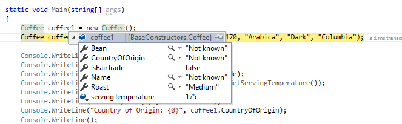

 Coffee coffee2 = new Coffee("Fourth Espresso", true, 170, "Arabica", "Dark", "Columbia");   
Coffee(string name, bool isFairTrade, int servingTemp, string bean, string roast, string countryOfOrigin)
            : base(name, isFairTrade, servingTemp) llama al constructor alternativo de la clase base   
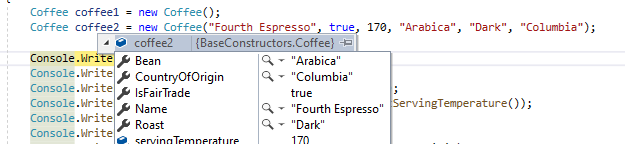


### Lesson 2: Extending .NET Framework Classes


##### Demonstration: Refactoring Common Functionality into the User Class Lab


Revisión de la clase abstracta User   
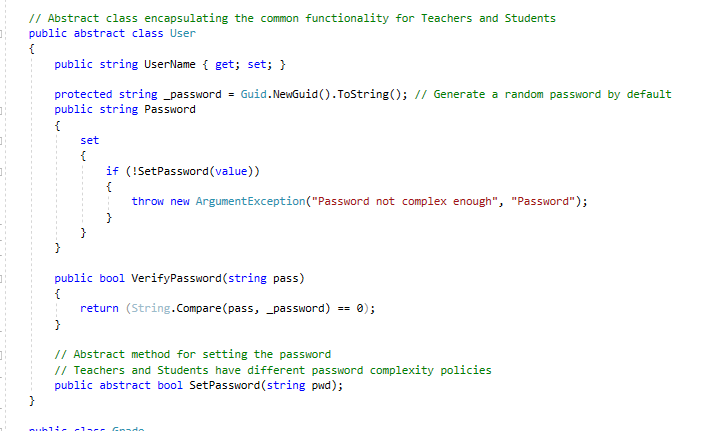


Revisión de la clase Student wue hereda de User  
 Observa el override de SetPassword
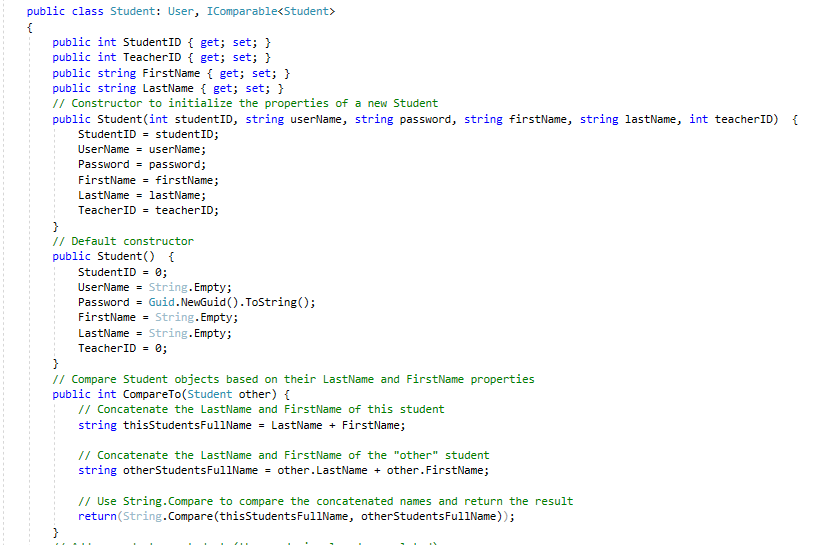
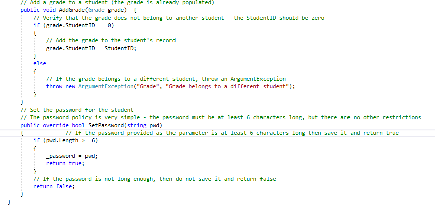
 
 
 
 Revisión de la clase ClassFullException   
 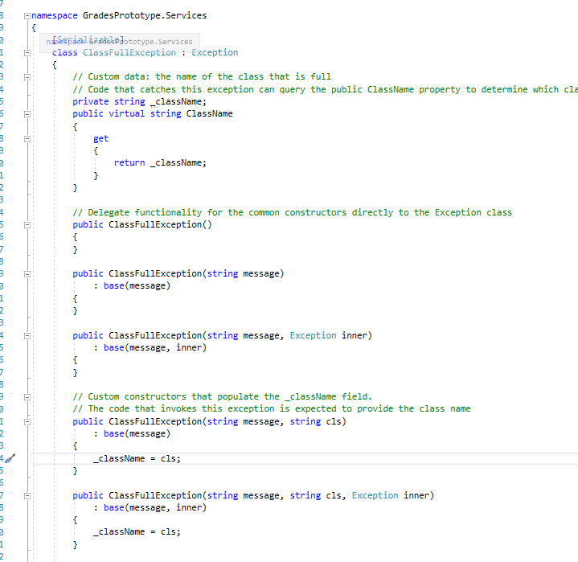   
 
  Revisión de la clase Teacher
  
 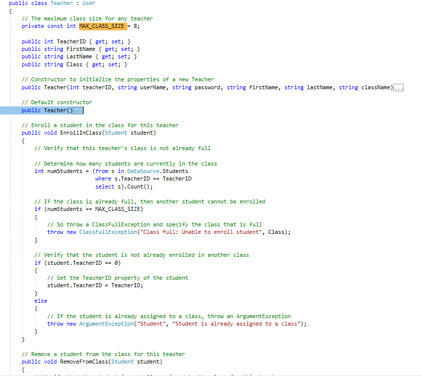  
 
 
 Ejecución del programa 
 
  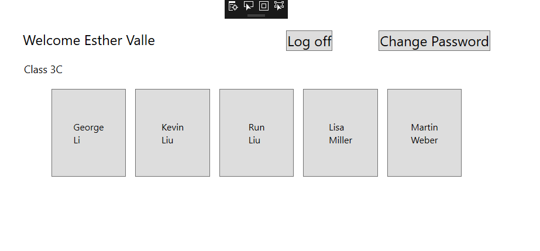    

  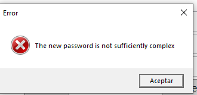  

  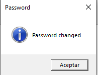  

  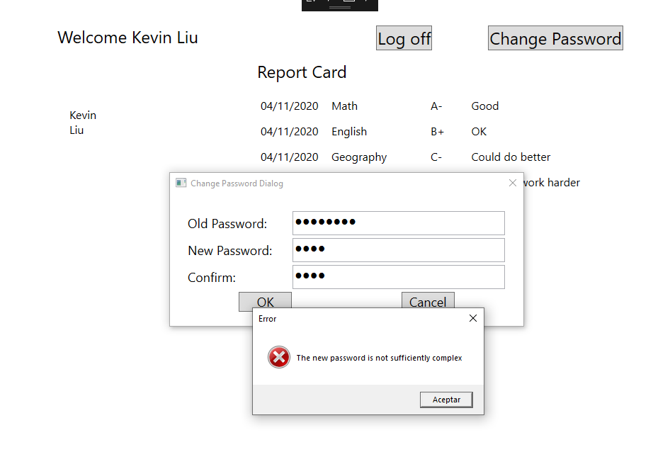  

 
 
 


