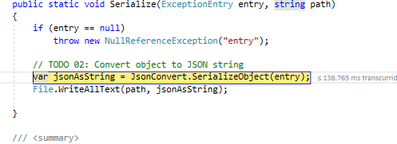
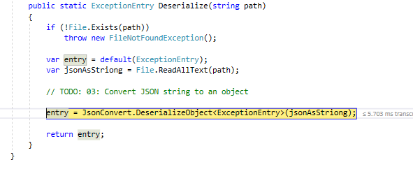
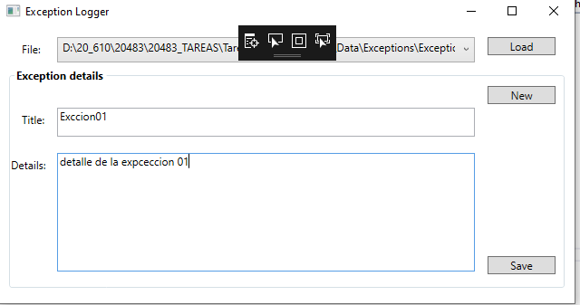
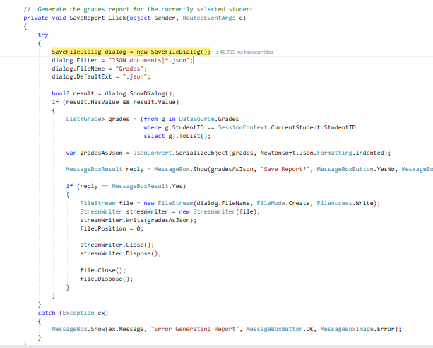
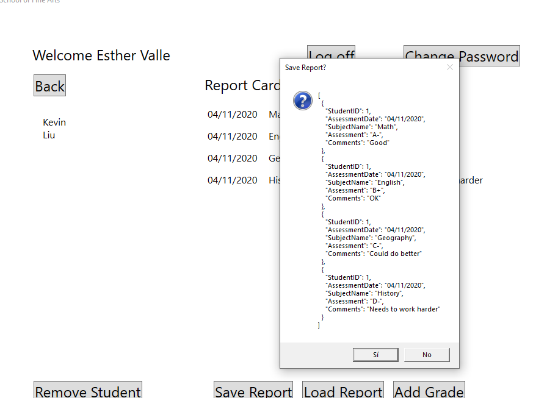
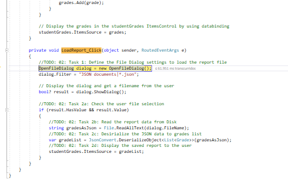

### Módulo 6: Lectura y escritura de datos locales

##### Lección 1: Lectura y escritura de archivos

###### Demostración: manipulación de archivos, directorios y rutas
	 
Navegue a [Repository Root] \ Allfiles \ Mod06 \ Democode \ Starter \ FourthCoffee.LogProcessor y luego abra el archivo FourthCoffee.LogProcessor.sln .


1.- Comprobacion si existe el directorios (bool Directory.Exists())

```c#
using System.IO;

public LogLocator(string logDirectoryRoot)
{
	// TODO: 01: Ensure log file directory exists.
	if (!Directory.Exists(logDirectoryRoot))   
		throw new DirectoryNotFoundException();

	this._logDirectoryPath = logDirectoryRoot;
}
````

2.- retornar una coleccion de archivos (*.txt solo en el directorio) (IEnumerable<string> Directory.GetFiles)


````
/// <summary>
/// Returns a collection of log file paths for a given directory.
/// </summary>
public IEnumerable<string> GetLogFilePaths()
{
 // TODO: 02: Get all log file paths.
	return Directory.GetFiles(this._logDirectoryPath,"*.txt", SearchOption.TopDirectoryOnly);

}
````

3.- Eliminacion de un archivo (bool File.Exists()  / File.Delete() )

````
// TODO: 03: Check for existing combined log file and delete if it already exists.
if (File.Exists(combinedLogPath))
	File.Delete(combinedLogPath);
````	


4.- Añadadir lineas de texto a un archivo  File.AppendAllLines(fichero, list<string>) 
````
var heading = new List<string>();
heading.Add("########################################");
heading.Add("######### Combined Log File ############");
heading.Add("########################################");

// TODO: 04: Write the heading to the combined log file.
File.AppendAllLines(combinedLogPath, heading);
````

5.- obtener el nombre del fichero sin extensión Path.GetFileNameWithoutExtension(logPath)

````
 // TODO: 05: Get the log file name without the file extension.  
````
var logName = Path.GetFileNameWithoutExtension(logPath)
´´´´		


6.-  leer el contenido de un fichero de texto (en una variable string) ( File.ReadAllText(logPath))

````
// TODO: 06: Read the contents of the existing log file.
		var logText = File.ReadAllText(logPath);

		if (string.IsNullOrEmpty(logText))
		{
			logText = "No entries";
		}
````
`
7.- Agregar contenido al fichero  File.AppendAllLines(fichero, list<string>) 

````
		var logContent = new List<string>();
		logContent.Add("");
		logContent.Add(string.Format("######### [{0}]", logName));
		logContent.Add(logText);
		logContent.Add("");

		// TODO: 07: Write the log file contents to the combined log file.
		File.AppendAllLines(combinedLogPath, logContent);
````
	
8.-  TODO 09: Replace [Repository Root] with your folder path Para probar la aplicación


````
        static void Main(string[] args)
        {
        //TODO 09: Replace [Repository Root] with your folder path 
        

            var logLocator = new LogLocator(@"D:\3- 20483\Allfiles\Mod06\Democode\Data\Logs\");
            var logCombiner = new LogCombiner(logLocator);

            logCombiner.CombineLogs(@"D:\20_610\20483\20483_TAREAS\Tareas03\06Democode\Data\LogsCombinedLog.txt");
````

#####  Lesson 2: Serializing and Deserializing Data

###### Demostración: Serializing Objects as JSON using JSON.Net

1.- Agregar con Nuget Newtonsoft.Json e incluir el espacion de nombres  using Newtonsoft.Json;
2.- Incluir el código de Serialización  
3.- Incluir el código de Deserializar  


nota: debemos modificar el app.config
<add key="rootPath" value="D:\20_610\20483\20483_TAREAS\Tareas03\06Democode\Data\Exceptions" />


  
  
  


#####  Lección 3: Realización de E / S mediante secuencias  

###### Demostración: Generación del laboratorio de informes de calificaciones


  

  

  


