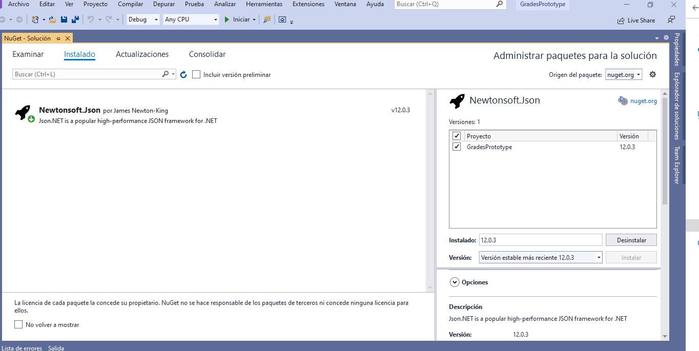
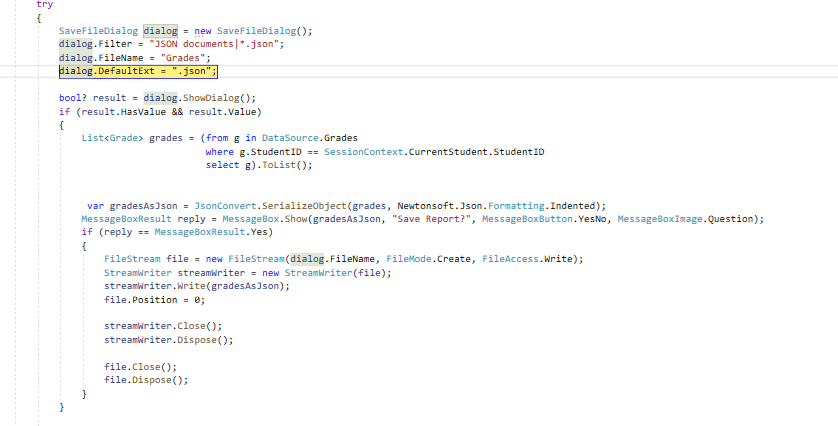
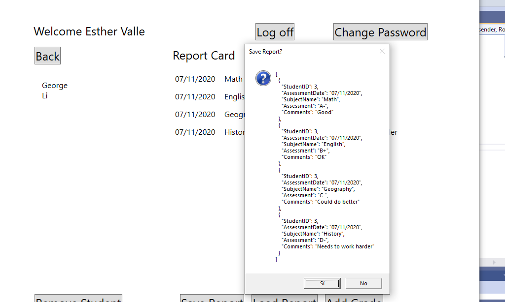
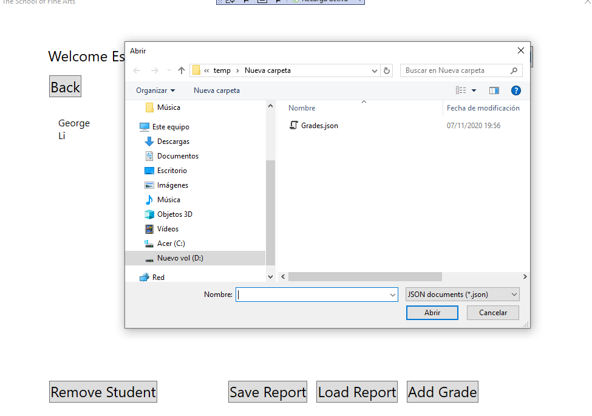
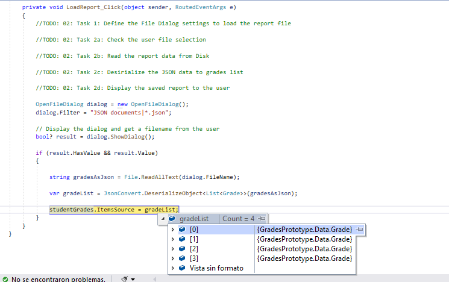

### Módulo 6: Lectura y escritura de datos locales

### Laboratorio: Generación y carga del informe de calificacione

#### Ejercicio 1: serializar datos para el informe de calificaciones como JSON

Agergamos Newton.Json desde nuget



deserializamos las notas y las guardamos a un fichero

```


        private void AddGrade_Click(object sender, RoutedEventArgs e)
        {
            // If the user is not a teacher, do nothing (the button should not appear anyway)
            if (SessionContext.UserRole != Role.Teacher)
            {
                return;
            }

            try
            {
                // Use the GradeDialog to get the details of the assessment grade
                GradeDialog gd = new GradeDialog();

                // Display the form and get the details of the new grade
                if (gd.ShowDialog().Value)
                {
                    // When the user closes the form, retrieve the details of the assessment grade from the form
                    // and use them to create a new Grade object
                    Grade newGrade = new Grade();
                    newGrade.AssessmentDate = gd.assessmentDate.SelectedDate.Value.ToString("d");
                    newGrade.SubjectName = gd.subject.SelectedValue.ToString();
                    newGrade.Assessment = gd.assessmentGrade.Text;
                    newGrade.Comments = gd.comments.Text;

                    // Save the grade to the list of grades
                    DataSource.Grades.Add(newGrade);

                    // Add the grade to the current student
                    SessionContext.CurrentStudent.AddGrade(newGrade);

                    // Refresh the display so that the new grade appears
                    Refresh();
                }
            }
            catch (Exception ex)
            {
                MessageBox.Show(ex.Message, "Error adding assessment grade", MessageBoxButton.OK, MessageBoxImage.Error);
            }
        }

        //  Generate the grades report for the currently selected student
        // TODO: Exercise 1: Task 1b: Store the return value from the SaveFileDialog in a nullable Boolean variable.
        // TODO: Exercise 1: Task 1c: Get the grades for the currently selected student.
        // TODO: Exercise 1: Task 2: Serialize the grades to a JSON.
        //TODO: Exercise 1: Task 3a: Modify the message box and ask the user whether they wish to save the report
        //TODO: Exercise 1: Task 3b: Check if the user what to save the report or not
        //TODO: Exercise 1: Task 3c: Save the data to the file by using FileStream
        //TODO: Exercise 1: Task 3d: Release all the stream resources
        private void SaveReport_Click(object sender, RoutedEventArgs e)
        {
            try
            {
                SaveFileDialog dialog = new SaveFileDialog();
                dialog.Filter = "JSON documents|*.json";
                dialog.FileName = "Grades";
                dialog.DefaultExt = ".json";

                bool? result = dialog.ShowDialog();
                if (result.HasValue && result.Value)
                {
                    List<Grade> grades = (from g in DataSource.Grades
                                          where g.StudentID == SessionContext.CurrentStudent.StudentID
                                          select g).ToList();

              
                     var gradesAsJson = JsonConvert.SerializeObject(grades, Newtonsoft.Json.Formatting.Indented);
                    MessageBoxResult reply = MessageBox.Show(gradesAsJson, "Save Report?", MessageBoxButton.YesNo, MessageBoxImage.Question);
                    if (reply == MessageBoxResult.Yes)
                    {
                        FileStream file = new FileStream(dialog.FileName, FileMode.Create, FileAccess.Write);
                        StreamWriter streamWriter = new StreamWriter(file);
                        streamWriter.Write(gradesAsJson);
                        file.Position = 0;

                        streamWriter.Close();
                        streamWriter.Dispose();

                        file.Close();
                        file.Dispose();
                    }
                }
              

            }
            catch (Exception ex)
            {
                MessageBox.Show(ex.Message, "Error Generating Report", MessageBoxButton.OK, MessageBoxImage.Error);
            }
        }
````

    



#### Ejercicio 2: deserializar datos del informe JSON al objeto de calificaciones

bueno ahora se trata de desrializar el fichero guardadado

```
   private void LoadReport_Click(object sender, RoutedEventArgs e)
        {
            //TODO: 02: Task 1: Define the File Dialog settings to load the report file

            //TODO: 02: Task 2a: Check the user file selection

            //TODO: 02: Task 2b: Read the report data from Disk

            //TODO: 02: Task 2c: Desirialize the JSON data to grades list

            //TODO: 02: Task 2d: Display the saved report to the user

            OpenFileDialog dialog = new OpenFileDialog();
            dialog.Filter = "JSON documents|*.json";

            // Display the dialog and get a filename from the user
            bool? result = dialog.ShowDialog();

            if (result.HasValue && result.Value)
            {

                string gradesAsJson = File.ReadAllText(dialog.FileName);

                var gradeList = JsonConvert.DeserializeObject<List<Grade>>(gradesAsJson);

                studentGrades.ItemsSource = gradeList;
            }
        }
````

    



