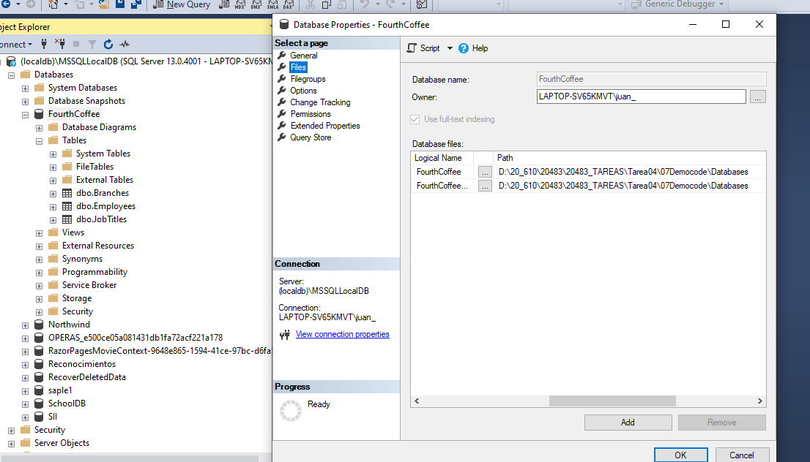
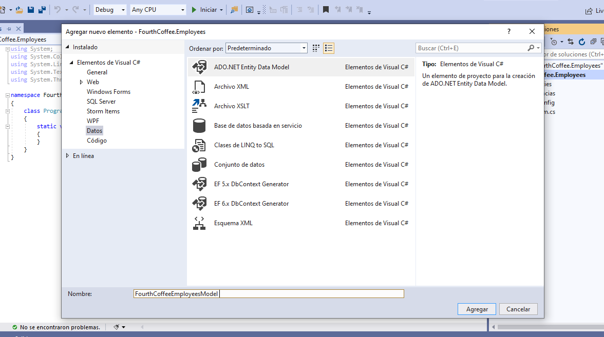
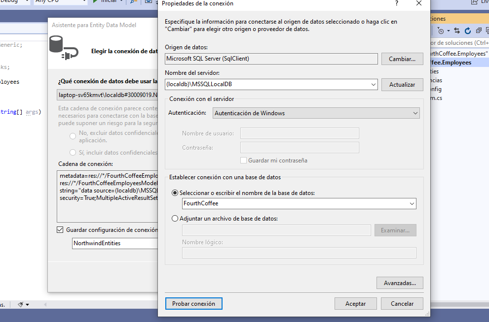
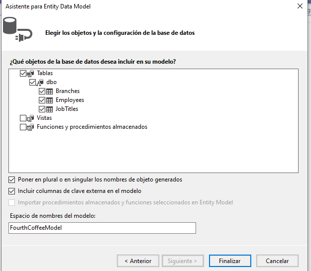
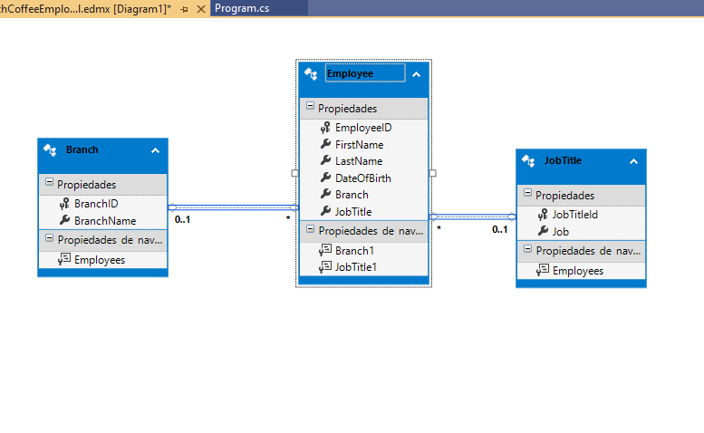
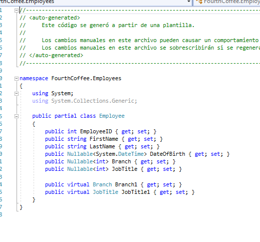
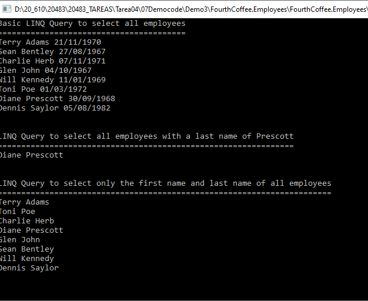
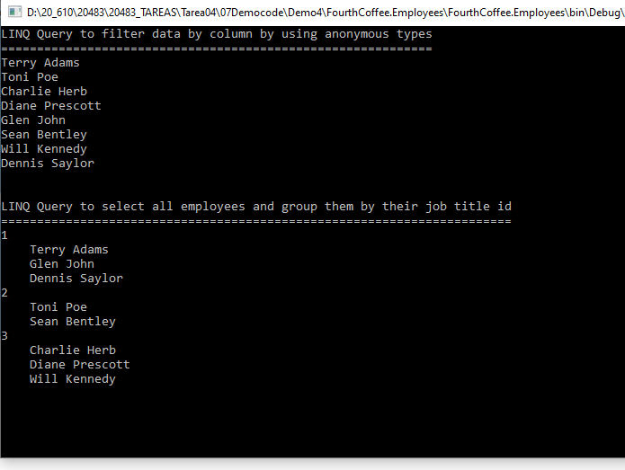
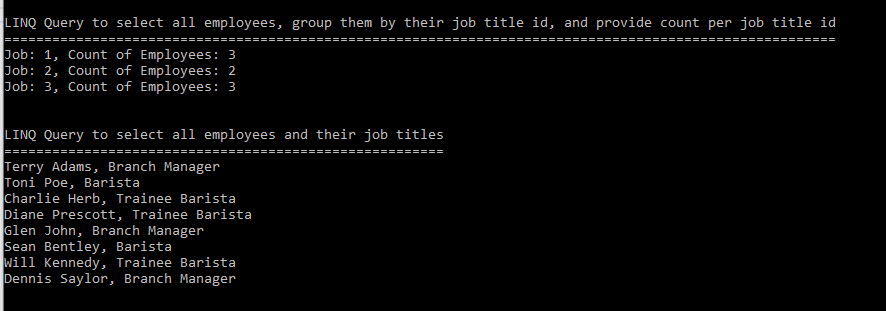

# Module 7: Accessing a Database  

##  Lesson 1: Creating and Using Entity Data Models

#### Demonstration: Creating an Entity Data Model


Crea la base de datos

  

crea el modelo de datos EFF a partir de la base de datos

  

  

  

  

anota que es un clase parcial

  

#### Demonstration: Reading and Modifying Data in an EDM

(Practica del laboratorio)


##  Lección 2: Consultar datos mediante LINQ

####  Demostración: consulta de dato

Revisa los linq codes de cada metodo

seleccion básica todos los empleados order by e.LastName

````c#
   private static void QueryingData()
        {
            IQueryable<Employee> emps = from e in DBContext.Employees
                                        orderby e.LastName
                                        select e;

            Console.WriteLine("Basic LINQ Query to select all employees");
            Console.WriteLine("========================================");
            foreach (var emp in emps)
            {
                Console.WriteLine("{0} {1} {2}", emp.FirstName, emp.LastName, DateTime.Parse(emp.DateOfBirth.ToString()).ToShortDateString());
            }
            Console.WriteLine();
            Console.ReadLine();
        }
````
seleccion where e.LastName == _LastName

````c#
        private static void FilteringDataByRow()
        {
            string _LastName = "Prescott";
            IQueryable<Employee> emps = (from e in DBContext.Employees
                                         where e.LastName == _LastName
                                         select e);

            Console.WriteLine("LINQ Query to select all employees with a last name of Prescott");
            Console.WriteLine("===============================================================");
            foreach (var emp in emps)
            {
                Console.WriteLine("{0} {1}", emp.FirstName, emp.LastName);
            }
            Console.WriteLine();
            Console.ReadLine();
        }
````

select de todos los empleados pero hceindo un "cast" a la clase FullName

````c#
        private class FullName
        {
            public string Forename { get; set; }
            public string Surname { get; set; }
        }

        private static void FilteringDataByColumn()
        {
            IQueryable<FullName> names = from e in DBContext.Employees
                                         select new FullName { Forename = e.FirstName, Surname = e.LastName };

            Console.WriteLine("LINQ Query to select only the first name and last name of all employees");
            Console.WriteLine("=======================================================================");

            foreach (var name in names)
            {
                Console.WriteLine("{0} {1}", name.Forename, name.Surname);
            }
            Console.WriteLine();
            Console.ReadLine();
        }
    }
````
  

####  Demostración: consulta de datos mediante tipos anónimos


Revision de los métodos


select similar al anterior pero lo vuelco en un tipo anonimo
````c#

static FourthCoffeeEntities DBContext = new FourthCoffeeEntities();

        static void Main(string[] args)
        {
            UsingAnonymousTypes();
            GroupingData();
            AggregatingData();
            NavigatingData();
        }

        private static void UsingAnonymousTypes()
        {
            var emps = from e in DBContext.Employees
                       select new { e.FirstName, e.LastName };

            Console.WriteLine("LINQ Query to filter data by column by using anonymous types");
            Console.WriteLine("============================================================");

            foreach (var emp in emps)
            {
                Console.WriteLine("{0} {1}", emp.FirstName, emp.LastName);
            }
            Console.WriteLine();
            Console.ReadLine();
        }
````
group by con anonimo

````c#
        private static void GroupingData()
        {
            var emps = from e in DBContext.Employees
                       group e by e.JobTitle into eGroup
                       select new { Job = eGroup.Key, Names = eGroup };

            Console.WriteLine("LINQ Query to select all employees and group them by their job title id");
            Console.WriteLine("=======================================================================");

            foreach (var emp in emps)
            {
                Console.WriteLine(emp.Job);
                foreach (var name in emp.Names)
                {
                    Console.WriteLine("    {0} {1}", name.FirstName, name.LastName);
                }
            }
            Console.WriteLine();
            Console.ReadLine();
        }

````
group by con count

````c#
		
        private static void AggregatingData()
        {
            var jobs = from e in DBContext.Employees
                       group e by e.JobTitle into eGroup
                       select new { Job = eGroup.Key, CountOfEmployees = eGroup.Count() };

            Console.WriteLine("LINQ Query to select all employees, group them by their job title id, and provide count per job title id");
            Console.WriteLine("========================================================================================================");

            foreach (var job in jobs)
            {
                Console.WriteLine("Job: {0}, Count of Employees: {1}", job.Job, job.CountOfEmployees);
            }
            Console.WriteLine();
            Console.ReadLine();
        }
````
navegation ??

````c#  
  
        private static void NavigatingData()
        {
            var emps = from e in DBContext.Employees
                       select new
                       {
                           FirstName = e.FirstName,
                           LastName = e.LastName,
                           Job = e.JobTitle1.Job
                       };

            Console.WriteLine("LINQ Query to select all employees and their job titles");
            Console.WriteLine("=======================================================");
            foreach (var emp in emps)
            {
                Console.WriteLine("{0} {1}, {2}", emp.FirstName, emp.LastName, emp.Job);
            }
            Console.WriteLine();
            Console.ReadLine();
        }
    }
	
````

 

   
	
 
	
####  Demostración: Laboratorio de recuperación y modificación de datos de calificaciones

(Practica del laboratorio)
	
	
    
