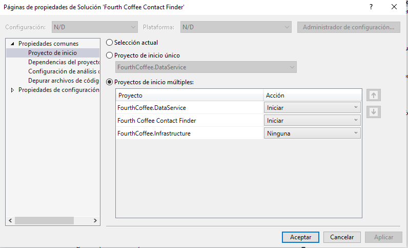
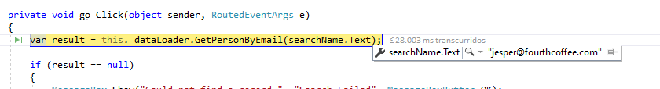
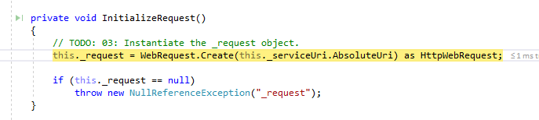
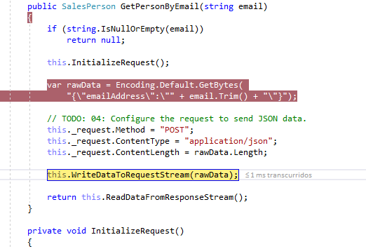
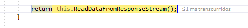
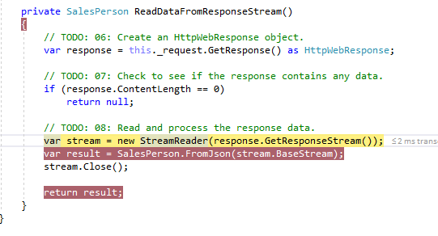
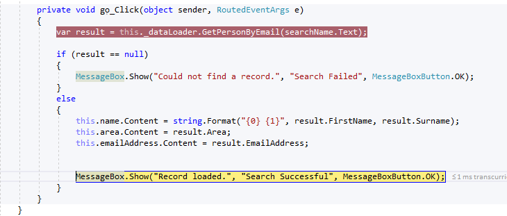

## Módulo 8: Acceso a datos remotos

#### Lección 1: Acceso a datos en la Web


Se trata de acceder a uns servicio web que se haya en la misma solución
por ello habrá que ejecutar los dos proyectos


1. Datacontract esta implementado en FourthCoffee.Infrastructure 
SalesPerson y metodo para Serializar jsonstring a SalesPerrson

````c#
using System.IO;
using System.Runtime.Serialization;
using System.Runtime.Serialization.Json;

namespace FourthCoffee.DataService.Infrastructure
{
    [DataContract()]
    public class SalesPerson
    {
        [DataMember()]
        public string FirstName { get; set; }

        [DataMember()]
        public string Surname { get; set; }

        [DataMember()]
        public string Area { get; set; }

        [DataMember()]
        public string EmailAddress { get; set; }

        public static SalesPerson FromJson(Stream json)
        {
            var jsonSerializer = new DataContractJsonSerializer(typeof(SalesPerson));

            return jsonSerializer.ReadObject(json) as SalesPerson;
        }
    }
}
````


2. el dataServicie expone la funcion SalesPerson GetSalesPerson(string emailAddress);
a traves de POST 
    }
```` 
[ServiceContract]
    public interface ISalesService
    {
        [OperationContract]
        [WebInvoke(
            Method = "POST",
            ResponseFormat = WebMessageFormat.Json,
            BodyStyle = WebMessageBodyStyle.WrappedRequest)]
        SalesPerson GetSalesPerson(string emailAddress);
    }
````
Esta función retorna de una lista Queryable<SalesPerson> el FirstOrDefault where emailAddress = s.EmailAddress`
```` 
 return this.GetSalesPeople()
                .Where(s => s.EmailAddress.Equals(emailAddress, StringComparison.OrdinalIgnoreCase))
                .FirstOrDefault();
```` 


3. Una vez estudiado el DataService veamos el cliente

la estrutura de un webRequest / webResponse  

3.1.- using System.Net;  
3.2.- HttpWebRequest _request =  WebRequest.Create(this._serviceUri.AbsoluteUri) as HttpWebRequest; en InitializeRequest();  
3.3.- Enviar la petición  
      /* vamos a mandar el email como bytes */
	  var rawData = Encoding.Default.GetBytes("{\"emailAddress\":\"" + email.Trim() + "\"}");

      this._request.Method = "POST";  
      this._request.ContentType = "application/json";  
      this._request.ContentLength = rawData.Length;  
	  this.WriteDataToRequestStream(rawData);  
			var dataStream = this._request.GetRequestStream();  
            dataStream.Write(data, 0, data.Length);  
            dataStream.Close();  
            
3.4 Leer la respuesta  
	private SalesPerson ReadDataFromResponseStream()  
        {
            // TODO: 06: Create an HttpWebResponse object.
            var response = this._request.GetResponse() as HttpWebResponse;

            // TODO: 07: Check to see if the response contains any data.
            if (response.ContentLength == 0)
                return null;

            // TODO: 08: Read and process the response data.
            var stream = new StreamReader(response.GetResponseStream());
            var result = SalesPerson.FromJson(stream.BaseStream);
            stream.Close();

            return result;
        }
4.- Procesar la respuesta en el Xmal

 private void go_Click(object sender, RoutedEventArgs e)
        {
            var result = this._dataLoader.GetPersonByEmail(searchName.Text);

            if (result == null)
            {
                MessageBox.Show("Could not find a record.", "Search Failed", MessageBoxButton.OK);
            }
            else
            {
                this.name.Content = string.Format("{0} {1}", result.FirstName, result.Surname);
                this.area.Content = result.Area;
                this.emailAddress.Content = result.EmailAddress;


                MessageBox.Show("Record loaded.", "Search Successful", MessageBoxButton.OK);
            }

			
			La uri se la pasamos en MainWindow() al constructor de SalesDataLoader
```` 
        public MainWindow()
        {
            InitializeComponent();
            this._dataLoader = new SalesDataLoader(
                new Uri("http://localhost:8090/SalesService.svc/GetSalesPerson"));
        }
````


**Ejecutamos la DEMO**

Ejecutamos el DataServer y el cliente   

   

Al Cargar la vista cargamos la uri del servidor en el objeto SalesDataLoader

 

Al hacer click en el botón llamamos al metodo para leer del dataService

  

Creamos el HttpWebRequest
 
   

Configuramos el HttpWebRequest 

 

  
LLamamos a leer la respuesta
  
   

Creamos el HttpWebResponse y leemos la respuesta

 

Procesamos la respuesta
  
   


## Módulo 8: Acceso a datos remotos

#### Lección 2: Acceso a datos mediante OData Connected Services


(Práctica del laboratorio)

(preparamos la práctica)

1. - Actualización de la base de Datos

SetupSchoolGradesDB.cmd

2.- Preparación..  
Instale **Microsoft.OData.ConnectedService.vsix** desde [Repository Root] \ AllFiles \ Assets .   
Como alternativa, descargue la última versión de Visual Studio Marketplace: https://marketplace.visualstudio.com/items?itemName=laylaliu.ODataConnectedService
Instale WcfDataServices.exe desde [Repository Root] \ AllFiles \ Assets .
Ejecute el archivo WCF.reg desde [Repository Root] \ AllFiles \ Assets .


nota dejamos D:\20_610\20483\20483_TAREAS\Tareas04\08Democode\Demo02  
con Asserts por el WCF.reg  
y Databses por los mdf y ldf


