### Module 7: Accessing a Database

### Lab: Retrieving and Modifying Grade Data

#### Exercise 1: Creating an Entity Data Model from The School of Fine Arts Database


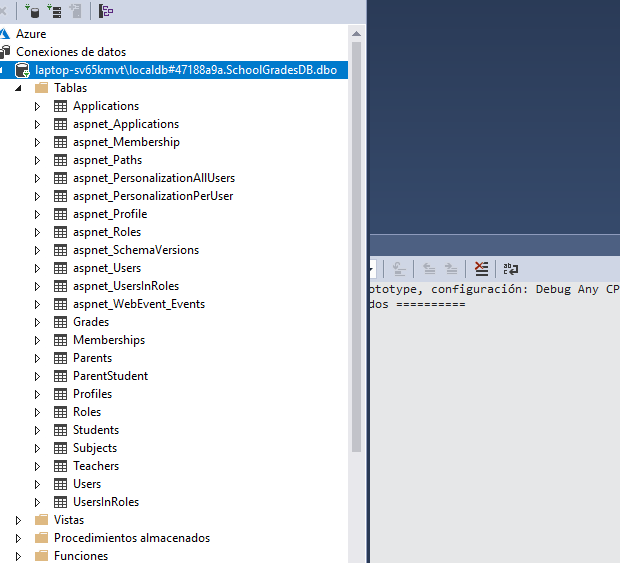

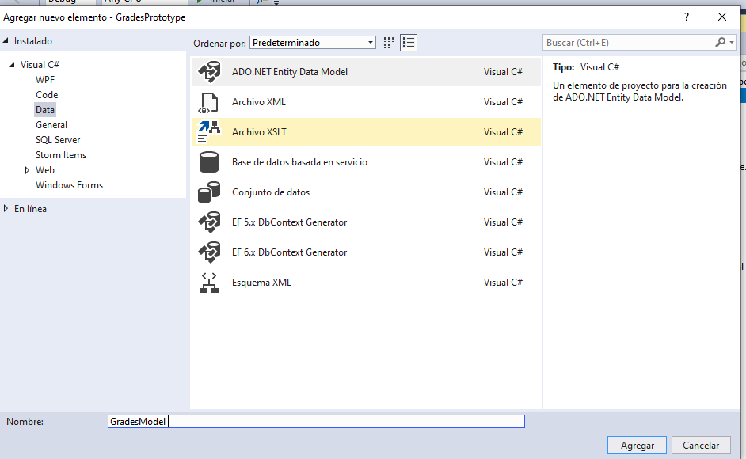

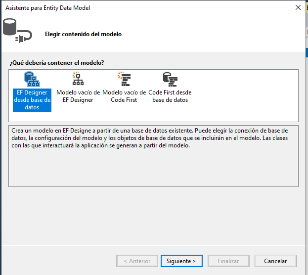


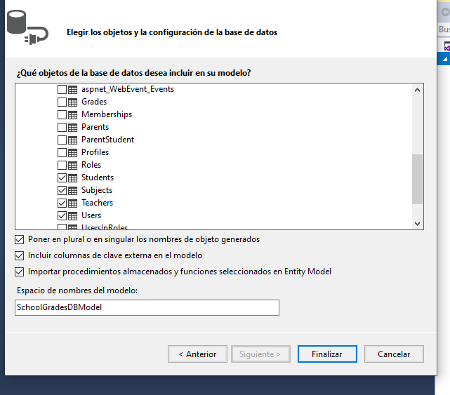

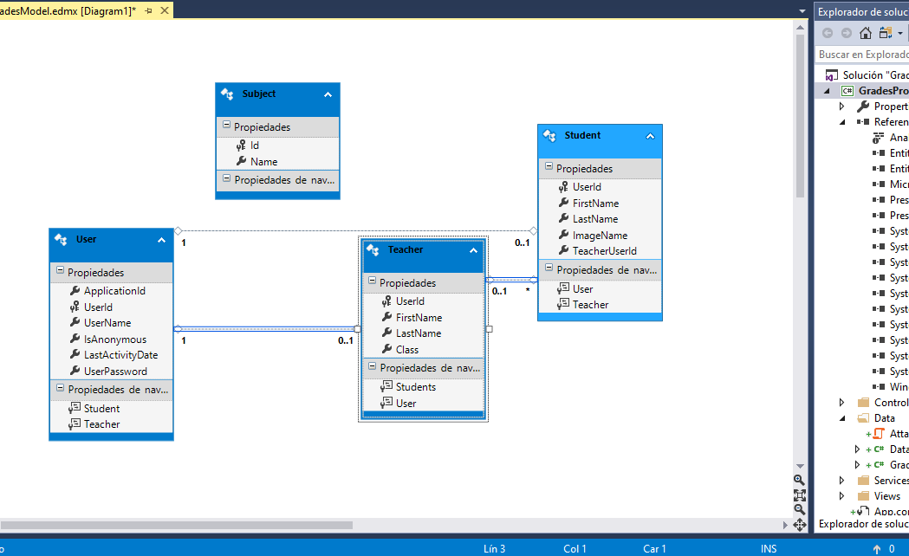

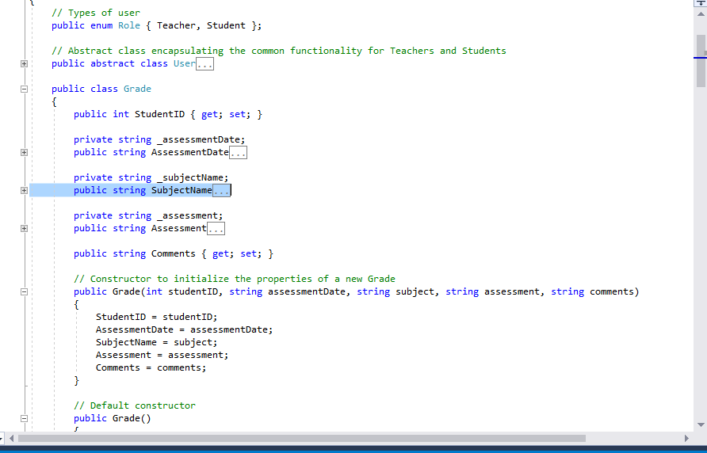


Exercise 2: Updating Student and Grade Data by Using the Entity Framework


Añadimos a Refresh cargar los grades estudiantes y mostrarlos en studentGrades ItemsControl 

```` 
 public void Refresh()
        {
            // Bind the studentName StackPanel to display the details of the student in the TextBlocks in this panel
            studentName.DataContext = SessionContext.CurrentStudent;

            // If the current user is a student, hide the Back, Remove, and Add Grade buttons
            // (these features are only applicable to teachers)
            if (SessionContext.UserRole == Role.Student)
            {
                btnBack.Visibility = Visibility.Hidden;
                btnRemove.Visibility = Visibility.Hidden;
                btnAddGrade.Visibility = Visibility.Hidden;
            }
            else
            {
                btnBack.Visibility = Visibility.Visible;
                btnRemove.Visibility = Visibility.Visible;
                btnAddGrade.Visibility = Visibility.Visible;
            }
			// TODO: Exercise 2: Task 1a: Find all the grades for the student.
			List<Grades.DataModel.Grade> grades = new List<Grades.DataModel.Grade>();

			foreach (Grades.DataModel.Grade grade in SessionContext.DBContext.Grades)
			{
				if (grade.StudentUserId == SessionContext.CurrentStudent.UserId)
				{
					grades.Add(grade);
				}
			}
			// TODO: Exercise 2: Task 1b: Display the grades in the studentGrades ItemsControl by using databinding
			studentGrades.ItemsSource = grades;

````

Probamos la aplicación

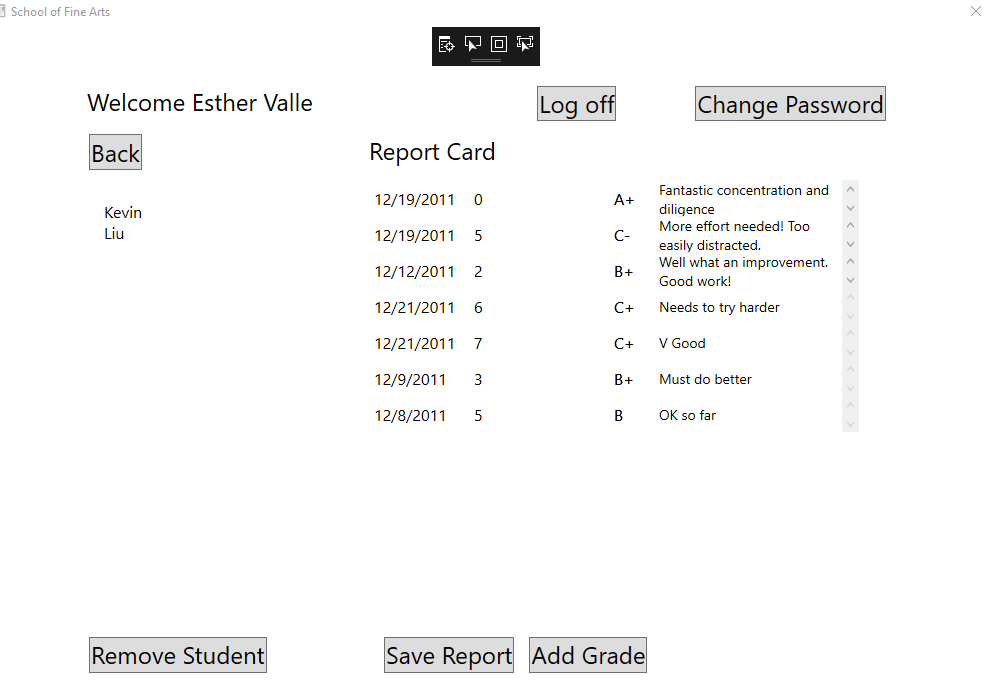


````
Ahora se trata de que aparezca el nombre de la materia en vez del id
````
    // Value converter that converts the integer subject id into the string subject name, for display purposes
    [ValueConversion(typeof(string), typeof(int))]
    class SubjectConverter : IValueConverter
    {
        public object Convert(object value, Type targetType, object parameter,
                              System.Globalization.CultureInfo culture)
        {
            // TODO: Exercise 2: Task 2a: Convert the subject ID provided in the value parameter.
            int subjectId = (int)value;
            var subject = SessionContext.DBContext.Subjects.FirstOrDefault(s => s.Id == subjectId);
            // TODO: Exercise 2: Task 2b: Return the subject name or the string "N/A".


            return subject.Name != string.Empty ? subject.Name : "N/A";
        }
````

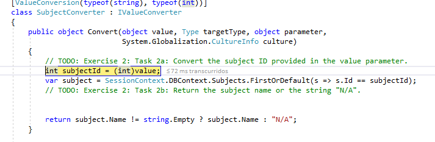


Mostrar la vista GradeDialog y usar la entrada para agregar una nueva calificación

````
`     private void AddGrade_Click(object sender, RoutedEventArgs e)
        {
            // If the user is not a teacher, do nothing (the button should not appear anyway)
            if (SessionContext.UserRole != Role.Teacher)
            {
                return;
            }

            try
            {
                // TODO: Exercise 2: Task 3a: Use the GradeDialog to get the details of the new grade.
                // TODO: Exercise 2: Task 3b: Display the form and get the details of the new grade.
                // TODO: Exercise 2: Task 3c: When the user closes the form, retrieve the details of the assessment grade from the form
                // and use them to create a new Grade object.
                // TODO: Exercise 2: Task 3d: Save the grade.
                // TODO: Exercise 2: Task 3e: Refresh the display so that the new grade appears
                GradeDialog gd = new GradeDialog();
                if (gd.ShowDialog().Value)
                {
                    Grades.DataModel.Grade newGrade = new Grades.DataModel.Grade();
                    newGrade.AssessmentDate = gd.assessmentDate.SelectedDate.Value;
                    newGrade.SubjectId = gd.subject.SelectedIndex;
                    newGrade.Assessment = gd.assessmentGrade.Text;
                    newGrade.Comments = gd.comments.Text;
                    newGrade.StudentUserId = SessionContext.CurrentStudent.UserId;
                    SessionContext.DBContext.Grades.Add(newGrade);
                    SessionContext.Save();
                    Refresh();
                }
            }
            catch (Exception ex)
            {
                MessageBox.Show(ex.Message, "Error adding assessment grade", MessageBoxButton.OK, MessageBoxImage.Error);
            }
        }
````


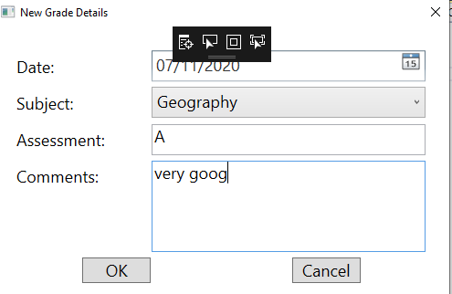

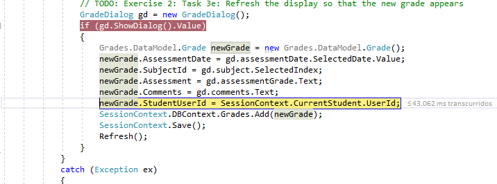


.


####  Ejercicio 3: ampliación del modelo de datos de entidad para validar datos


extendemos plas clases Grade y Teacher

Implementamos codigos de validación

Teacher. EnrollInClass()

Grade.ValidateAssessmentDate y ValidateAssessmentGrade


e implementamos los metodos que utilizaran


````
private void ok_Click(object sender, RoutedEventArgs e)
        {
            // Create a Grade object and use it to trap and report any data validation exceptions that are thrown
            try
            {
                // TODO: Exercise 3: Task 2a: Create a Grade object.
                // TODO: Exercise 3: Task 2b: Call the ValidateAssessmentDate method.
                // TODO: Exercise 3: Task 2c: Call the ValidateAssessmentGrade method.
                Grades.DataModel.Grade testGrade = new Grades.DataModel.Grade();
                testGrade.ValidateAssessmentDate(assessmentDate.SelectedDate.Value);
                testGrade.ValidateAssessmentGrade(assessmentGrade.Text);

            }
            catch (Exception ex)
            {
                MessageBox.Show(ex.Message, "Error creating assessment", MessageBoxButton.OK, MessageBoxImage.Error);
                return;
            }            

            // Indicate that the data is valid
            this.DialogResult = true;
        }
		
		
  // Enroll a student in the teacher's class
        private void Student_Click(object sender, RoutedEventArgs e)
        {
            try
            {
                // Determine which student the user clicked using the StudentID held in the Tag property of the Button that the user clicked
                Button studentClicked = sender as Button;
                Guid studentID = (Guid)studentClicked.Tag;

                // Find this student in the Students collection
                Grades.DataModel.Student student = (from s in SessionContext.DBContext.Students 
                                   where s.UserId == studentID
                                   select s).First();

                // Prompt the user to confirm that they wish to add this student to their class
                string message = String.Format("Add {0} {1} to your class?", student.FirstName, student.LastName);
                MessageBoxResult reply = MessageBox.Show(message, "Confirm", MessageBoxButton.YesNo, MessageBoxImage.Question);

                // If the user confirms, add the student to their class
                if (reply == MessageBoxResult.Yes)
                {
                    // Get the ID of the currently logged-on teacher
                    Guid teacherID = SessionContext.CurrentTeacher.UserId ;

                    // TODO: Exercise 3: Task 1a: Call the EnrollInClass method to assign the student to this teacher's class.

                    // TODO: Exercise 3: Task 1b: Save the updated student/class information back to the database.

                    SessionContext.CurrentTeacher.EnrollInClass(student);
                    SessionContext.Save();


                    // Refresh the display - the newly assigned student should disappear from the list of unassigned students
                    Refresh();
                }
            }
            catch (Grades.DataModel.ClassFullException cfe)
            {
                MessageBox.Show(String.Format("{0}. Class: {1}", cfe.Message, cfe.ClassName), "Error enrolling student", MessageBoxButton.OK, MessageBoxImage.Error);
            }
            catch (Exception ex)
            {
                MessageBox.Show(ex.Message, "Error enrolling student", MessageBoxButton.OK, MessageBoxImage.Error);
            }
        }
````
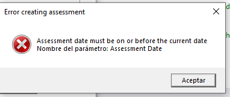

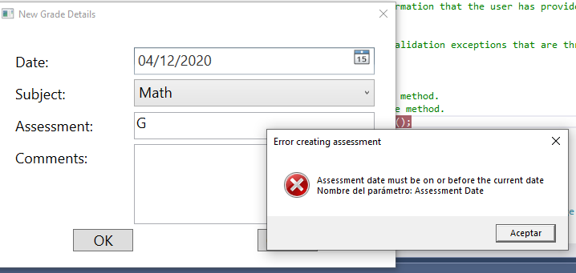

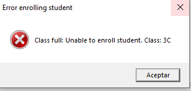