### Módulo 8: Acceso a datos remotos

### Laboratorio: Recuperación y modificación de datos de calificaciones de forma remota

Preparacion:
Instalacion de Microsoft.OData.ConnectedService.vsix  
Instalacion de WcfDataServices.exe  
registrar WCF.reg  

#### Ejercicio 1: creación de un servicio de datos WCF para la base de datos SchoolGrades


Restaurar paquetes de Nuget.   
Agregar referencia  EntityFramework.5.0.0   
Agregar la cadena de conexxion al app.config.  en   GradesPrototype

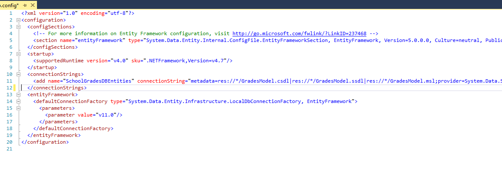

lo mismo en el web.config de Grades.Web

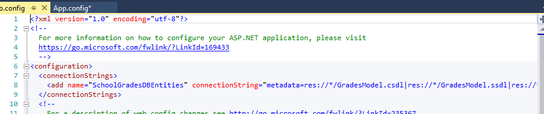

Ahora implementemos del servicio web

Partimos del siguiente condigo.  

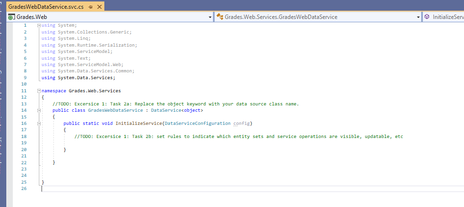

```` using System;
using System.Collections.Generic;
using System.Linq;
using System.Runtime.Serialization;
using System.ServiceModel;
using System.Text;
using Grades.DataModel;
using System.Data.Services;
using System.ServiceModel.Web;
using System.Data.Services.Common;

namespace Grades.Web.Services
{
    //TODO: Excersice 1: Task 2a: Replace the object keyword with your data source class name.
    public class GradesWebDataService : DataService<SchoolGradesDBEntities>
    {
        public static void InitializeService(DataServiceConfiguration config)
        {
            //TODO: Excersice 1: Task 2b: set rules to indicate which entity sets and service operations are visible, updatable, etc
            // Configure the StudentsInClass operation as read-only.
            config.SetServiceOperationAccessRule("StudentsInClass", ServiceOperationRights.AllRead);

            // Configure all entity sets to permit read and write access.
            config.SetEntitySetAccessRule("Grades", EntitySetRights.All);
            config.SetEntitySetAccessRule("Teachers", EntitySetRights.All);
            config.SetEntitySetAccessRule("Students", EntitySetRights.All);
            config.SetEntitySetAccessRule("Subjects", EntitySetRights.All);
            config.SetEntitySetAccessRule("Users", EntitySetRights.All);

        }

        [WebGet]
        public IEnumerable<Student> StudentsInClass(string className)
        {
            var students = from Student s in this.CurrentDataSource.Students
                           where String.Equals(s.Teacher.Class, className)
                           select s;
            return students;
        }
    }
}
````


y probamos el servicio web


 
#### Exercise 2: Integrating the Data Service into the Application  

Establecer proyecto inicio en el cliente y configurar la solución para que se ejecuten los dos proyectos

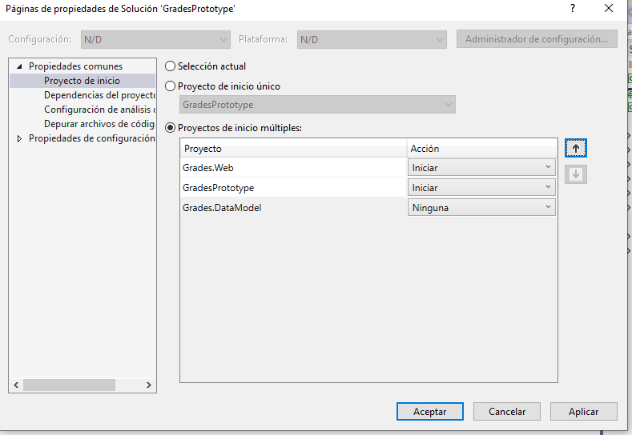
 
 
 examinar GradesWebDataService.svc/$metadata
 
 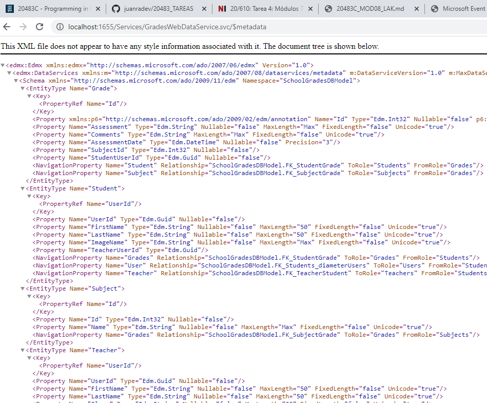
 
 
 eliminamos la referencia Grades.DataModel y agragamos un servicio conectado OData Connected Service.
 
 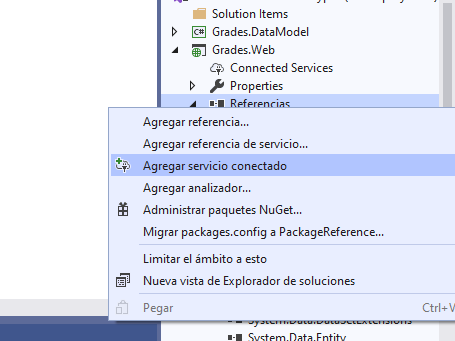

 
 agragamos el endpoint
 
  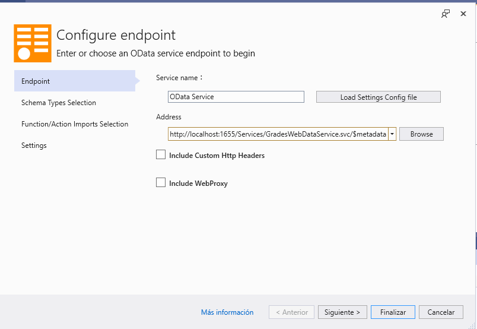
  
  
  me da un error al añadir el endpoint por lo que continuo con la Soluction...
  
  
  verificando que funciona con el endpoint

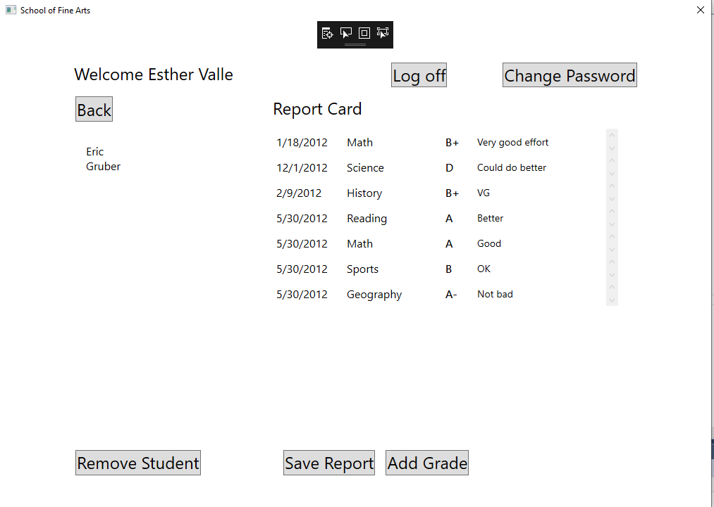  
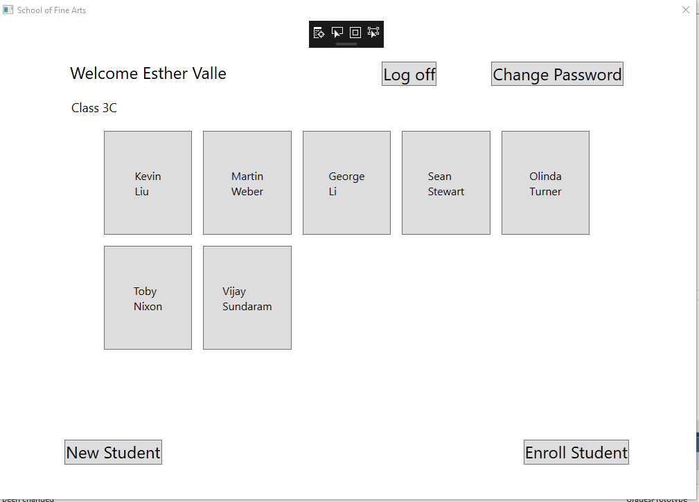  
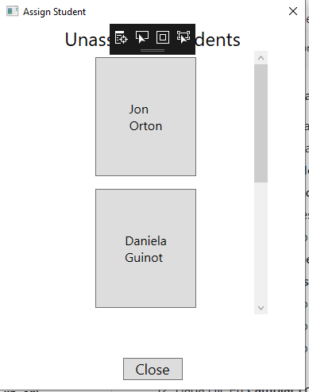  
     
  
  
  
  

  
#### Exercise 3: Retrieving Student Photographs Over the Web (If Time Permits)

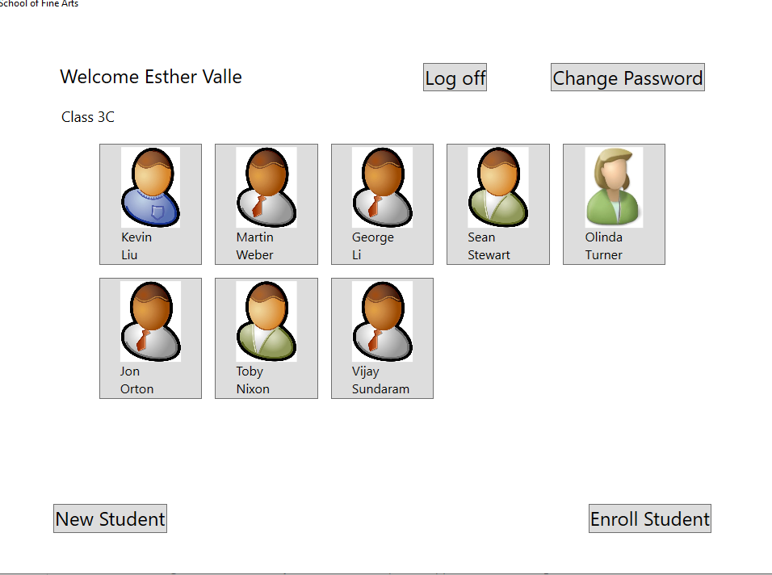  


  