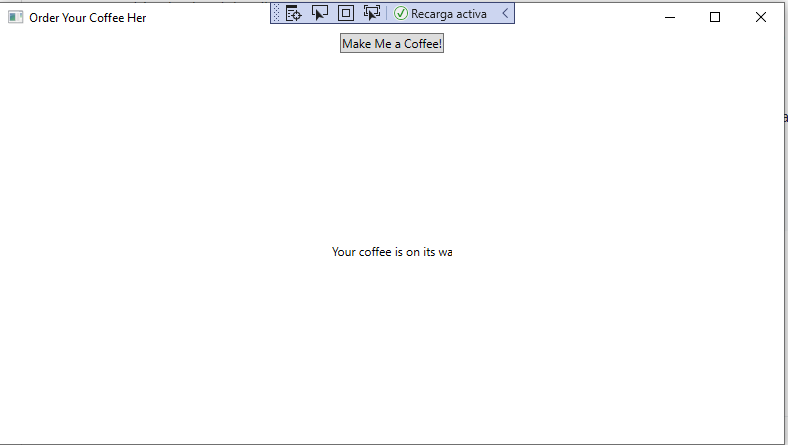
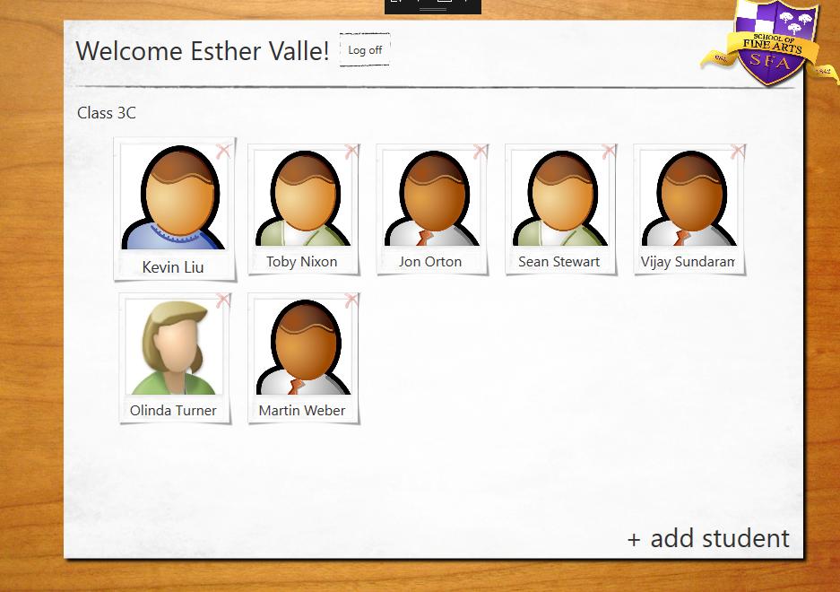
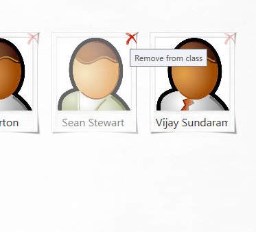
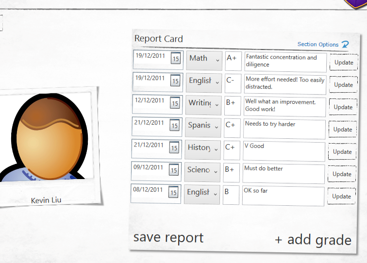

### Módulo 9: Diseño de la interfaz de usuario para una aplicación gráfica

### Lección 1: Usar XAML para diseñar una interfaz de usuario

#### Demostración: uso de la vista Diseño para crear una interfaz de usuario XAML

### Lección 3: Aplicar estilo a una interfaz de usuario

#### Demostración: personalización de fotografías de estudiantes y diseño del laboratorio de aplicaciones

(laboratorio)

