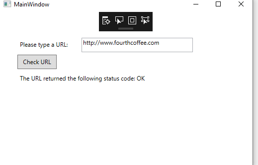
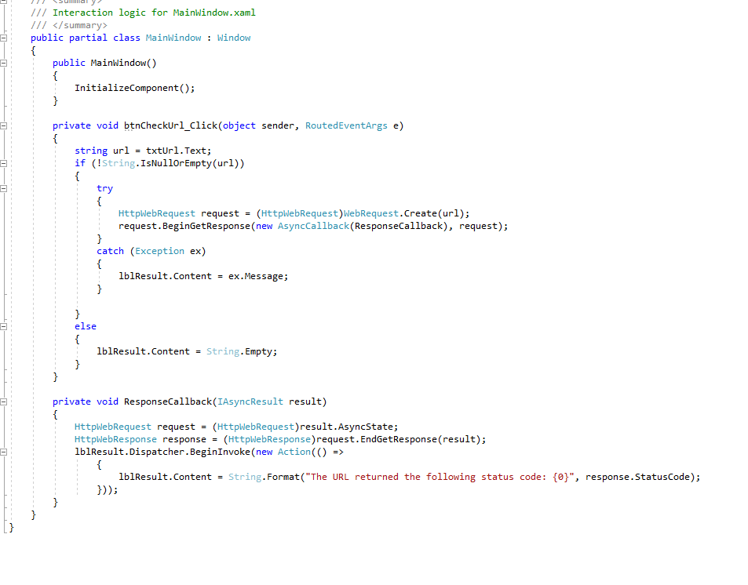
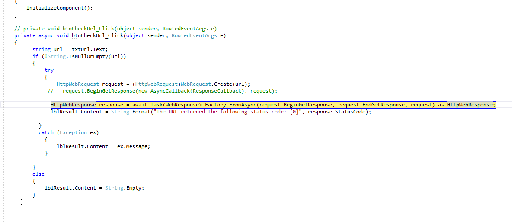
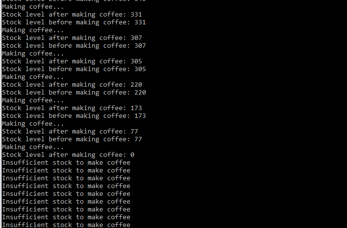
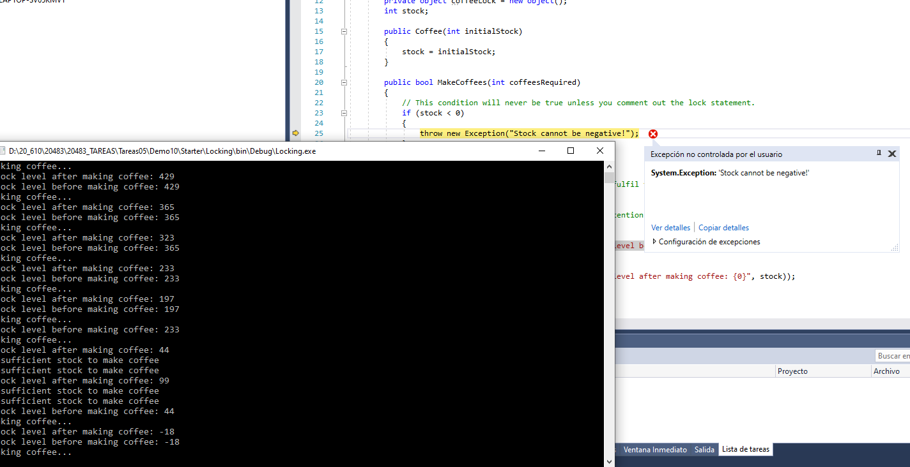

### Módulo 10: Mejora del rendimiento y la capacidad de respuesta de las aplicaciones

### Lección 2: Realizar operaciones de forma asincrónica

#### Demostración: uso de Tak Parallel Library para invocar operaciones APM





async  
+  
HttpWebResponse response = await Task<WebResponse>.Factory.FromAsync(request.BeginGetResponse, request.EndGetResponse, request) as HttpWebResponse;  
lblResult.Content = String.Format("The URL returned the following status code: {0}", response.StatusCode);  

y eliminamos el callback




### Lección 3: Sincronización del acceso concurrente a los datos

#### Demostración: uso de declaraciones de bloqueo
````c#

using System;
using System.Collections.Generic;
using System.Linq;
using System.Text;
using System.Threading;
using System.Threading.Tasks;

namespace Locking
{  
    class Program
    {
        static void Main(string[] args)
        {
            // Create a Coffee instance with enough stock to make 1000 coffees.
            Coffee coffee = new Coffee(1000);
            Random r = new Random();
            
            // Create 100 iterations of a parallel for loop.
            Parallel.For(0, 100, index =>
                {
                    // Place an order for a random number of coffees.
                    coffee.MakeCoffees(r.Next(1, 100));
                });
            Console.ReadLine();
        }
    }
}


class Coffee
    {
        private object coffeeLock = new object();
        int stock;

        public Coffee(int initialStock)
        {
            stock = initialStock;
        }

        public bool MakeCoffees(int coffeesRequired)
        {
            // This condition will never be true unless you comment out the lock statement.
            if (stock < 0)
            {
                throw new Exception("Stock cannot be negative!");
            }

            lock (coffeeLock)
            {
                // Check that there is sufficient stock to fulfil the order.
                if (stock >= coffeesRequired)
                {
                    // Introduce a delay to make thread contention more likely.
                    Thread.Sleep(500);

                    Console.WriteLine(String.Format("Stock level before making coffee: {0}", stock));
                    Console.WriteLine("Making coffee...");
                    stock = stock - coffeesRequired;
                    Console.WriteLine(String.Format("Stock level after making coffee: {0}", stock));
                    return true;
                }
                else
                {
                    Console.WriteLine("Insufficient stock to make coffee");
                    return false;
                }
            }
        }
````

`


eliminamos  lock (coffeeLock)
            
y vemos como se produce una exceoccion personalizada por que el sotck <0 
			
`


#### Demostración: mejora de la capacidad de respuesta y el rendimiento del laboratorio de aplicaciones


(laboratorio)

