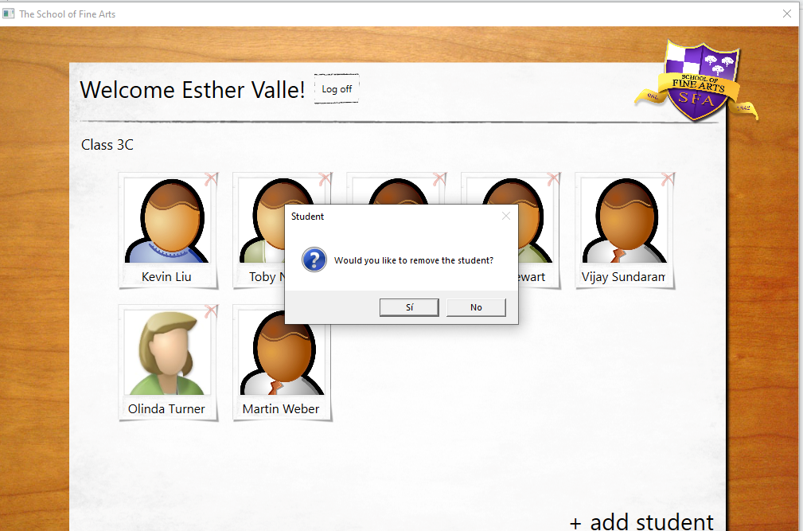
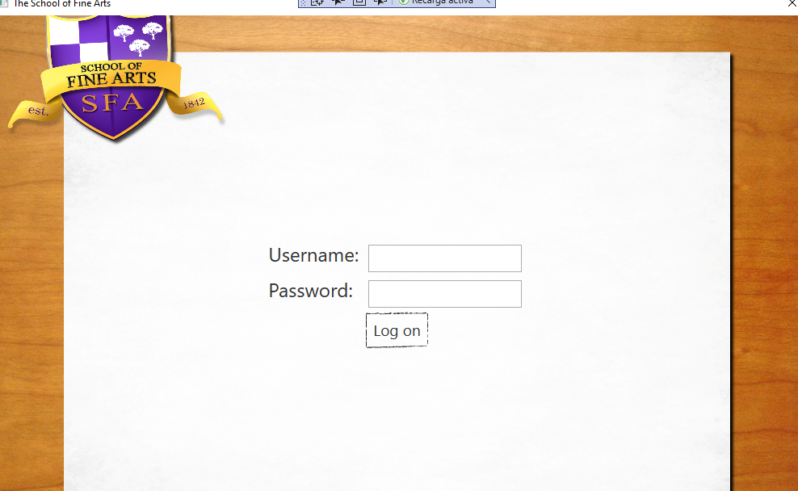
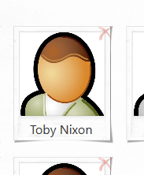

### Módulo 9: Diseño de la interfaz de usuario para una aplicación gráfica

### Laboratorio: Personalización de fotografías de estudiantes y diseño de la aplicación

#### Ejercicio 1: personalización de la apariencia de las fotografías de los alumnos


````c#

<UserControl x:Class="Grades.WPF.StudentPhoto"
             xmlns="http://schemas.microsoft.com/winfx/2006/xaml/presentation"
             xmlns:x="http://schemas.microsoft.com/winfx/2006/xaml"
             xmlns:mc="http://schemas.openxmlformats.org/markup-compatibility/2006" 
             xmlns:d="http://schemas.microsoft.com/expression/blend/2008" 
             mc:Ignorable="d" 
             d:DesignHeight="300" d:DesignWidth="300">
    <Grid>
        <Image Stretch="UniformToFill" Margin="8" Source="{Binding File}"/>   
        <Image Stretch="Fill" Margin="0" Source="../Images/Image_Frame.png"/>
        <TextBlock Text="{Binding Name}" Style="{StaticResource LabelCenter}" FontSize="16" VerticalAlignment="Bottom" Margin="8,0,14.583,8"/>
    </Grid>
</UserControl>
````

el lio me lo estaba haciendo el source de la foto Source="{Binding File}"  
ya que la clase del contexto es nombre del campo de la imagen es Imagename   

Bueno el truco está en el código de StudentPage ya que no trabaja con Student
sino con una lista de LocalStudent definida en Data.css


```` c#
 #region Refresh
        public void Refresh()
        {
            // Find all students for the current teacher
            ServiceUtils utils = new ServiceUtils();

            var students = utils.GetStudentsByTeacher(SessionContext.UserName);

            // Iterate through the returned set of students, construct a local student object list
            List<LocalStudent> resultData = new List<LocalStudent>();
````
````
namespace Grades.WPF
{
    public class LocalStudent
    {
        public Student Record { get; set; }

        public Guid ID
        {
            get { return Record.UserId; }
        }

        public string Name
        {
            get { return String.Format("{0} {1}", Record.FirstName, Record.LastName); }
        }

        public string File
        {
            get { return String.Format(@"{0}Images/Portraits/{1}", @"http://localhost:1103/", Record.ImageName); }
        }

````

Bueno una vez visto como se cargan las imagenes 
el resto consiste en crar los eventos modificando  propiedades de la photo (opacidad...)

```` c#
// TODO: Exercise 1: Task 4b: Review the following event handler.
        //Animate the photo as the user moves the mouse over the "delete" image
        private void RemoveStudent_MouseEnter(object sender, MouseEventArgs e)
        {
            Grid grid = (Grid)sender;
            grid.Opacity = 1.0;
            StudentPhoto photo = ((Grid)grid.Parent).Children[0] as StudentPhoto;
            photo.Opacity = 0.6;
        }

        // TODO: Exercise 1: Task 4c: Review the following event handler.
        // Animate the photo as the user moves the mouse away from the "delete" image
        private void RemoveStudent_MouseLeave(object sender, MouseEventArgs e)
        {
            Grid grid = (Grid)sender;
            grid.Opacity = 0.3;
            StudentPhoto photo = ((Grid)grid.Parent).Children[0] as StudentPhoto;
            photo.Opacity = 1.0;
        }

        // TODO: Exercise 1: Task 3b: Review the following event handler.
        // If the user clicks a photo, raise the StudentSelected event to display the details of the student
        private void Student_Click(object sender, MouseButtonEventArgs e)
        {
            if (StudentSelected != null)
                StudentSelected(sender, new StudentEventArgs((sender as StudentPhoto).DataContext as LocalStudent));
        }

````
`



### Ejercicio 2: estilo de la vista de inicio de sesión




#### Demostración: personalización de fotografías de estudiantes y diseño del laboratorio de aplicaciones


