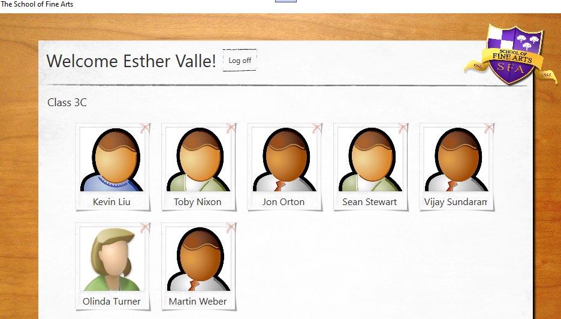
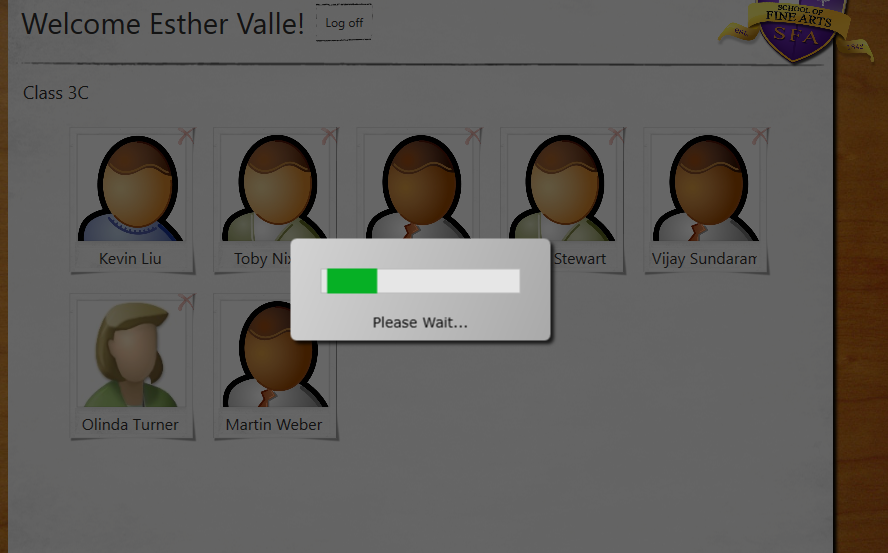

### Módulo 10: Mejora del rendimiento y la capacidad de respuesta de las aplicaciones

### Laboratorio: Mejora de la capacidad de respuesta y el rendimiento de la aplicación


convertir asyncrono GetTeacher

```

// TODO: Exercise 1: Task 2a: Convert GetTeacher into an async method that returns a Task<Teacher>
        public Teacher GetTeacher(string userName)
        {
            if (!IsConnected())
                return null;
            
            // TODO: Exercise 1: Task 2b: Perform the LINQ query to fetch Teacher information asynchronously
            var teacher = (from t in DBContext.Teachers
                           where t.User.UserName == userName
                           select t).FirstOrDefault();

            return teacher;
        }
````

refactorizamos a :

````

public async Task<Teacher> GetTeacher(string userName)
        {
            if (!IsConnected())
                return null;
            
            // TODO: Exercise 1: Task 2b: Perform the LINQ query to fetch Teacher information asynchronously
            var teacher = await Task.Run(() =>
                (from t in DBContext.Teachers
                 where t.User.UserName == userName
                 select t).FirstOrDefault());

            return teacher;
        }
````

Modificamos el metodo refresh de MainWindowXml
````
 #region Refresh

        // TODO: Exercise 1: Task 2c: Mark MainWindow.Refresh as an asynchronous method
        public void Refresh()
        {
            if (SessionContext.Role == "")
            {
                GotoLogon();
                return;
            }
            // Databind Name
            ServiceUtils utils = new ServiceUtils();
            try
            {
                switch (SessionContext.Role)
                {
                    #region caseStudent
                    #endregion
                    #region caseParent
                    #endregion
                    case "Teacher":
                        // Get the details of the current user (which must be a teacher)
                        // TODO: Exercise 1: Task 2d: Call GetTeacher asychronously
                        var teacher = utils.GetTeacher(SessionContext.UserName);

                        // Display the details for the teacher
                        try
                        {
                            SessionContext.CurrentTeacher = teacher;
                            txtName.Text = String.Format("Welcome {0} {1}!", teacher.FirstName, teacher.LastName);

                            // Display the students in the class taught by this teacher
                            GotoStudentsPage();
                        }
                        catch (DataServiceQueryException ex)
                        {
                            MessageBox.Show(String.Format("Error: {0} - {1}",
                                ex.Response.StatusCode.ToString(), ex.Response.Error.Message));
                        }  
                        break;
                }
            }
            catch (Exception e)
            {
                MessageBox.Show(e.Message, "Error fetching details", MessageBoxButton.OK, MessageBoxImage.Error);
            }
        }
        #endregion
````
Mediante tecnicas de async

````
       public async void Refresh()
        {
            if (SessionContext.Role == "")
            {
                GotoLogon();
                return;
            }
            // Databind Name
            ServiceUtils utils = new ServiceUtils();
            try
            {
                switch (SessionContext.Role)
                {
                    #region caseStudent
                    #endregion
                    #region caseParent
                    #endregion
                    case "Teacher":
                        // Get the details of the current user (which must be a teacher)
                        // TODO: Exercise 1: Task 2d: Call GetTeacher asychronously
                        ///////////////var teacher = utils.GetTeacher(SessionContext.UserName);
						 var teacher = await utils.GetTeacher(SessionContext.UserName);
                        // Display the details for the teacher
                        try
                        {
                            SessionContext.CurrentTeacher = teacher;
                            txtName.Text = String.Format("Welcome {0} {1}!", teacher.FirstName, teacher.LastName);

                            // Display the students in the class taught by this teacher
                            GotoStudentsPage();
                        }
                        catch (DataServiceQueryException ex)
                        {
                            MessageBox.Show(String.Format("Error: {0} - {1}",
                                ex.Response.StatusCode.ToString(), ex.Response.Error.Message));
                        }  
                        break;
                }
            }
            catch (Exception e)
            {
                MessageBox.Show(e.Message, "Error fetching details", MessageBoxButton.OK, MessageBoxImage.Error);
            }
        }
        #endregion

``````

Tambien en Refresh de StudentsPage


````c#
 #region Refresh
        public async void Refresh()
        {
            ServiceUtils utils = new ServiceUtils();

            await utils.GetStudentsByTeacher(SessionContext.UserName, OnGetStudentsByTeacherComplete);
        }
        #endregion

        #region Callbacks
        // Callback that displays the list of students for a teacher
        private void OnGetStudentsByTeacherComplete(IEnumerable<Student> students)
        {
            // Iterate through the set of students, construct a local student object list
            // and then data bind this to the list item template
            List<LocalStudent> resultData = new List<LocalStudent>();

            foreach (Student s in students)
            {
                LocalStudent student = new LocalStudent()
                {
                    Record = s
                };

                resultData.Add(student);
            }

            this.Dispatcher.Invoke(() => {
                list.ItemsSource = resultData;
                txtClass.Text = String.Format("Class {0}", SessionContext.CurrentTeacher.Class);
            });
        }
        #endregion
````
 el ServiceUtils utils
````

// TODO: Exercise 1: Task 3e: Convert GetStudentsByTeacher into an async method that invokes a callback
        public async Task GetStudentsByTeacher(string teacherName, Action<IEnumerable<Student>> callback)
        {
            if (!IsConnected())
                return ;

            // Fetch students by using the GradesService service
            // TODO: Exercise 1: Task 3f: Perform the LINQ query to fetch Student data asynchronously
            var students = await Task.Run(() =>
                (from s in DBContext.Students
                 where s.Teacher.User.UserName == teacherName
                 select s).OrderBy(s => s.LastName).ToList());

            // TODO: Exercise 1: Task 3g: Run the callback by using a new task rather than returning a list of students
            await Task.Run(() => callback(students));
        }
````
Probamos que siga funcionando

			



#### Ejercicio 2: Proporcionar comentarios visuales durante operaciones de larga duración


Creamos el control BusyIndicator.xaml 


En la clase StudentsPage : agreguemos  eventos públicos   StartBusy y EndBusy .


Implementar los controladores de eventos StartBusy y EndBusy 

`````c#
 #region Events
        private void StartBusy(object sender, EventArgs e)
        {
            
            busyIndicator.Visibility = Visibility.Visible;
        }

        private void EndBusy(object sender, EventArgs e)
        {
            
            busyIndicator.Visibility = Visibility.Collapsed;
        }
````

Agregamos los eventos StartBusy  y EndBussy
```` c#
	public event EventHandler StartBusy;
	public event EventHandler EndBusy;
``````
Imlementamos los métodos
```` c#
 private void StartBusyEvent()
 {
     if (StartBusy != null)
         StartBusy(this, new EventArgs());
 }
 private void EndBusyEvent()
 {
     if (EndBusy != null)
         EndBusy(this, new EventArgs());
 }
 ````  
 
 Modificamos el XMAL
  ```` XMAL
 <y:StudentsPage x:Name="studentsPage"
                StartBusy="StartBusy"
                EndBusy="EndBusy"
                StudentSelected="studentsPage_StudentSelected"
                Visibility="Collapsed" />

 ````  
 
 y levantamos el evento
 ````
 
         public async void Refresh()
        {
            StartBusyEvent();

            ServiceUtils utils = new ServiceUtils();

            await utils.GetStudentsByTeacher(SessionContext.UserName, OnGetStudentsByTeacherComplete);

            EndBusyEvent();
        }
``````



