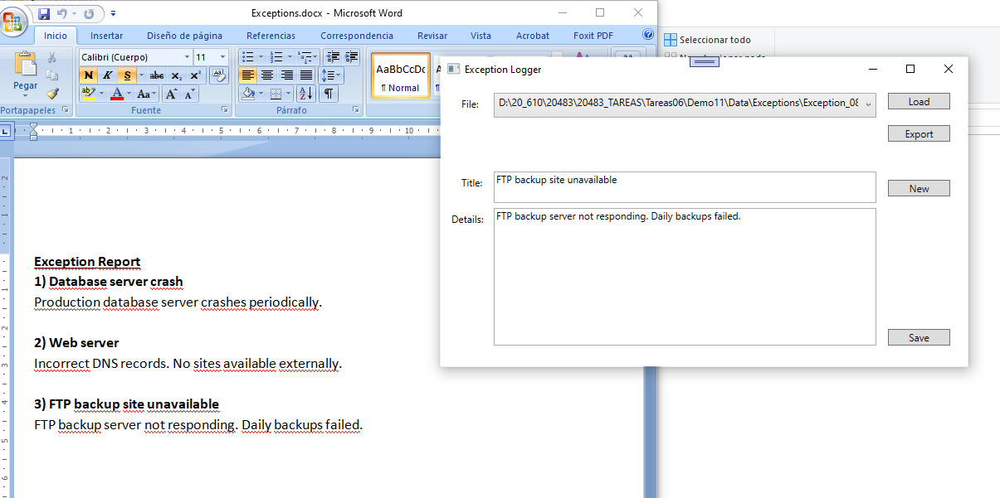
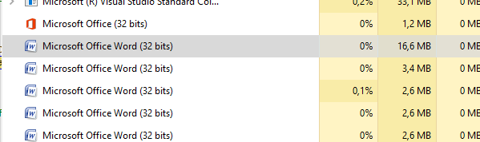

### Module 11: Integrating with Unmanaged Code

### Lesson 1: Creating and using Dynamic Objects


````
1. declaración del dynamic object

using Microsoft.Office.Inerop.Word;
......

dynamic word = new Appliation(); 
// variables de tipo object  
// No soportan type checking en tiempo de compilación ni proporcionan IntelliSense  


Invoking Methods on a Dynamic Object

string filepath ="....documento.docx";
dynamic word = new Appliation(); 
dynamic doc = word.Documents.Open(filepath);
doc.SaveAs(filepath);


// Start Microsoft Word.
dynamic word = new Application();
...
// Create a new document.
dynamic doc = word.Documents.Add();
doc.Activate();
````



### Lesson 2: Managing the Lifetime of Objects and Controlling Unmanaged Resources

#### Demonstration: Upgrading the Grades Report Lab


(laboratorio)





