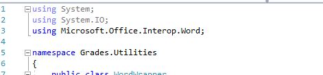
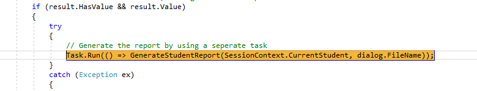
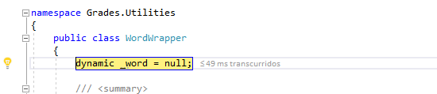
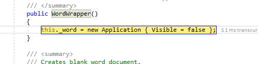
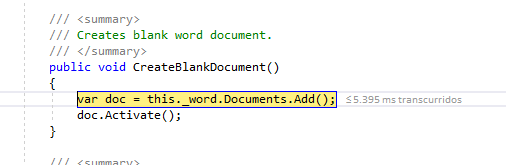
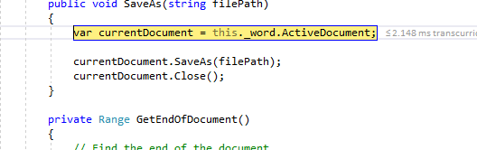

## Module 11: Integrating with Unmanaged Code
### Lab: Upgrading the Grades Report

#### Exercise 1: Generating the Grades Report by Using Word




















####  Exercise 2: Controlling the Lifetime of Word Objects by Implementing the Dispose Pattern


Implementar la interfaz Idisposable en la clase WordWrapper 


````c#
  ~WordWrapper()
        {
            this.Dispose(false);
        }


        #region IDisposable Support
        private bool disposedValue = false; // Para detectar llamadas redundantes

        protected virtual void Dispose(bool disposing)
        {
            if (!disposedValue)
            {
                if (disposing)
                    // Release managed resources here
                    if (this._word != null)
                    {
                        this._word.Quit();
                    }
            }

            // Release unmanaged resources here
            if (this._word != null)
            {
                System.Runtime.InteropServices.Marshal.ReleaseComObject(this._word);
            }
            disposedValue = true;
        }
   


    // Este código se agrega para implementar correctamente el patrón descartable.
    public void Dispose()
    {
        this.Dispose(true);
        GC.SuppressFinalize(this);
    }
    #endregion
``````


Por ultimo para no tener que hacer el Dispose nosotros envolvemos su uso en un using

````c#

 public void GenerateStudentReport(LocalStudent studentData, string reportPath)
        {
            using (var wrapper = new WordWrapper())
            {


                // Create a new Word document in memory
                wrapper.CreateBlankDocument();

                // Add a heading to the document
                wrapper.AppendHeading(String.Format("Grade Report: {0} {1}", studentData.FirstName, studentData.LastName));
                wrapper.InsertCarriageReturn();
                wrapper.InsertCarriageReturn();

                // Output the details of each grade for the student
                foreach (var grade in SessionContext.CurrentGrades)
                {
                    wrapper.AppendText(grade.SubjectName, true, true);
                    wrapper.InsertCarriageReturn();
                    wrapper.AppendText("Assessment: " + grade.Assessment, false, false);
                    wrapper.InsertCarriageReturn();
                    wrapper.AppendText("Date: " + grade.AssessmentDateString, false, false);
                    wrapper.InsertCarriageReturn();
                    wrapper.AppendText("Comment: " + grade.Comments, false, false);
                    wrapper.InsertCarriageReturn();
                    wrapper.InsertCarriageReturn();
                }

                // Save the Word document
                wrapper.SaveAs(reportPath);
            }
        }
````