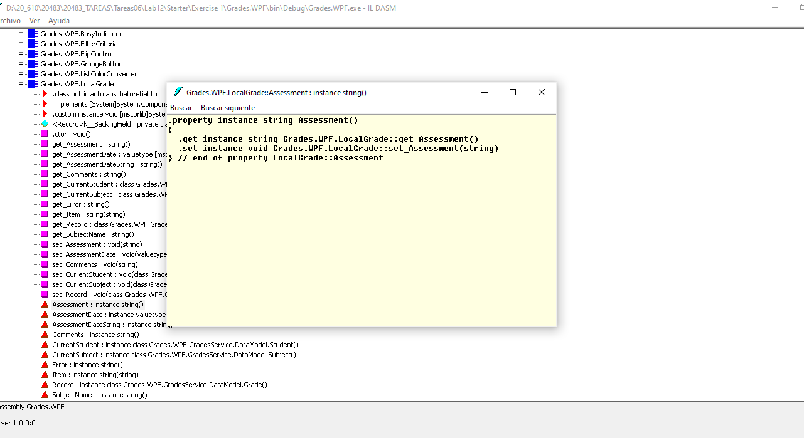
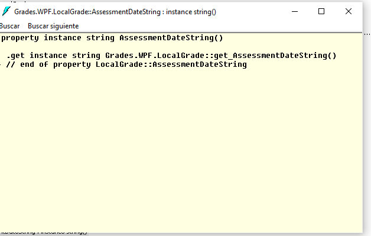
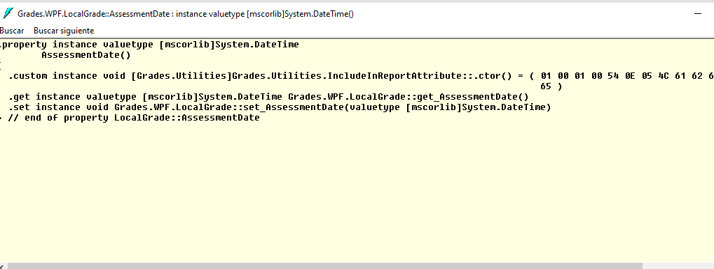

## Módulo 12: Creación de tipos y ensamblajes reutilizables

### Laboratorio: Especificación de los datos para incluir en el informe de calificaciones


Implemetar la clase IncludeInReportAttribute : Attribute

````c#

 [AttributeUsage(AttributeTargets.Field | AttributeTargets.Property, AllowMultiple = false)]
    public class IncludeInReportAttribute : Attribute
    {
        private bool _include;
        public bool Underline { get; set; }
        public bool Bold { get; set; }

        public string Label { get; set; }

        public IncludeInReportAttribute()
        {
            this._include = true;
            this.Underline = false;
            this.Bold = false;
            this.Label = string.Empty;
        }

        public IncludeInReportAttribute(bool includeInReport)
        {
            this._include = includeInReport;
            this.Underline = false;
            this.Bold = false;
            this.Label = string.Empty;
        }
    }
`````


Apply the IncludeInReportAttribute attribute to the appropriate properties

`````c#
 public class LocalGrade : IDataErrorInfo
    {
       .......................
        [IncludeInReport(Label = "Subject Name", Bold = true, Underline = true)]
        public string SubjectName
        {
            get { return (Record.Subject != null) ? Record.Subject.Name : ""; }
        }
        
        
        [IncludeInReport(Label = "Date")]
        public DateTime AssessmentDate
        {
            get { return Record.AssessmentDate; }
            set { Record.AssessmentDate = value; }
        }

        ..........................
        [IncludeInReport(Label = "Comments")]
        public string Comments
        {
            get { return Record.Comments; }
            set { Record.Comments = value; }
        }
        ...................
        }
    }
`````


Build the application and review the metadata for the LocalGrades class


 ildsam  
 



 ildsam  



 ildsam  



Ejercicio 2: actualización del informe

`Creo la esturcutura FormatField

````c#
    // TODO: Exercise 2: Task 1a: Define a struct that specifies the formatting to apply to an item
    public struct FormatField
    {
        public string Value;
        public string Label;
        public bool IsBold;
        public bool IsUnderlined;
    }
````


Recorror las propiedades y examino los atributos

`````c#
  public static class IncludeProcessor
    {
        // Examine the fields and properties in the dataForReport object and determine whether any are tagged with the IncludeInReport attribute
        // For each field or property that is tagged, create a FormatField item that specifies the formatting to apply
        // Return the collection of FormatField items that represents the set of fields and properties to be formatted
        public static List<FormatField> GetItemsToInclude(object dataForReport)
        {
            List<MemberInfo> fieldsAndProperties = new List<MemberInfo>();
            List<FormatField> items = new List<FormatField>();

            // Find all the public fields and properties in the dataForReport object
            Type dataForReportType = dataForReport.GetType();
            fieldsAndProperties.AddRange(dataForReportType.GetFields());
            fieldsAndProperties.AddRange(dataForReportType.GetProperties());

            // Iterate through all public fields and properties, and process each item that is tagged with the IncludeInReport attribute
            foreach (MemberInfo member in fieldsAndProperties)
            {
                // Determine whether the current member is tagged with the IncludeInReport attribute
                object[] attributes = member.GetCustomAttributes(false);
                IncludeInReportAttribute attributeFound = Array.Find(attributes, a => a.GetType() == typeof(IncludeInReportAttribute)) as IncludeInReportAttribute;

                // If the member is tagged with the IncludeInReport attribute, construct a FormatField item
                // and populate it with the data and format information specified by the attribute
                if (attributeFound != null)
                {
                    // Find the value of the item tagged with the IncludeInReport attribute
                    string itemValue;
                    if (member is FieldInfo)
                    {
                        itemValue = (member as FieldInfo).GetValue(dataForReport).ToString();
                    }
                    else
                    {
                        itemValue = (member as PropertyInfo).GetValue(dataForReport).ToString();
                    }

                    // Construct a FormatField item with this data
                    FormatField item = new FormatField() 
                    { 
                        Value = itemValue, 
                        Label = attributeFound.Label, 
                        IsBold = attributeFound.Bold, 
                        IsUnderlined = attributeFound.Underline
                    };

                    // Add the FormatField item to the collection to be returned
                    items.Add(item);
                }
            }

            // Return the list of FormatField items
            return items;
        }
    }
````


