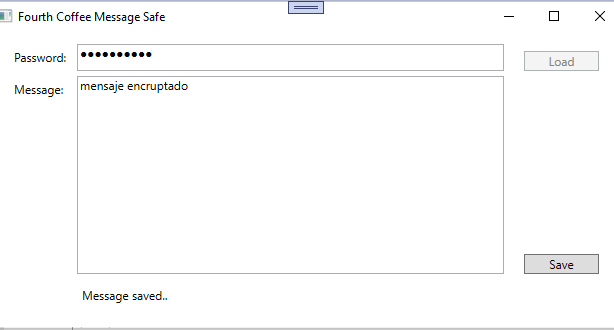
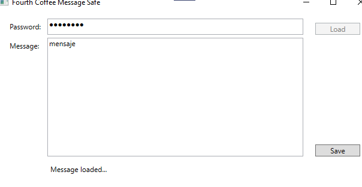
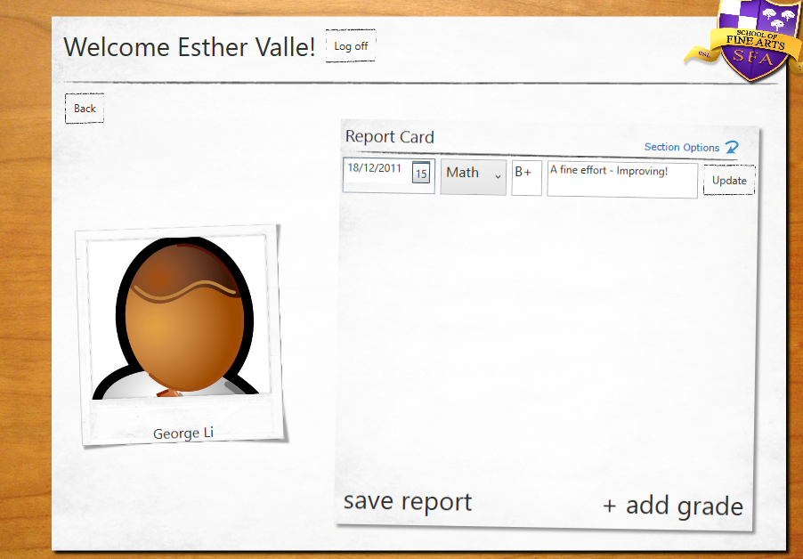
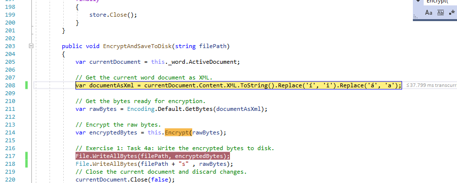

## Módulo 13: Cifrado y descifrado de datos

### Lección 1: Implementación de cifrado simétrico

#### Demostración: cifrado y descifrado de datos

Preparación


app.cofig
````
<add key="EncryptedFilePath" value="[Repository Root]\Allfiles\Mod13\Democode\Data"/>
````


````
using System;
using System.IO;
using System.Security.Cryptography;
using System.Text;

Encryptor _encryptor;
this._encryptor = new Encryptor("74519A8D-1519-4E14-A66A-9F9F9BE95860"); 


var decryptedBytes = Encoding.Default.GetBytes(this.messageText.Text);


var passwordHash = this.GeneratePasswordHash(password);
            return new Rfc2898DeriveBytes(password, this._salt);    //genero el hash de la passwod
        
var key = this.GenerateKey(passwordHash);                           // genero la key con el hash password
           return passwordHash.GetBytes(this._algorithm.KeySize / 8);
        
var iv = this.GenerateIV(passwordHash);                             // genero el vector de incializacion con el hash password
            return passwordHash.GetBytes(this._algorithm.BlockSize / 8);

var transformer = this._algorithm.CreateEncryptor(key, iv);         // encripto el texto

this.TransformBytes(transformer, bytesToEncypt);                    // lo cargo en un memory stream
            var bufferStream = new MemoryStream();
            var cryptoStream = new CryptoStream(bufferStream,transformer, CryptoStreamMode.Write);
            cryptoStream.Write(bytesToTransform, 0, bytesToTransform.Length);
            cryptoStream.FlushFinalBlock();
            var transformedBytes = bufferStream.ToArray();
            cryptoStream.Close();
            bufferStream.Close();
            return transformedBytes;


File.WriteAllBytes(this._protectedFile.FullName, encryptedBytes);   // lo grabo en dicso
``````




````

var encryptedBytes = File.ReadAllBytes(_protectedFile.FullName);  // leo el archivo en bytes

var decryptedBytes = this._encryptor.Decrypt(encryptedBytes, this.password.Password);
            
{
            var passwordHash = this.GeneratePasswordHash(password);
            var key = this.GenerateKey(passwordHash);
            var iv = this.GenerateIV(passwordHash);
            var transformer = this._algorithm.CreateDecryptor(key, iv);
            return this.TransformBytes(transformer, bytesToDecypt);

var decryptedText = Encoding.Default.GetString(decryptedBytes);

this.messageText.Text = decryptedText;

````




### Lección 2: Implementación del cifrado asimétrico

#### Demostración: Laboratorio de cifrado y descifrado de informes de calificaciones


(demostración del laboratorio)

Preparación: 

ejecucion de SetupSchoolGradesDB.cmd

ejecución del CreateCertificate.cmd que crea el certificado

makecert -n "CN=Grades" -a sha1 -pe -r -sr LocalMachine -ss my -sky exchange

Observamos como genera las notas encriptadas a partir del certificado





Por algún motivo mi versión de Word tiene problemas con los acentos en los atritubos de word  
(Título y Párrafo)  


por lo que modifico la funcion de generar el xml  


Mostramos los dos documentos (encritpado y sin encriptar)


