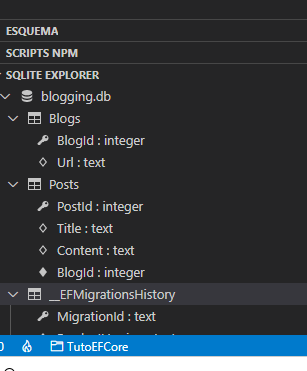

## tutorial de EFCORE (sqlite)

https://docs.microsoft.com/es-es/ef/core/get-started/?tabs=netcore-cli

Pasos:
1. dotnet new console -o EFGetStarted   // crea la apliación de consola -O nombre de la app
2. dotnet add package Microsoft.EntityFrameworkCore.Sqlite  // instalar EF.sqlite dentro de la carpeta
3. creaccion del modelo (Models.cs) Contexto y Modelo 
4. Creacción de la base de datos a partir del Modelo (migración)
dotnet tool install --global dotnet-ef  // Instalar  dotnet-ef  
dotnet add package Microsoft.EntityFrameworkCore.Design // y el paquete de diseño necesario para ejecutar el comando en un proyecto  
dotnet ef migrations add InitialCreate  //  scaffolding primera
dotnet ef database update // creara la base de datos con esta migracion
5. (opcional) Instalamos sqlite para Code y ejecutasmos SQLite Open Database

(
.PNG)

6. Modificamos Prorams.cs 
para hacer un CRUD