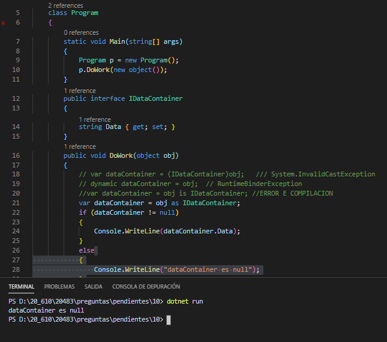

### QUESTION 10

##### operador as 

(correspondía a Rebeca)

You are developing an application by using C#. The application includes the following code segment. (Line
numbers are included for reference only.)


````c#
01	public interface IDataContainer
02	{
03      string Data {get:set;
04  }
05  void DoWork(object obj)
06  {
07  
08      if (dataContainer != null)
09      {  
10          Console.WriteLine(dataContainer.Data)
11      }
12  }
````

The DoWork() method must not throw any exceptions when converting the obj object to the IDataContainer interface or when accessing the Data property.

You need to meet the requirements. Which code segment should you insert at line 07?

        A. var dataContainer = (IDataContainer)obj;

        B. dynamic dataContainer = obj;

        C. var dataContainer = obj is IDataContainer;

        D. var dataContainer = obj as IDataContainer;


Solucion :  d)  var dataContainer = obj as IDataContainer; RESPUESTA CORRECTA

           Se trata de que no genere excepción ni al hacer el cast ni por acceder al . Data

           obj as IDataContainer hace un catch y si falla en vez de generar excepcion devuelve un null
		   
		   La diferencia con (IDataContainer)obj es precisamente esa.


    a) var dataContainer = (IDataContainer)obj;
	
```output
    Unhandled exception. System.InvalidCastException: Unable to cast object of type 'System.Object' to type 'IDataContainer'.
    at _10.Program.DoWork(Object obj) in D:\20_610\20483\preguntas\pendientes\10\Program.cs:line 15
    at _10.Program.Main(String[] args) in D:\20_610\20483\preguntas\pendientes\10\Program.cs:line 9
````

    b)  dynamic dataContainer = obj;
	
```output
Unhandled exception. Microsoft.CSharp.RuntimeBinder.RuntimeBinderException: 'object' does not contain a definition for 'Data'
   at CallSite.Target(Closure , CallSite , Object )
   at System.Dynamic.UpdateDelegates.UpdateAndExecute1[T0,TRet](CallSite site, T0 arg0)
   at _10.Program.DoWork(Object obj) in D:\20_610\20483\preguntas\pendientes\10\Program.cs:line 21
   at _10.Program.Main(String[] args) in D:\20_610\20483\preguntas\pendientes\10\Program.cs:line 9    
````
    c)  var dataContainer = obj is IDataContainer;
	
```output
Program.cs(21,49): error CS1061: "bool" no contiene una definición para "Data" ni un método de extensión accesible "Data" que acepte un primer argumento del tipo "bool" (¿falta alguna directiva using o una referencia de ensamblado?) [D:\20_610\20483\preguntas\pendientes\10\10.csproj]
Program.cs(19,17): warning CS0472: El resultado de la expresión siempre es 'true' porque un valor del tipo 'bool' nunca es igual a 'NULL' de tipo 'bool?' [D:\20_610\20483\preguntas\pendientes\10\10.csproj]

ERROR al compilar.
````

   d)  var dataContainer = obj as IDataContainer; RESPUESTA CORRECTA


   
   
Explanation/Reference:

Explanation:

As - The as operator is like a cast operation. However, if the conversion isn't possible, as returns null instead of raising an exception.

<a href="https://docs.microsoft.com/en-us/previous-versions/visualstudio/visual-studio-2012/cscsdfbt(v=vs.110)?redirectedfrom=MSDN">https://docs.microsoft.com/en-us/previous-versions/visualstudio/visual-studio-2012/cscsdfbt(v=vs.110)?redirectedfrom=MSDN</a>





