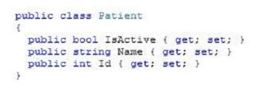

### QUESTION 125

#### DataContractJsonSerializer 

You are developing an application that retrieves patient data from a web service. The application stores the
JSON messages returned from the web service in a string variable named PatientAsJson. 
The variable is encoded as UTF-8. The application includes a class named Patient that is defined by the
following code: 




You need to populate the Patient class with the data returned from the web service.
Which code segment should you use?


Solución: A

Estamos hablando de deserializar Json (nos devuelve un string y tenemos que pasarlo a Json).

por lo que la B XmlSerializer no nos vale y un BinaryFormater tampoco

como nos piden llenar la clase paciente con los datos devueltos por el servicio web.
Patient p = (Patient).jsSerializer.ReadObject(stream);

la C sería para mandarlos


````c#
using System;
using System.IO;
using System.Runtime.Serialization.Json;
using System.Text;

namespace _125
{
    public class Patient 
            {
                public bool IsActive {get;set;}
                public string Name {get;set;}
                public int Id {get;set;}
            }

    class Program
    {
        static void Main(string[] args)
        {
            Console.WriteLine();
            Console.WriteLine();
            Console.WriteLine();
            Patient paciente = new Patient { IsActive=true ,Name="Juan Ramón" , Id=3};
            
            Serializar(paciente);
            Console.WriteLine(("").PadRight(60, '-'));
            string p = "{\"Id\":3,\"IsActive\":true,\"Name\":\"Juan Ramón\"}";
           
            DeSerializar(p);
        }

        static void  Serializar(Patient patientformJson )
        {
            Console.WriteLine ("Serializar: WriteObject ==> Pasa el objeto a un json string para que pueda ser enviado");
            DataContractJsonSerializer  jsSerializer = new DataContractJsonSerializer (typeof(Patient));
            MemoryStream stream = new MemoryStream() ;
            jsSerializer.WriteObject(stream, patientformJson);
            byte[] vector = stream.ToArray();

            Console.WriteLine(Encoding.UTF8.GetString(vector));
        }

        static void  DeSerializar(string PatientAsJson)
        {
            Console.WriteLine ("DeSerializar: ReadObject ==> pasa el json string a un objeto");
        

            Patient patientformJson = new Patient();
            DataContractJsonSerializer  jsSerializer = new DataContractJsonSerializer (typeof(Patient));
            using (MemoryStream stream = new MemoryStream(Encoding.UTF8.GetBytes(PatientAsJson)))
            {
                patientformJson = (Patient)jsSerializer.ReadObject(stream);
            }
            Console.WriteLine (patientformJson.Name);
            Console.WriteLine (patientformJson.IsActive);
            Console.WriteLine (patientformJson.Id);
        }

    }
       

    }
 
````