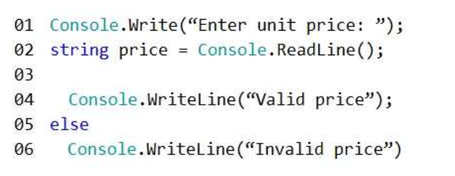

## QUESTION 138 --ERRATA-- __ERRATA__
LA RESPUESTA CORRECTA ES LA C

You are creating a console application named App1.  
App1 will validate user input for order entries.  
You are developing the following code segment (line numbers are included for reference only):  

You need to complete the code segment.  
The solution must ensure that prices are positive and have two decimal places.  
Which code should you insert at line 03?  

Correct Answer: A __ERRATA__ __ERRATA__ __ERRATA__ __ERRATA__ __ERRATA__

La CORRECTA ES LA C

Si te fijas B y C indican  que puede entrar un signo negativo!  DESCARTADAS

A if !(reg.IsMatch(price)) o sea que si no se cumple entonces price valid !!!!! __ERROR__

C if (reg.IsMatch(price))  si se cumple entonces prive valid OK  

