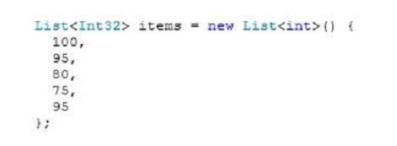
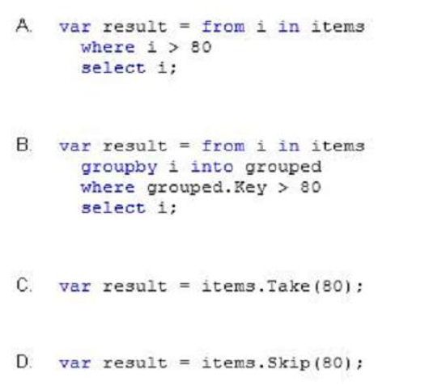
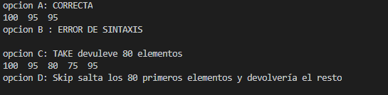

### QUESTION 139

##### LINQ


You have the following code:




You need to retrieve all of the numbers from the items variable that are greater than 80.  
Which code should you use?  




Respuesta A.





````c#
using System;
using System.Collections.Generic;
using static System.Console;
using System.Linq;
namespace _139
{
    class Program
    {

        static void Main(string[] args)
        {
            List<Int32> items = new List<Int32>() {
                100, 95, 80, 75, 95
            };
            new Program().a(items);WriteLine("");
            new Program().b(items);WriteLine("");
            new Program().c(items);WriteLine("");
            new Program().d(items);WriteLine("");
        }
        public void a(List<Int32> lista)
        {
            var results = from i in lista
                          where i > 80
                          select i;
            WriteLine("opcion A: CORRECTA ");
            foreach (Int32 i in results)
            {
                Write ($"{i}  ");
            }


        }
        public void b(List<Int32> lista)
        {
            /*
             var results = from i in lista
                        groupby i into grouped
                          where grouped.key > 80
                          select i;
            */
            WriteLine("opcion B : ERROR DE SINTAXIS");

        }
        public void c(List<Int32> lista)
        {
            var results = lista.Take(80);
            WriteLine("opcion C: TAKE devuleve 80 elementos");
            foreach (Int32 i in results)
            {
                Write ($"{i}  ");
            }
        }
        public void d(List<Int32> lista)
        {
            var results = lista.Skip(80);
            WriteLine("opcion D: Skip salta los 80 primeros elementos y devolvería el resto");
            foreach (Int32 i in results)
            {
                Write ($"{i}  ");
            }
        }
    }
}
````


