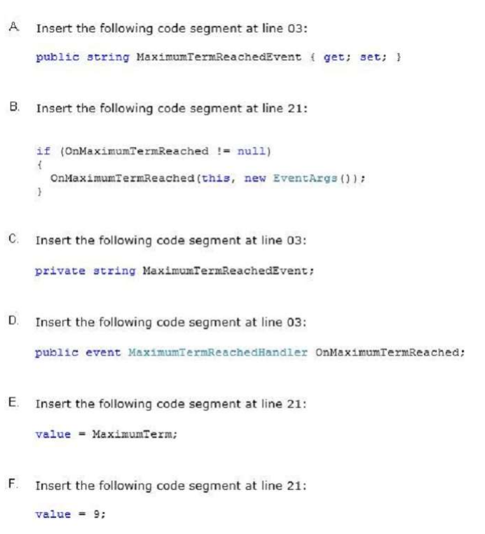

### QUESTION 144 

##### eventos

You are modifying an application that processes loans. The following code defines the Loan class. (Line
numbers are included for reference only.)


Loans are restricted to a maximum term of 10 years. The application must send a notification message if a loan
request exceeds 10 years.  
You need to implement the notification mechanism.  
Which two actions should you perform? (Each correct answer presents part of the solution. Choose two.)  





***las correctas son B y D***

Metodo descarte:
   
A 03 public string MaximumTermReachedEvent {get;set;}  **DESCARTADA no puede tratarse de una propiedad**   
E 21 value = MaximunTerm; **DESCARTADA value es la parte derecha de la asignación en el set**  
F 21 value = 9;  **DESCARTADA value es la parte derecha de la asignación en el set**  

una vez descartadas las E y F que eran el código de la 21 ya sólo queda está    
B 21  if (OnMaximunTermReached != null) ***CORRECTA***
      { 
		   OnMaximunTermReached( this, new EventArgs());
	  }

y de estas dos la declaración del evento  
C 03 private string MaximumTermReachedEvent;  **DESCARTA**  
D 03 public event MaximumTermReachedHandler OnMaximunTermReached; ***CORRECTA***  


Metodo pensar:   

usando eventos.   
1.- declaración del evento en la clase   
  event  **delegado**  **evento**  
2.- disparador   
  if (**evento** ! null)  **evento** (this, argumentos)      
3.- declaración del delegado    
  delegate  tipo  **delegado** (objeto, argummentos)  

el código quedaría así
```` c#
public class Loan
{
	public event MaximunTermReachedHandler OnMaximunTermReached;
	private int _term;
	private const int MaximumTerm = 10;
	private const decimal Rate = 0.034m;
	public int Term
	{
		get 
		{
			return _term
		}
		set
		{
			if (value <= MaximumTerm)
			{
				_term = value;
			}
			else
			{
				if (OnMaximunTermReached != null)
					OnMaximunTermReached (this, new EventArgs());

			}
		}
	}
}
public delegate void MaximunTermReachedHandler (object source, EventArgs e);
```` 


La forma de utiliar un delegado es la siguiente

````c#
  class CLASE
 {
        public delegate void name_delegado (CLASE obj, EventArgs args);
        public event name_delegado name_evento
        if (name_evento != null)
            name_evento(this, e);
 }


        public static void metodo(CLASE objeto, EventArgs e) //la firma
        { ..........
        }


		Main { // o en donde se vaya a utilizar

            //De la siguiente forma se puede suscribir al evento pero en la definición
            //del metodo suscrito en la linea 28 no pude ser "static"
            //      RaisingAnEvent rae = new RaisingAnEvent();
            //      instancia.name_evento += rae.metodo;
            //De esta forma la suscripción si puede ser a un metodo "static" de la linea 28
            intancia.name_evento += new CLASE.name_delegado(metodo);
		}

`````