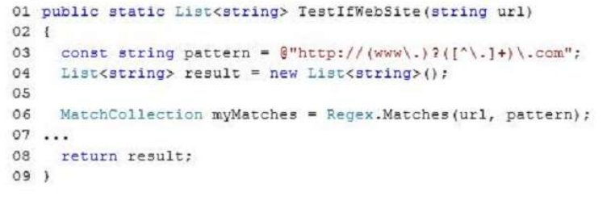
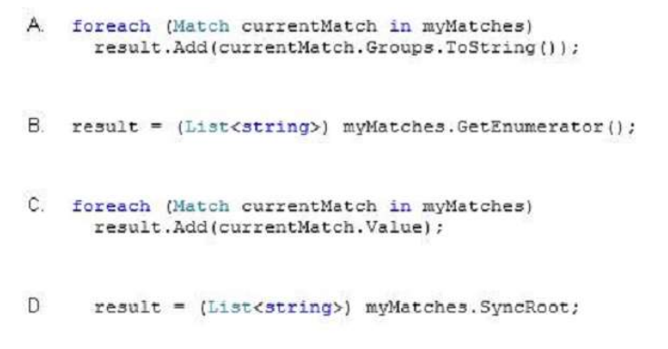

### QUESTION 161

#### (ES IGUAL QUE LA 121) Expresión regular MatchCollection Regex.Matches

You write the following method (line numbers are included for reference only):




You need to ensure that the method extracts a list of URLs that match the following pattern:  
@http://(www\.)?([^\.]+)\.com;  
Which code should you insert at line 07?  





Solución: C
 ````c#
 MatchCollection myMatches = Regex.Matches(url, pattern);  //añade si url cumple el patrón
            foreach (Match currentMatch in myMatches)
                result.Add(currentMatch.Value);
 //  recorre el  MatchCollection y la añade  asa a la lista              
````


Es igual que la 121

En este caso B y D dan error.
la A  evalua la expresión pero no añade el valor sino System.Text.RegularExpressions.GroupCollection  

La opción c ) es la correcta.  
 Regex.Matches();  devuelve una  MatchCollection con todos las ocurrencias que cumplen la condición
 por lo que   
 ````c#
 MatchCollection myMatches = Regex.Matches(url, pattern);  //añade si url cumple el patrón
            foreach (Match currentMatch in myMatches)
                result.Add(currentMatch.Value);
 //  recorre el  MatchCollection y la aañade a la lista              
````
nota: como hace un result = new List<string>() dentro del metodo, la lista final sólo tendrá un elemento o ninguno. 


Explanation/Reference:
Explanation:
. MatchCollection  
Represents the set of successful matches found by iteratively applying a regular expression pattern to the
input string.  
The collection is immutable (read-only) and has no public constructor. The Regex.Matches method returns
a MatchCollection object.  
. List<T>.Add Method  
Adds an object to the end of the List<T>.  

Este es otro ejemplo le pasa una frase y saca las palabras que se repiten  

````c#
using System;
using System.Collections.Generic;
using System.Text.RegularExpressions;
using System.Linq;
namespace _121
{
    class Program
    {
        static void Main(string[] args)
        {
 
        // Define a regular expression for repeated words.
        Regex rx = new Regex(@"\b(?<word>\w+)\s+(\k<word>)\b",
          RegexOptions.Compiled | RegexOptions.IgnoreCase);

        // Define a test string.
        string text = "The the quick brown fox  fox jumps over the lazy dog dog.";

        // Find matches.
        MatchCollection matches = rx.Matches(text);

        // Report the number of matches found.
        Console.WriteLine("{0} matches found in:\n   {1}",
                          matches.Count,
                          text);

        // Report on each match.
        foreach (Match match in matches)
        {
            GroupCollection groups = match.Groups;
            Console.WriteLine("'{0}' repeated at positions {1} and {2}",
                              groups["word"].Value,
                              groups[0].Index,
                              groups[1].Index);
        }
    }
}
````
salida : The  fox  dog