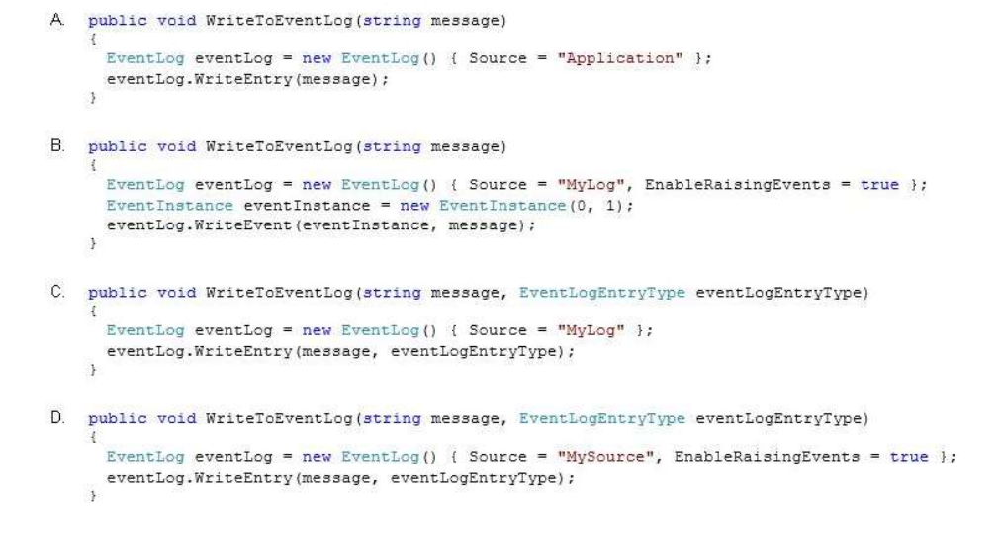
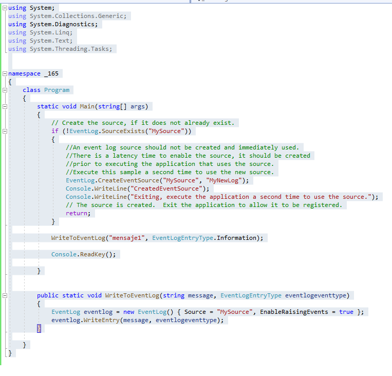
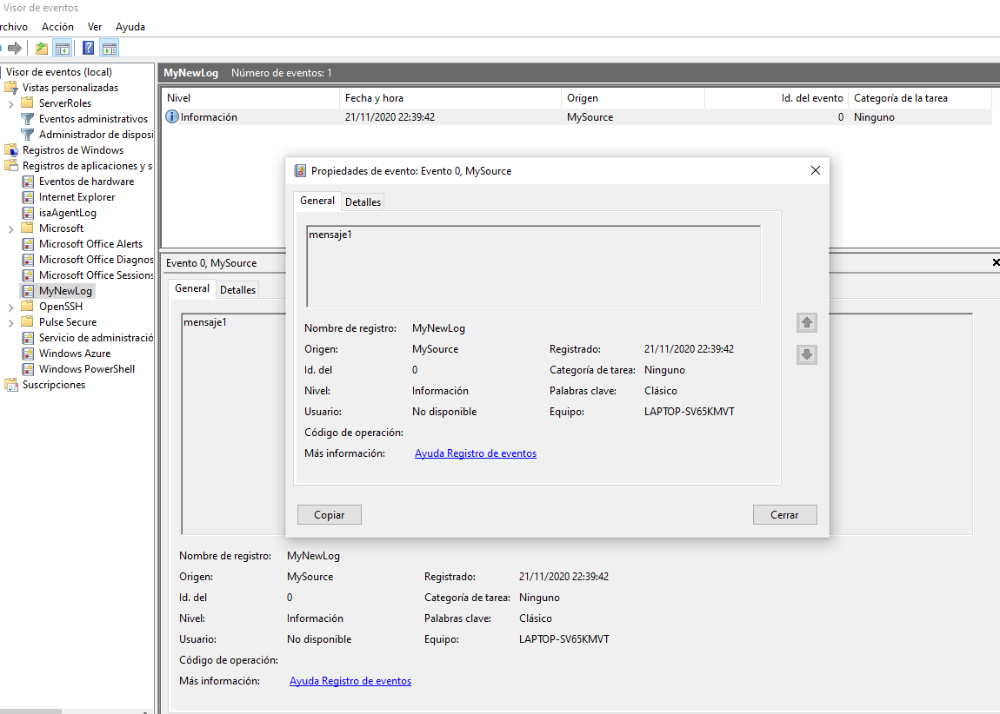

### QUESTION 165

##### event log


You are developing an application by using C#. The application will write events to an event log. You plan to
deploy the application to a server.  
You create an event source named MySource and a custom log named MyLog on the server.
You need to write events to the custom log.  
Which code segment should you use?  




A. Option A  
B. Option B  
C. Option C  
D. Option D  


Ojo:  fuente de eventos llamada MySource   
y un registro personalizado llamado MyLog en el servidor  


Respuesta D.


 
A) ERROR DE REQUERIMIENTO : La fuente debe llamarse MySource!!!!
```c#
        public void WriteToEventLog_A(string message)
        {
            EventLog eventlog = new EventLog() { Source = "Application" };
            eventlog.WriteEntry(message);
        }
````

B)  ERROR DE SINTAXIS: eventlog.WriteEntry() 
public static void WriteEntry (string source, string message, System.Diagnostics.EventLogEntryType type, int eventID, short category, byte[] rawData);

```c#
        public void WriteToEventLog_B(string message)
        {
            EventLog eventlog = new EventLog() { Source = "Mylog", EnableRaisingEvents=true }; 
            EventInstance eventInstance = new EventInstance(0, 1);
            eventlog.WriteEntry(eventInstance,message);
        }
````

C) ERROR DE REQUERIMIENTO : La fuente debe llamarse MySource!!!!
```c#
public void WriteToEventLog_BC(string message, EventLogEntryType eventlogeventtype)
        {
            EventLog eventlog = new EventLog() { Source = "Mylog" };
            eventlog.WriteEntry(message, eventlogeventtype);
        }
````
D) CORRECTA
````c#
        public void WriteToEventLog_D(string message, EventLogEntryType eventlogeventtype)
        {
            EventLog eventlog = new EventLog() { Source = "MySource", EnableRaisingEvents = true };
            eventlog.WriteEntry(message, eventlogeventtype);
        }
````


FrameWork 4.8 !!!






