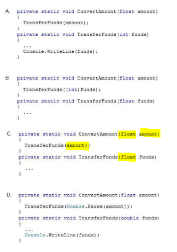

### QUESTION 168

##### Sintaxis cast 

(correspondía a Rebeca)

 
You are developing an application that includes methods named ConvertAmount and TransferFunds.
You need to ensure that the precision and range of the value in the amount variable is not lost when the
TransferFunds() method is called.
Which code segment should you use?




Respuesta la C (es la lógica) porque es el mismo tipo (float) y en la llamada no lo convierto 

a) recibo un float lo paso al metodo sin convertir, pero el metodo espera un int por lo que lo convierte.
b) recibo un float y el metodo espera un float, pero le mando un int

c) es la correcta!  porque es el mismo tipo (float) y en la llamada no lo convierto 

```c#
private static void ConvertAmount(float amount)
{
	TransferFunds(amount)
{
private static void TransferFunds(float funds)
{
..................
}
````
d) recibo un float, el metodo espera un double por lo que lo convierto a double
aunque double tenga más precisión no es el mismo rango.


Explanation:

Simply use float for the TransferFunds parameter.

Note:

The float keyword signifies a simple type that stores 32-bit floating-point values.

The double keyword signifies a simple type that stores 64-bit floating-point values


