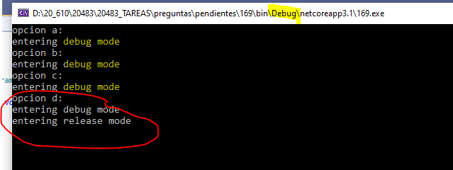

### QUESTION 169 

##### Sintaxis DEBUG (direciva de compilación)
(correspondía a Laura)

You need to write a console application that meets the following requirements:

If the application is compiled in Debug mode, the console output must display Entering debug mode.

If the application is compiled in Release mode, the console output must display Entering release mode.

Which code should you use?

Resultados

Segun los pantallazos podría ser B y C 
pero es más correcta la B  !!!

https://stackoverflow.com/questions/7073266/if-debug-vs-system-diagnostics-debugger-isattached

#if DEBUG ensures the code is not included in the assembly at all in release builds. Also, code included by #if DEBUG runs all the time in a debug build - not just when running under a debugger.

Debugger.IsAttached means the code is included for both debug and release builds. And a debugger can be attached to release builds too.

It's common to use both together. #if DEBUG is usually used for things like logging, or to reduce exception handling in internal test builds. Debugger.IsAttached tends to just be used to decide whether to swallow exceptions or show them to a programmer - more of a programmer aid than anything else.

Explanation:
When the C# compiler encounters an #if directive, followed eventually by an #endif directive, it will compile the
code between the directives only if the specified symbol is defined. Unlike C and C++, you cannot assign a
numeric value to a symbol; the #if statement in C# is Boolean and only tests whether the symbol has been
defined or not. For example,
#define DEBUG
// ...

#if DEBUG
Console.WriteLine("Debug version");
#endif
