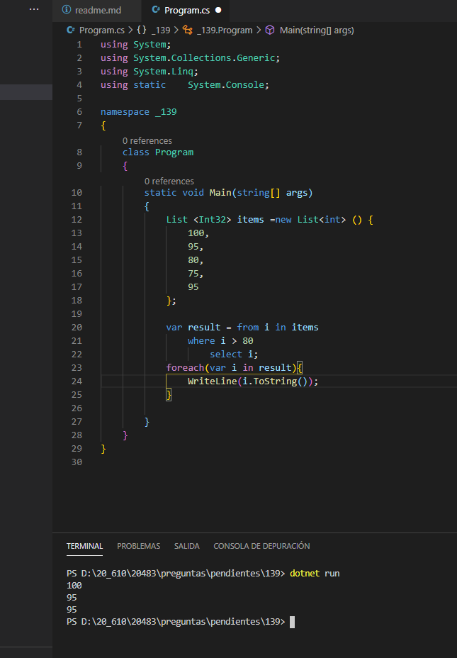

### QUESTION 139

##### LINQ


You have the following code:

````c#

List <Int32> items =new List<Int> () {
	100,
	 95,
	 80,
	 75,
	 95
}

````

You need to retrieve all of the numbers from the items variable that are greater than 80.
Which code should you use?

Opcion A

````c#
var result = from i in items 
	where i > 80
	select i;
````

Opcion B

````c#
var result = from i in items 
	where i into grouped
	where grouped.key > 80
	select i;
````

Opcion C
````c#
var result = items.Take(80)

````

Opcion D
````c#
var result = items.Skip(80)
````


Solucion: A
````c#
var result = from i in items 
	where i > 80
	select i;
````


Explicacion
A. Correcta

B. ERROR DE SINTXIS

C. Take(80) Coge los 80 primeros

D. Skip(80) Salta los 80 primeros y devuleve los siguientes


Solucion :  





