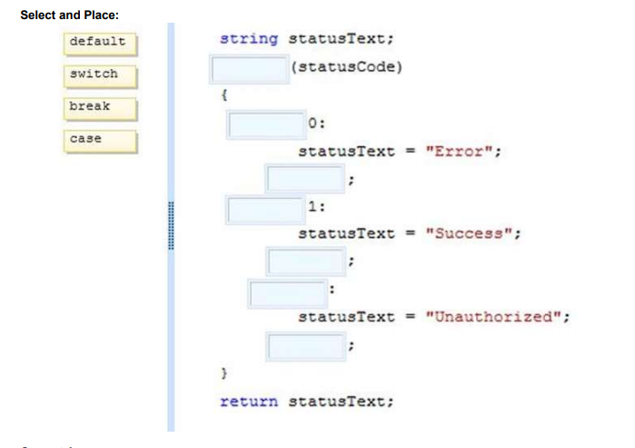
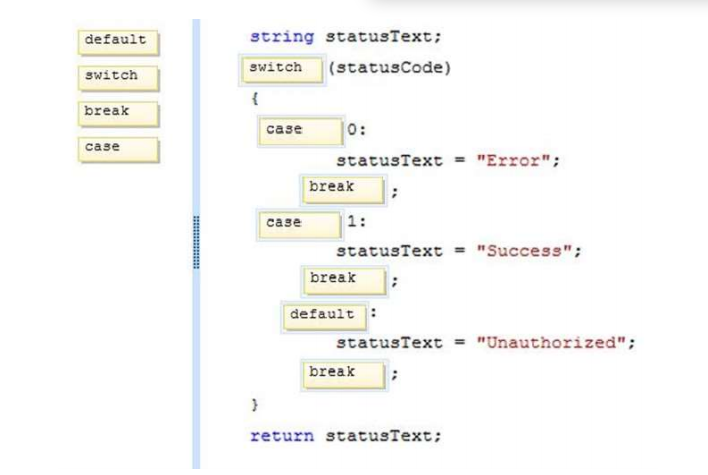
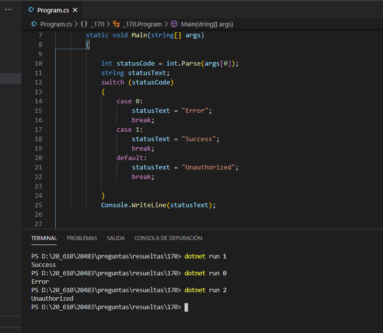

### QUESTION 170

##### sintaxis switch/case

(correspondía a Laura)

You are adding a method to an existing application. The method uses an integer named statusCode as an input
parameter and returns the status code as a string.
The method must meet the following requirements:
Return "Error" if the statusCode is 0.
Return "Success" if the statusCode is 1.
Return "Unauthorized" if the statusCode is any value other than 0 or l.
You need to implement the method to meet the requirements.
How should you complete the relevant code? (To answer, drag the appropriate statements to the correct
locations in the answer area. Each statement may be used once, more than once, or not at all. You may need
to drag the split bar between panes or scroll to view content.)







SOLUCION



Otra forma de codificar la instruccion swicth

```c#
  statusText = statusCode switch
            {
                0 => "ERROR",
                1 => "SUCESS",
                _ => "Unauthorized",

            };
           Console.WriteLine(statusText);

````

