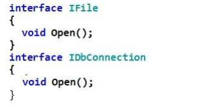
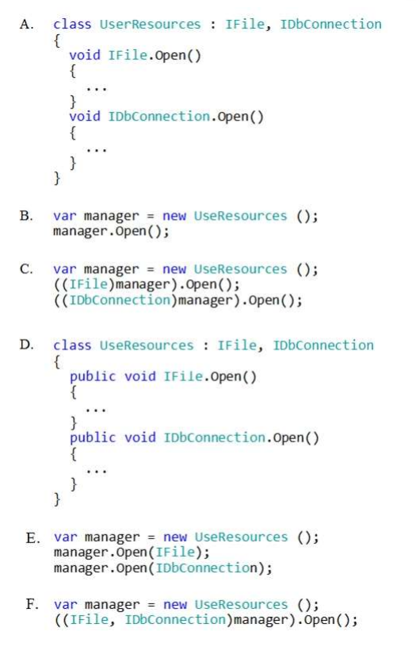
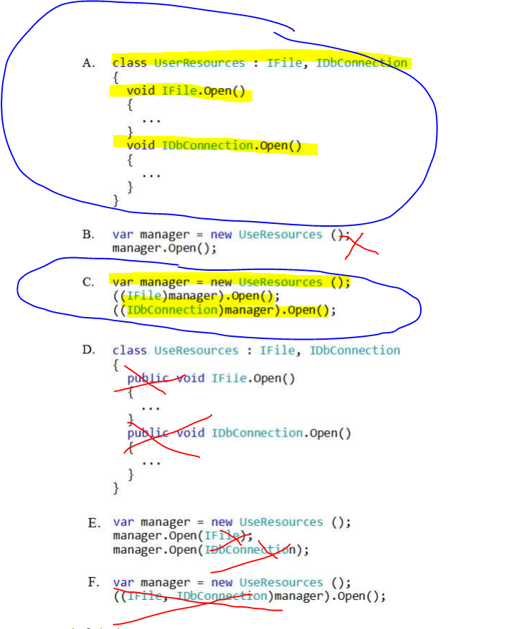
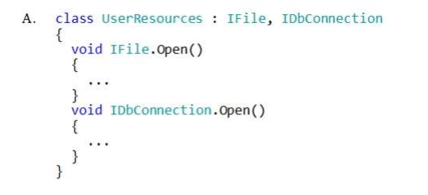
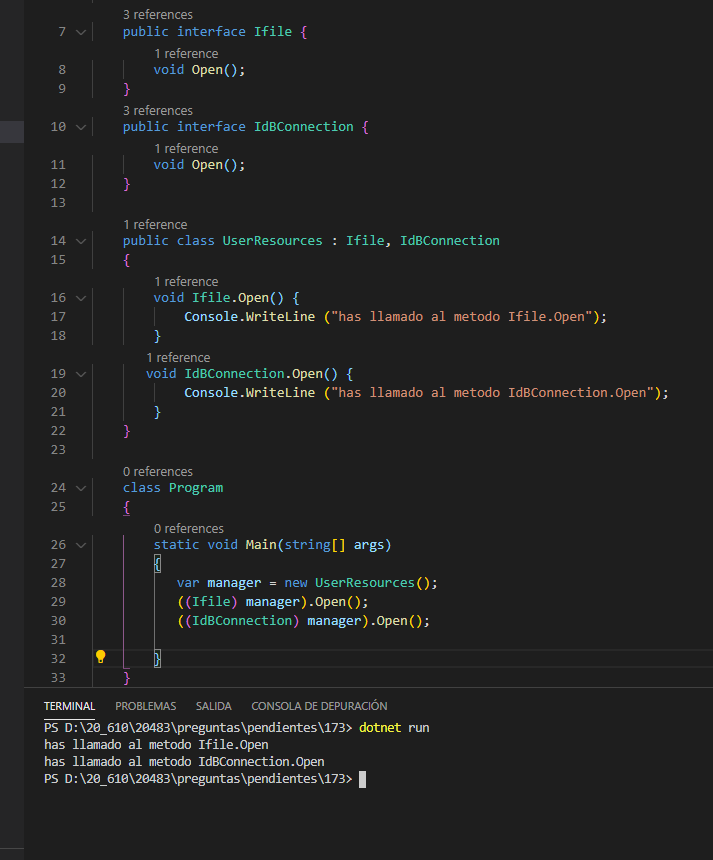

### QUESTION 173

##### Interfaces

You are developing an application that includes the following code segment:




You need to implement the Open() method of each interface in a derived class named UseResources and
call the Open() method of each interface.

Which two code segments should you use? Each correct answer presents part of the solution.
NOTE: Each correct selection is worth one point.

Select and Place:





Vamos por partes.
1.- Por un lado implementar la interface.

En este caso tenemos la A y la D, la diferencia es que declaran los metodos como publicos en la D , pero como sabemos que la firma debe ser la misma pues elegimos la A ya que la interface los declara como privados (por defecto)

2.- el segundo tema es que nos piden llamar a cada uno de los metodos
la B la vamos a rechazar solo hace un manager.Open(); 

la F no conocemos nimgun cast con dos tipos ((IFile, IdbConnectecion) manager).Open()  erroneo

Asi que me queda la E y la C

La E la rechazamos porque manager.Open (Ifile) y manager.Open(IDbConnection) no corresponde a la firma

por lo q me queda únicamente  la C




Solucion: A y C




Explanation/Reference:

Explanation:

An interface contains only the signatures of methods, properties, events or indexers. A class or struct that
implements the interface must implement the members of the interface that are specified in the interface
definition.

Example:
````c#
interface ISampleInterface
{
 void SampleMethod();
}
class ImplementationClass : ISampleInterface
{
 // Explicit interface member implementation:
 void ISampleInterface.SampleMethod()
 {
 // Method implementation.
 }
 static void Main()
 {
 // Declare an interface instance.
 ISampleInterface obj = new ImplementationClass();
 // Call the member.
 obj.SampleMethod();
 }
}
````````
 


