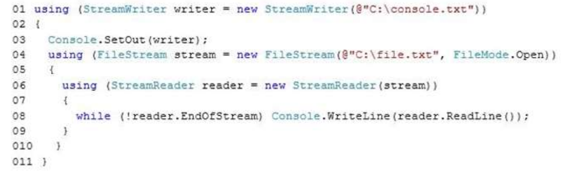
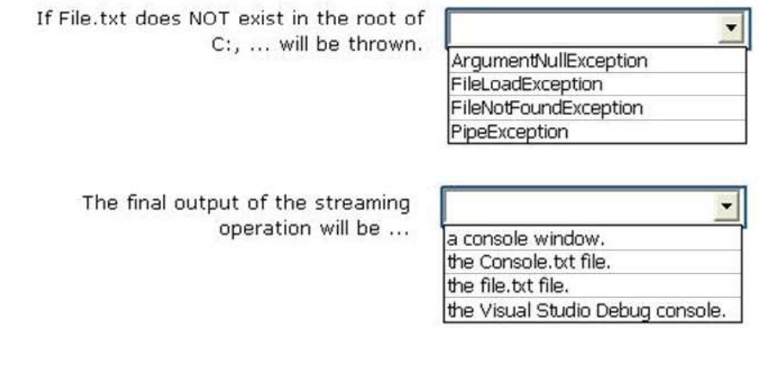
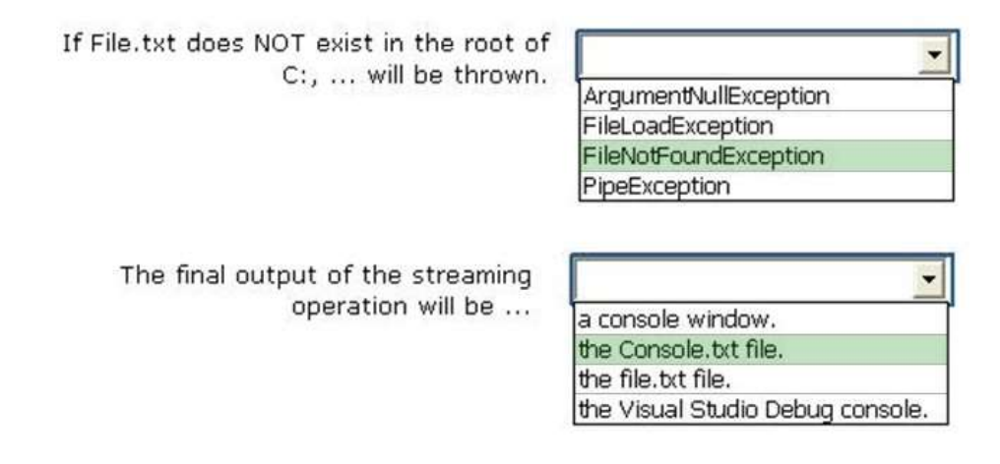
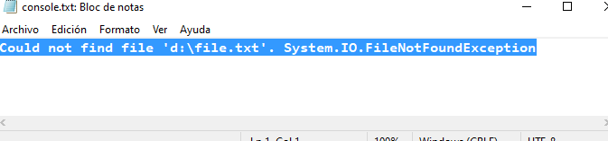
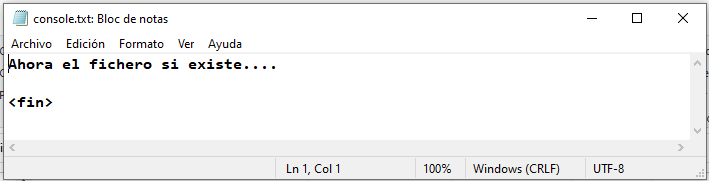

### QUESTION 175

##### StreamWriter/ StreamReader / FileStream /  FileNotFoundException / Console.SetOut(fichero)

You have the following code (line numbers are included for reference only):



To answer, complete each statement according to the information presented in the code




Solución:




notas: Console.SetOut(fichero.txt) establece la salida de Console a fichero.txt   
	   Console.Write  escribira en el fichero y no por pantalla.    
	   El modo File.Open da una excepcion de FileNotFoundException si no existe el fichero
	   

ejecución si no existe el fichero  

  
   
ejecución si existe el fichero  



````c#

using System;
using System.IO;

namespace _175
{
    class Program
    {
        static void Main(string[] args)
        {
            new Program().escribir();
        }

        public    void escribir ()
        {
            
            using (StreamWriter writer = new StreamWriter(@"d:\console.txt"))
            {
                try
                {
                    Console.SetOut (writer); //Establece la salida de consola a writer
                using (FileStream stream = new FileStream (@"d:\file.txt", FileMode.Open))
                {
                    using (StreamReader reader = new StreamReader (stream))
                    {
                        while (!reader.EndOfStream) Console.WriteLine(reader.ReadLine());
                    }
                }
            }
            
            catch (Exception ex){
                Console.WriteLine (ex.Message + " " +  ex.GetType());
            }
            finally
            {
                    writer.Close();
            }
            }
        }
        
    }
}

````

Referencia_
https://www.returngis.net/2014/12/save-console-writeline-output-to-a-file-with-c/


