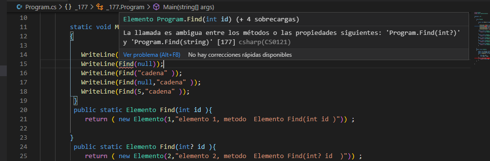

### QUESTION 177 

##### parameros en metodos int? **ERRATA o raro**

You are developing an application that will manage the inventory of a warehouse. The application includes a
method named FindItem.  
Users must be able to locate item records by using the item identifier, item name, or a combination of the two
values.  
You need to implement the FindItem() method to meet the requirement.  
Which two sets of method signatures can you use to achieve this goal? Each correct answer presents a
complete solution.  
NOTE: Each correct selection is worth one point   


Opcion A
```c#
public static Item FindItem (int id);
public static Item FindItem (string name);
public static Item FindItem (Int32 id);
````
Opcion B
```c#
public static Item FindItem (int id);
public static Item FindItem (string name);
public static Item FindItem (int ? id);
````
Opcion C
```c#
public static Item FindItem (int id);
public static Item FindItem (string name);
public static Item FindItem (int  id, String name);
````
Opcion D
```c#
public static Item FindItem (int id);
public static Item FindItem (string name);
public static void FindItem (int id);
````

Respuesta: B y C


Tanto la A como la D dan error de compilación porque Finditem(int id) ya esta de definido.  
Es independiente declarar el parametro int ó int32.  en la opcion A.  
y en la D la firma del metodo es la misma aunque varie el tipo retorno .  

La opción C cumple perfectamente los requisitos.  
La opción B Es ERRATA  ó nunca utilizaremos el metodo Find(int? id)  
si llamamos a Find(5) iremos por Find(int id)   
si llamamos a Find(null) Nos lanza un error: 
La llamada es ambigua entre los métodos o las propiedades siguientes: 'Program.Find(int?)' y 'Program.Find(string)

En fin como hay que elegir dos la C y la B (aunque nunca entrará en Find(int? id) ni tampoco servirá pará una  combination of the two values)  
 





nota: public static Item FindItem (int ? id); significa que id puede ser un entero o nulo

