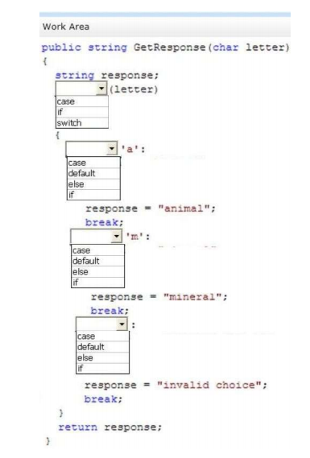

### QUESTION 19 

##### Sintaxis SWITCH/CASE

(correspondía a Rebeca)

You are implementing a library method that accepts a character parameter and returns a string.
If the lookup succeeds, the method must return the corresponding string value. If the lookup fails, the method
must return the value "invalid choice."
You need to implement the lookup algorithm.
How should you complete the relevant code? (To answer, select the correct keyword in each drop-down list in
the answer area.)




```c#

public string GetResponse(char letter)
{
            string response;
            switch (letter)
            {
                case 'a':
                    response = "animal";
                    break;
                case 'm':
                    response = "mineral";
                    break;
                default:
                    break;
            }
            return (response);

        }
````

Referencia:
https://docs.microsoft.com/en-us/previous-versions/visualstudio/visual-studio-2012/06tc147t(v=vs.110)?redirectedfrom=MSDN