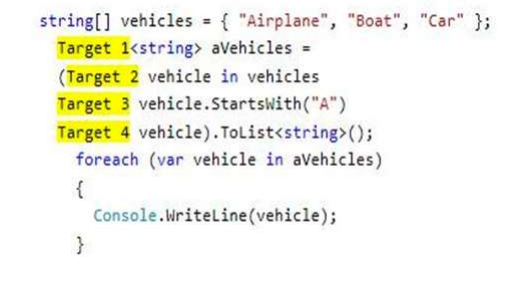
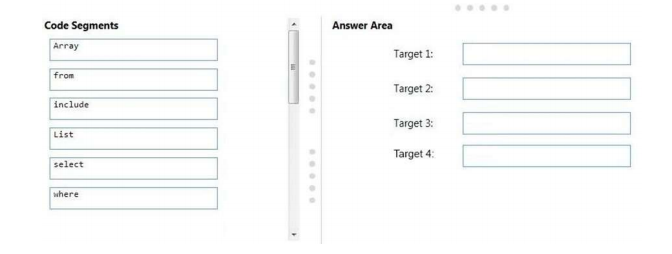
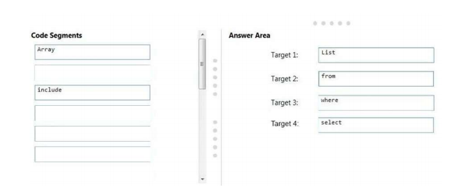
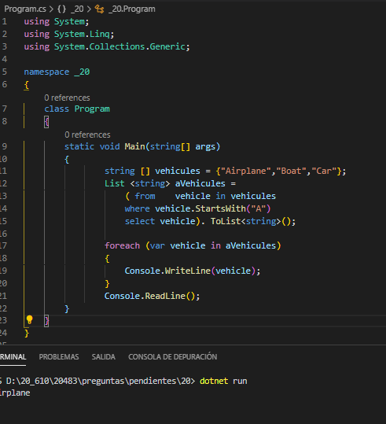

### QUESTION 20

##### LINQ

(correspondía a Laura)

You have the following code:



You need to display all of the vehicles that start with the letter “A”.

How should you complete the code? To answer, drag the appropriate code elements to the correct targets.

Each code element may be used once, more than once, or not at all. You may need to drag the split bar between panes or scroll to view content.

NOTE: Each correct selection is worth one point.





Solucion :  





```c#
		string [] vehicules = {"Airplane","Boat","Car"};
		List <string> aVehicules = 
			( from    vehicle in vehicules
			where vehicle.StartsWith("A")
			select vehicle). ToList<string>();
		
		foreach (var vehicle in aVehicules)
		{
			Console.WriteLine(vehicle);
		}
``` 

   
   
   
   
Explanation/Reference:

Explanation:

 
<a href="https://docs.microsoft.com/en-us/dotnet/csharp/language-reference/keywords/select-clause">https://docs.microsoft.com/en-us/dotnet/csharp/language-reference/keywords/select-clause</a>


 




