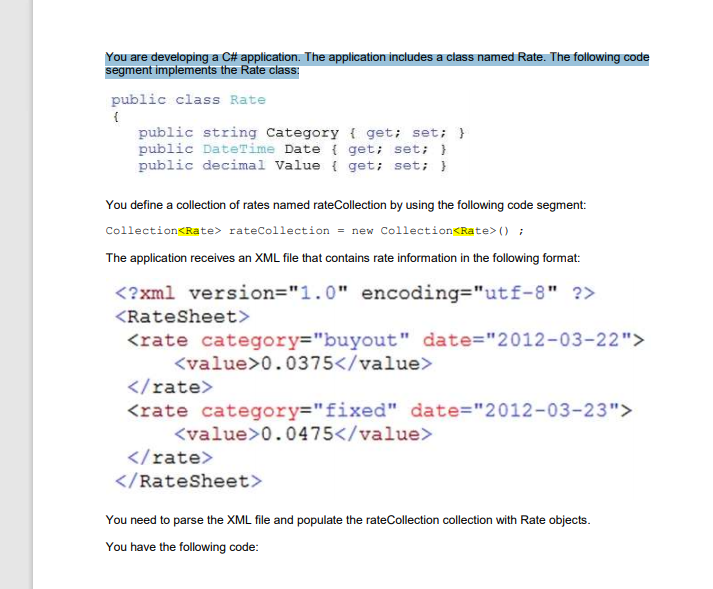
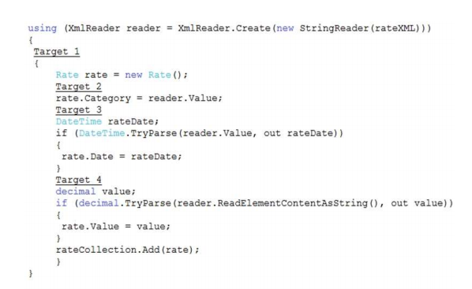
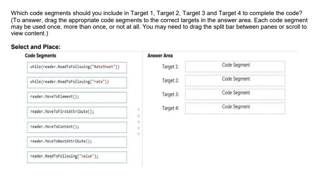
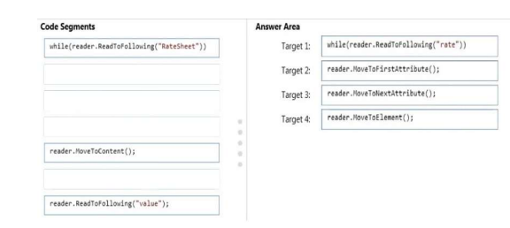

## QUESTION 206 __ERRATA__ __ERRATA__ __ERRATA__ __ERRATA__
DRAG DROP

You are developing a C# application. The application includes a class named Rate. The following code
segment implements the Rate class:

   

  

  
__ERRATA__ __ERRATA__ __ERRATA__ __ERRATA__ __ERRATA__  

  

La solición da un error Element' is an invalid XmlNodeType.

LA Solución correcta es 
     while (reader.ReadToFollowing("rate"))
     reader.MoveToFirstAttribute();
     reader.MoveToNextAttribute();
     __ reader.ReadToFollowing("value");__


````
using System;
using System.Collections.ObjectModel;
using System.Xml;

namespace _206
{

    public class Rate
    {
        public string Category { get; set; }
        public DateTime Date { get; set; }
        public decimal Value { get; set; }
        public override string  ToString() 
        {
             return $"Category : {Category} Date {Date.ToLongDateString()} Value { Value.ToString()}";  
        }
    }


    class Program
    {


        public static void Main()
        {
            Collection<Rate> rateCollection = new Collection<Rate>();

            string path = @"entrada.xml";

            using var reader = XmlReader.Create(path);
            {
                while (reader.ReadToFollowing("rate"))
                {
                    Rate rate = new Rate();
                    reader.MoveToFirstAttribute();
                    rate.Category = reader.Value;

                    reader.MoveToNextAttribute();
                    DateTime ratetime;
                    if (DateTime.TryParse(reader.Value, out ratetime))
                    {
                        rate.Date = ratetime;
                    }
                     /// reader.MoveToElement();    'Element' is an invalid XmlNodeType.
                    decimal value;
                    reader.ReadToFollowing("value");
                    if (decimal.TryParse(reader.ReadElementContentAsString(), out value))
                        rate.Value = value;
                    rateCollection.Add(rate);
                }
            }
            foreach (var r in rateCollection)
                System.Console.WriteLine(r);
        }
    }
}


````

Output:  
Category : buyout Date jueves, 22 de marzo de 2012 Value 375  
Category : fixed Date viernes, 23 de marzo de 2012 Value 475  