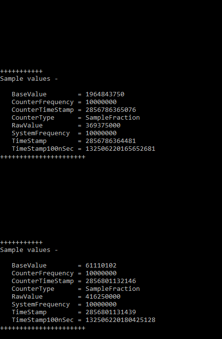

### QUESTION 211

#####  PerformanceCounterType  


You are developing a method named CreateCounters that will create performance counters for an application.  
The method includes the following code. (Line numbers are included for reference only.)  


You need to ensure that Counter2 is available for use in Windows Performance Monitor (PerfMon).  
Which code segment should you insert at line 16?  


A. CounterType = PerformanceCounterType.RawBase  
B. CounterType = PerformanceCounterType.AverageBase  
C. CounterType = PerformanceCounterType.SampleBase  
D. CounterType = PerformanceCounterType.CounterMultiBase  


La Respuesta Correcta es C.   
Es por lógica si se utiliza un SampleFraction lo lógico es utilizar un SampleBase     
Puedes ver ejemplos de código en https://docs.microsoft.com/en-us/dotnet/api/system.diagnostics.performancecountertype?redirectedfrom=MSDN&view=dotnet-plat-ext-5.0  


Recuerda abrir el proyecto con Visual Studio 2019 ADMINISTRADOR!!!  


Explanation:
PerformanceCounterType.SampleBase - A base counter that stores the number of sampling interrupts taken
and is used as a denominator in the sampling fraction. The sampling fraction is the number of samples that
were 1 (or true) for a sample interrupt. Check that this value is greater than zero before using it as the
denominator in a calculation of SampleFraction.  
PerformanceCounterType.SampleFraction - A percentage counter that shows the average ratio of hits to all
operations during the last two sample intervals. Formula: ((N 1 - N 0) / (D 1 - D 0)) x 100, where the numerator
represents the number of successful operations during the last sample interval, and the denominator
represents the change in the number of all operations (of the type measured) completed during the samp  


````c#
using System;
using System.Collections;
using System.Collections.Specialized;
using System.Diagnostics;

// Provides a SampleFraction counter to measure the percentage of the user processor
// time for this process to total processor time for the process.
public class App
{

    private static PerformanceCounter perfCounter;
    private static PerformanceCounter basePerfCounter;
    private static Process thisProcess = Process.GetCurrentProcess();

    public static void Main()
    {

        ArrayList samplesList = new ArrayList();

        // If the category does not exist, create the category and exit.
        // Performance counters should not be created and immediately used.
        // There is a latency time to enable the counters, they should be created
        // prior to executing the application that uses the counters.
        // Execute this sample a second time to use the category.
        if (SetupCategory())
            return;
        CreateCounters();
        CollectSamples(samplesList);
        CalculateResults(samplesList);
    }

    private static bool SetupCategory()
    {
        if (!PerformanceCounterCategory.Exists("SampleFractionCategory"))
        {

            CounterCreationDataCollection CCDC = new CounterCreationDataCollection();

            // Add the counter.
            CounterCreationData sampleFraction = new CounterCreationData();
            sampleFraction.CounterType = PerformanceCounterType.SampleFraction;
            sampleFraction.CounterName = "SampleFractionSample";
            CCDC.Add(sampleFraction);

            // Add the base counter.
            CounterCreationData sampleFractionBase = new CounterCreationData();
            sampleFractionBase.CounterType = PerformanceCounterType.SampleBase;
            sampleFractionBase.CounterName = "SampleFractionSampleBase";
            CCDC.Add(sampleFractionBase);

            // Create the category.
            PerformanceCounterCategory.Create("SampleFractionCategory",
                "Demonstrates usage of the SampleFraction performance counter type.",
                PerformanceCounterCategoryType.SingleInstance, CCDC);

            return (true);
        }
        else
        {
            Console.WriteLine("Category exists - SampleFractionCategory");
            return (false);
        }
    }

    private static void CreateCounters()
    {
        // Create the counters.

        perfCounter = new PerformanceCounter("SampleFractionCategory",
            "SampleFractionSample",
            false);

        basePerfCounter = new PerformanceCounter("SampleFractionCategory",
            "SampleFractionSampleBase",
            false);

        perfCounter.RawValue = thisProcess.UserProcessorTime.Ticks;
        basePerfCounter.RawValue = thisProcess.TotalProcessorTime.Ticks;
    }
    private static void CollectSamples(ArrayList samplesList)
    {

        // Loop for the samples.
        for (int j = 0; j < 100; j++)
        {

            perfCounter.IncrementBy(thisProcess.UserProcessorTime.Ticks);

            basePerfCounter.IncrementBy(thisProcess.TotalProcessorTime.Ticks);

            if ((j % 10) == 9)
            {
                OutputSample(perfCounter.NextSample());
                samplesList.Add(perfCounter.NextSample());
            }
            else
            {
                Console.WriteLine();
            }

            System.Threading.Thread.Sleep(50);
        }
    }

    private static void CalculateResults(ArrayList samplesList)
    {
        for (int i = 0; i < (samplesList.Count - 1); i++)
        {
            // Output the sample.
            OutputSample((CounterSample)samplesList[i]);
            OutputSample((CounterSample)samplesList[i + 1]);

            // Use .NET to calculate the counter value.
            Console.WriteLine(".NET computed counter value = " +
                CounterSampleCalculator.ComputeCounterValue((CounterSample)samplesList[i],
                (CounterSample)samplesList[i + 1]));

            // Calculate the counter value manually.
            Console.WriteLine("My computed counter value = " +
                MyComputeCounterValue((CounterSample)samplesList[i],
                (CounterSample)samplesList[i + 1]));
        }
    }

    //++++++++//++++++++//++++++++//++++++++//++++++++//++++++++//++++++++//++++++++
    // Description - This counter type provides A percentage counter that shows the
    // average ratio of user proccessor time to total processor time  during the last
    // two sample intervals.
    //++++++++//++++++++//++++++++//++++++++//++++++++//++++++++//++++++++//++++++++
    private static Single MyComputeCounterValue(CounterSample s0, CounterSample s1)
    {
        Single numerator = (Single)s1.RawValue - (Single)s0.RawValue;
        Single denomenator = (Single)s1.BaseValue - (Single)s0.BaseValue;
        Single counterValue = 100 * (numerator / denomenator);
        return (counterValue);
    }

    // Output information about the counter sample.
    private static void OutputSample(CounterSample s)
    {
        Console.WriteLine("\r\n+++++++++++");
        Console.WriteLine("Sample values - \r\n");
        Console.WriteLine("   BaseValue        = " + s.BaseValue);
        Console.WriteLine("   CounterFrequency = " + s.CounterFrequency);
        Console.WriteLine("   CounterTimeStamp = " + s.CounterTimeStamp);
        Console.WriteLine("   CounterType      = " + s.CounterType);
        Console.WriteLine("   RawValue         = " + s.RawValue);
        Console.WriteLine("   SystemFrequency  = " + s.SystemFrequency);
        Console.WriteLine("   TimeStamp        = " + s.TimeStamp);
        Console.WriteLine("   TimeStamp100nSec = " + s.TimeStamp100nSec);
        Console.WriteLine("++++++++++++++++++++++");
        Console.ReadKey();
    }
}
````




