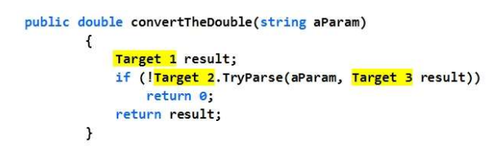
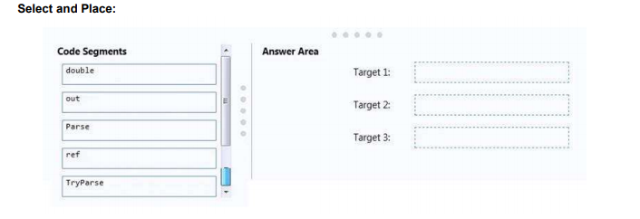
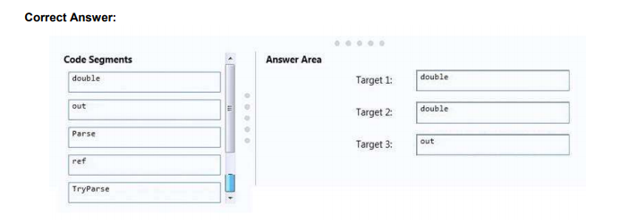
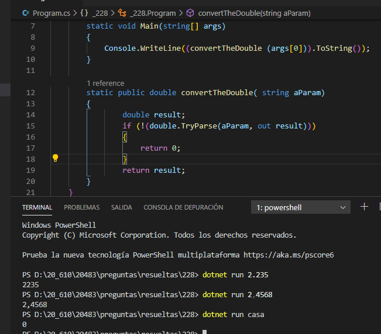

### QUESTION 228

##### TryParse

(correspondía a JuanRa)

You are developing a function that takes a parameter named aParam as a string input.
You need to convert aParam to a Double. If the conversion cannot be completed, the function should return 0.

How should you complete the code? To answer, drag the appropriate code elements to the correct targets.
Each code element may be used once, more than once, or not at all. You may need to drag the split bar
between panes or scroll to view content.
NOTE: Each correct selection is worth one point.

 

RESPUESTA:  

 

SOLUCION

