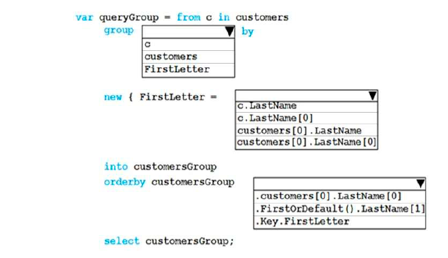
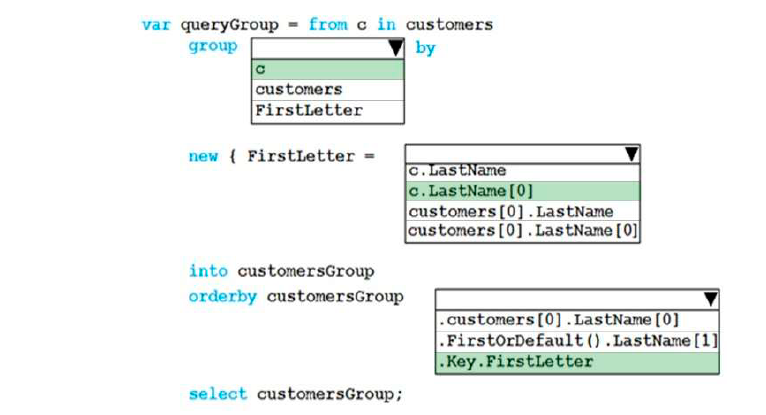

### QUESTION 234

##### LINQ (GROUP)


You have a C# application named Application1 that contains the following code:


The customers object is populated with data.  
You need to create a LINQ query that will group Customer objects by the first letter of the customers’ last
name. The query must return Customer objects.  
How should you complete the LINQ query? To answer, select the appropriate options in the answer area.  
NOTE: Each correct selection is worth one point.  




solucion:




https://docs.microsoft.com/en-us/dotnet/csharp/programming-guide/concepts/linq/basic-linq-query-operations
https://docs.microsoft.com/en-us/dotnet/csharp/language-reference/keywords/group-clause
https://docs.microsoft.com/en-us/dotnet/csharp/language-reference/keywords/orderby-clause


````c#
using System;
using System.Collections.Generic;
using static System.Console;
using System.Linq;
.............................

public class Customer
{
    String FirstName { get; set; }
    public String LastName { get; set; }
    
}

...............
var queryqroup = (from c in customers
                    group c by
                    new { FirstLetter = c.LastName[0] }
    into customerGroup
                    orderby customerGroup.Key.FirstLetter,
    select customerGroup);

foreach (var customergroup in queryqroup)
{
    Console.WriteLine($"Grupo : {customergroup.Key}  Total: {customergroup.Count().ToString()}");
    foreach (Customer c in customergroup)
    {
        Console.WriteLine(c.ToString());
    }
}

````


