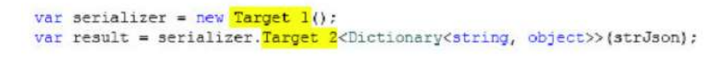
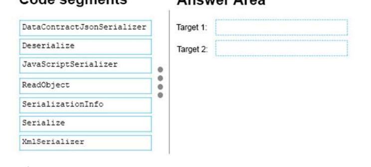
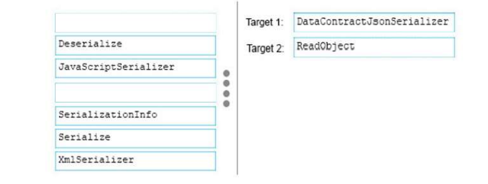

### QUESTION 237

#### DataContractJsonSerializer

You need to validate whether string strJson is a valid JSON string.
You write the following code:

How should you complete the code? To answer, drag the appropriate code elements to the correct targets in
the answer area. Each code element may be used once, more than once, or not at all. You may need to drag
the split bar between panes or scroll to view content.  
NOTE: Each correct selection is worth one point.

Solución: 

Se trata de desserializar un strjson en este caso a un objeto Dictionary  
DataContractJsonSerializer y ReadObject

Explanation:
serializer = new DataContractJsonSerializer();
var result = serializer.ReadObject<Dictionary<string, object>>(StrJson);

