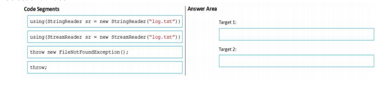
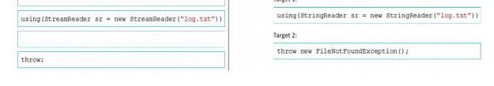

## QUESTION 24 __ERRATA__ __ERRATA__
DRAG DROP
You develop an application that displays information from log files when errors occur. The application will
prompt the user to create an error report that sends details about the error and the session to the administrator.  
When a user opens a log file by using the application, the application throws an exception and closes.  
The application must preserve the original stack trace information when an exception occurs during this
process.  

You have the following code 

SOLUCION __ERRATA__ __ERRATA__ __ERRATA__ __ERRATA__ __ERRATA__ __ERRATA__

SOLUCION CORRECTA:

using (StreamReader sr = new StreamReader(fichero)) 

throw ;    // The application must preserve the original stack trace information when an exception occurs during this
process.

StringReader para leer cadena