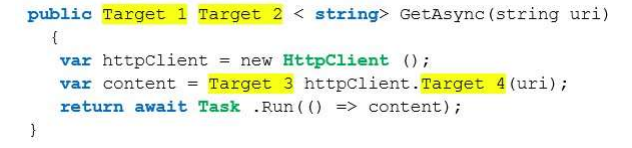
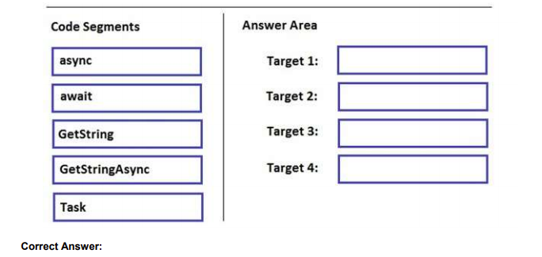
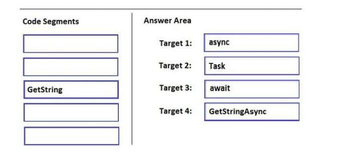

### QUESTION 240

#### HttpClient GetStringAsync async Task

You have the following code.




You need to complete the method to return the content as a string.  
How should you complete the code? To answer, drag the appropriate code elements to the correct targets.  
Each code element may be used once, more than once or not at all. You may need to drag the split bar
between panes or scroll to view content.  
NOTE: Each correct selection is worth one point.  



`


la solición es





Explanation/Reference:
References: https://docs.microsoft.com/en-us/dotnet/csharp/async


```c#
 using System;
using System.Net.Http;
using System.Threading.Tasks;

namespace _240
{
    class Program
    {
        static void Main(string[] args)
        {
            var pagina = GetAsync("https://dotnetfoundation.org/");
            Console.WriteLine(pagina.Result);
        }

        public static async Task <string> GetAsync(string uri)
        {
            var httpClient = new HttpClient();
            var content = await httpClient.GetStringAsync (uri);
            return await Task.Run (() => content); 
        }
    }
}
````

  var content = await httpClient.GetStringAsync (uri);  
  Devuelve el html de la uri   