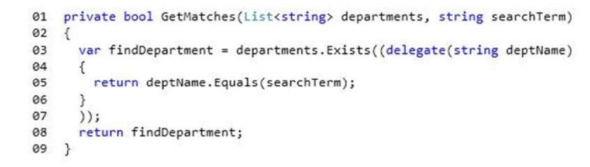
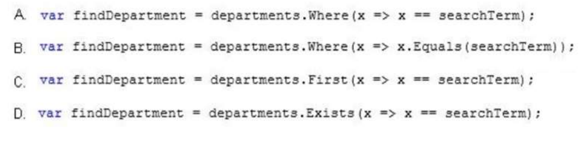

## QQUESTION 244
You have a List object that is generated by executing the following code:  

You need to alter the method to use a lambda statement.  
How should you rewrite lines 03 through 06 of the method?  

Correct Answer: B  __ERRATA__ __ERRATA__ __ERRATA__ __ERRATA__ __ERRATA__ __ERRATA__

Respuesta correcta:  var findepartament = departaments.__Exists__ (x => x==searchTerm);

ES LOGICO YA QUE DEBE DEVOLVER UN BOOLEAN Y ES LA UNICA QUE DEVUELVE UN BOOLEAM