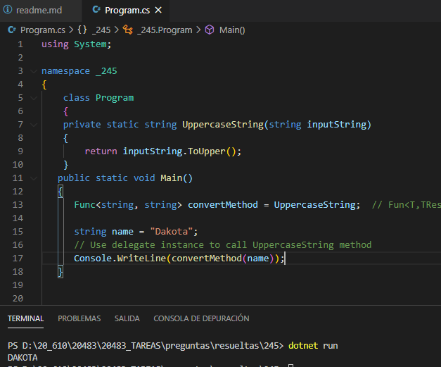

### QUESTION 245

##### DELEGADOS Func<TResult> / Action<>

You are developing an application.      
You need to declare a delegate for a method that accepts a string as a parameter, and then returns a string.  
Which type of delegate should you use?  

A. Func< string, string >  
B. Action< string, string >  
C. Func< string >  
D. Action< string>  

Correct Answer: A  
Func< T,TResult>  
Encapsula un método que tiene un parámetro y devuelve un valor del tipo especificado por el parámetro TResult  

https://docs.microsoft.com/es-es/dotnet/api/system.action-2?view=netframework-4.7.1  
https://docs.microsoft.com/es-es/dotnet/api/system.func-2?view=net-5.0  

B y D son incorrectas ya que Action < > , Action < T1 > , Action < T1, T2 > .....    
Encapsula un método que no tiene ó tiene parámetros y __no devuelve un valor__.  
C es incorrecta Func  < Tresult> Encapsula un método que __no recibe parametros__ y develeve Tresult  

