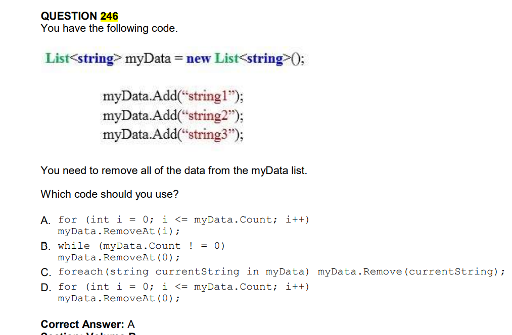

QUESTION 246 __ERRATA__ __ERRATA__ __ERRATA__ __ERRATA__ __ERRATA__
You have the following code.

LA RESPUESTA 
CORRECTA  B

            while (myData.Count != 0)
                myData.RemoveAt(0); 