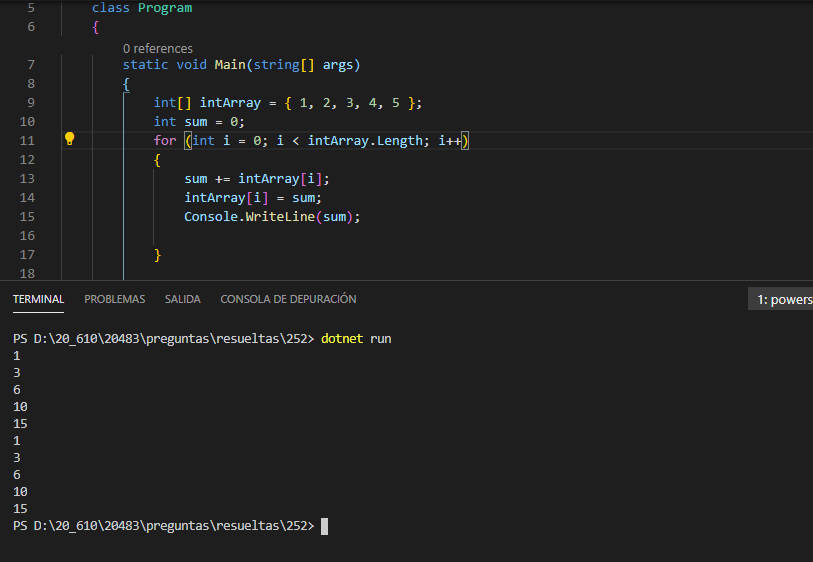

### QUESTION 252

##### Array foreach

(correspondía a JuanRa)

Note: This question is part of a series of questions that present the same scenario. Each question in
the series contains a unique solution that might meet the stated goals. Some question sets might have
more than one correct solution, while others might not have a correct solution.
After you answer a question in this section, you will NOT be able to return to it. As a result, these
questions will not appear in the review screen.
You have the following C# code. (Line numbers are included for reference only.)


```c#

01  int [] intArray ={ 1,2,3,4,5}
02   
03  foreach(var item in intArray)
04  {
05  Console.WriteLine (item);
06  }
```


You need the foreach loop to display a running total of the array elements, as shown in the following list.

1
3
6
10
15

Solution: You insert the following code segment at line 02:
```c#
int sum = 0;
for (int i=0; i < intArray.Length)
{
    sum += intArray[i];
	intArray[i] = sum;
	Console.WriteLine (sum);
	
}                                                      
```

Does this meet the goal?

A. Yes

B. No

=============================

RESPUESTA: NO 

=============================

OJO PORQUE VAN A LIARTE

ya que el for si saca el array 1 3 6 10 15

pero es que el foreach tambien saca la salida 1 3 6 10 15

La respuesta es NO PORQUE WriteLine ESTA DUPLICADA

es decir 
la salida es 1 3 6 10 15 1 3 6 10 15
y se pide 1 3 6 10 15
```c#
			int[] intArray = { 1, 2, 3, 4, 5 };
            int sum = 0;
            for (int i = 0; i < intArray.Length; i++)
            {
                sum += intArray[i];
                intArray[i] = sum;
                Console.WriteLine(sum);

            }

            foreach (var item in intArray)
            {
                Console.WriteLine(item);
            }
````


SOLUCION




