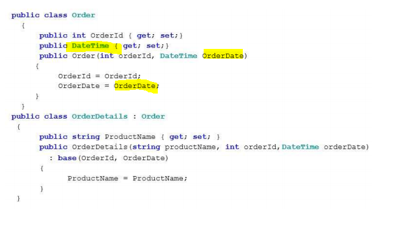
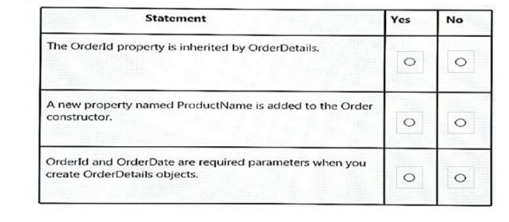
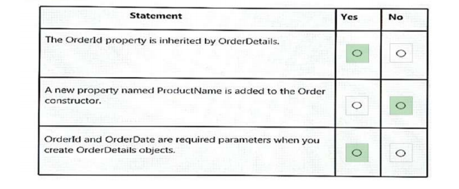

### QUESTION 253

##### herencia

You have the following code.

(el código tiene fallos pero lo damos por bueno)  



For each of the following statements, select Yes if the statement is true. Otherwise, select No.



solución




References:   
https://docs.microsoft.com/en-us/dotnet/csharp/programming-guide/classes-and-structs/inheritance   


Bueno entiendo que es correcto pero el código tiene mogollón de fallos
```c#
    public class OrderDetails : Order 
    {
          public String ProductName {get;set;}


        public OrderDetails(string productName, int orderId, DateTime orderDate)  : base (orderId,orderDate )
 
           
             { ProductName = productName;}
 
    }

    public class Order
    {
        public int OrderId {get;set;}
        public DateTime OrderDate {get;set;}

        public Order(int orderid, DateTime orderdate)
        {
            this.OrderId = orderid;
            this.OrderDate = orderdate;
        }
    }
````

| Question | |
| :---| --- |
|the OrderId property is inherited by OrderDetails |True |
|A new Property  named ProductName is added to the Order constructor. | False |
|OrderId and OrderDate are required paramaters when you create OrderDetails object. | True |


 


